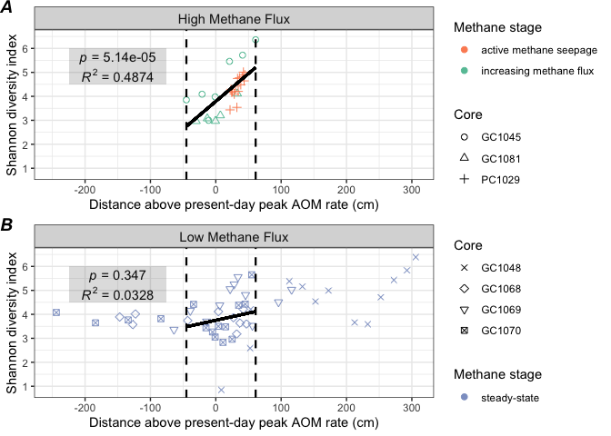
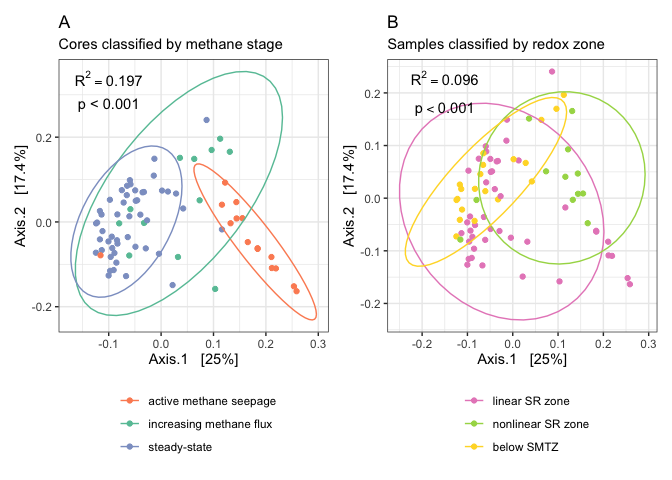
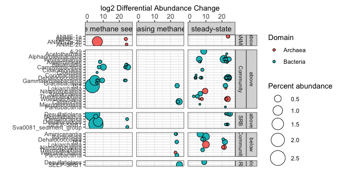

community\_analysis\_8.20
================
Scott Klasek
8/26/2020

## load necessary libraries and data

``` r
library(phyloseq)
library(tidyverse)
```

    ## ── Attaching packages ─────────────────────────────────────────────────────────────────────────────────────────────────────── tidyverse 1.3.0 ──

    ## ✓ ggplot2 3.3.2     ✓ purrr   0.3.3
    ## ✓ tibble  2.1.3     ✓ dplyr   0.8.4
    ## ✓ tidyr   1.0.2     ✓ stringr 1.4.0
    ## ✓ readr   1.3.1     ✓ forcats 0.4.0

    ## Warning: package 'ggplot2' was built under R version 3.6.2

    ## ── Conflicts ────────────────────────────────────────────────────────────────────────────────────────────────────────── tidyverse_conflicts() ──
    ## x dplyr::filter() masks stats::filter()
    ## x dplyr::lag()    masks stats::lag()

``` r
library(egg)
```

    ## Loading required package: gridExtra

    ## 
    ## Attaching package: 'gridExtra'

    ## The following object is masked from 'package:dplyr':
    ## 
    ##     combine

``` r
library(lemon)
```

    ## Warning: package 'lemon' was built under R version 3.6.2

    ## 
    ## Attaching package: 'lemon'

    ## The following object is masked from 'package:purrr':
    ## 
    ##     %||%

    ## The following objects are masked from 'package:ggplot2':
    ## 
    ##     CoordCartesian, element_render

``` r
library(gridExtra)
library(grid)
library(patchwork)
library(vegan)
```

    ## Loading required package: permute

    ## Loading required package: lattice

    ## This is vegan 2.5-6

``` r
library(DESeq2)
```

    ## Loading required package: S4Vectors

    ## Loading required package: stats4

    ## Loading required package: BiocGenerics

    ## Loading required package: parallel

    ## 
    ## Attaching package: 'BiocGenerics'

    ## The following objects are masked from 'package:parallel':
    ## 
    ##     clusterApply, clusterApplyLB, clusterCall, clusterEvalQ,
    ##     clusterExport, clusterMap, parApply, parCapply, parLapply,
    ##     parLapplyLB, parRapply, parSapply, parSapplyLB

    ## The following object is masked from 'package:gridExtra':
    ## 
    ##     combine

    ## The following objects are masked from 'package:dplyr':
    ## 
    ##     combine, intersect, setdiff, union

    ## The following objects are masked from 'package:stats':
    ## 
    ##     IQR, mad, sd, var, xtabs

    ## The following objects are masked from 'package:base':
    ## 
    ##     anyDuplicated, append, as.data.frame, basename, cbind, colnames,
    ##     dirname, do.call, duplicated, eval, evalq, Filter, Find, get, grep,
    ##     grepl, intersect, is.unsorted, lapply, Map, mapply, match, mget,
    ##     order, paste, pmax, pmax.int, pmin, pmin.int, Position, rank,
    ##     rbind, Reduce, rownames, sapply, setdiff, sort, table, tapply,
    ##     union, unique, unsplit, which, which.max, which.min

    ## 
    ## Attaching package: 'S4Vectors'

    ## The following objects are masked from 'package:dplyr':
    ## 
    ##     first, rename

    ## The following object is masked from 'package:tidyr':
    ## 
    ##     expand

    ## The following object is masked from 'package:base':
    ## 
    ##     expand.grid

    ## Loading required package: IRanges

    ## 
    ## Attaching package: 'IRanges'

    ## The following objects are masked from 'package:dplyr':
    ## 
    ##     collapse, desc, slice

    ## The following object is masked from 'package:purrr':
    ## 
    ##     reduce

    ## The following object is masked from 'package:phyloseq':
    ## 
    ##     distance

    ## Loading required package: GenomicRanges

    ## Loading required package: GenomeInfoDb

    ## Loading required package: SummarizedExperiment

    ## Loading required package: Biobase

    ## Welcome to Bioconductor
    ## 
    ##     Vignettes contain introductory material; view with
    ##     'browseVignettes()'. To cite Bioconductor, see
    ##     'citation("Biobase")', and for packages 'citation("pkgname")'.

    ## 
    ## Attaching package: 'Biobase'

    ## The following object is masked from 'package:phyloseq':
    ## 
    ##     sampleNames

    ## Loading required package: DelayedArray

    ## Loading required package: matrixStats

    ## 
    ## Attaching package: 'matrixStats'

    ## The following objects are masked from 'package:Biobase':
    ## 
    ##     anyMissing, rowMedians

    ## The following object is masked from 'package:dplyr':
    ## 
    ##     count

    ## Loading required package: BiocParallel

    ## 
    ## Attaching package: 'DelayedArray'

    ## The following objects are masked from 'package:matrixStats':
    ## 
    ##     colMaxs, colMins, colRanges, rowMaxs, rowMins, rowRanges

    ## The following object is masked from 'package:purrr':
    ## 
    ##     simplify

    ## The following objects are masked from 'package:base':
    ## 
    ##     aperm, apply, rowsum

``` r
library(here)
```

    ## here() starts at /Users/scottklasek/Desktop/svalflux

``` r
sessioninfo <- sessionInfo()
ps.frdp <- readRDS(file="ps.frdp") # imports the final phyloseq object
```

## alpha diversity

``` r
# subset by high flux vs low flux 
ps.frdp.ss <- subset_samples(ps.frdp, sample_data(ps.frdp)$stage=="steadystate") # subsetsall steady-state samples
ps.frdp.nss.seep <- subset_samples(ps.frdp, sample_data(ps.frdp)$stage!="steadystate") # subsets the non-steady-state samples and the seep

alphadiv.ss <- estimate_richness(ps.frdp.ss, split = TRUE, measures=c("Shannon","InvSimpson","Observed")) # calculate tables of alpha diversity
```

    ## Warning in estimate_richness(ps.frdp.ss, split = TRUE, measures = c("Shannon", : The data you have provided does not have
    ## any singletons. This is highly suspicious. Results of richness
    ## estimates (for example) are probably unreliable, or wrong, if you have already
    ## trimmed low-abundance taxa from the data.
    ## 
    ## We recommended that you find the un-trimmed data and retry.

``` r
alphadiv.nss <- estimate_richness(ps.frdp.nss.seep, split = TRUE, measures=c("Shannon","InvSimpson","Observed"))
```

    ## Warning in estimate_richness(ps.frdp.nss.seep, split = TRUE, measures = c("Shannon", : The data you have provided does not have
    ## any singletons. This is highly suspicious. Results of richness
    ## estimates (for example) are probably unreliable, or wrong, if you have already
    ## trimmed low-abundance taxa from the data.
    ## 
    ## We recommended that you find the un-trimmed data and retry.

``` r
alphadiv.ss$depth <- substring(rownames(alphadiv.ss), 8,12) # pull out depth values from the sample names
alphadiv.ss$depth <- as.numeric(alphadiv.ss$depth) # convert them to numeric
alphadiv.nss$depth <- substring(rownames(alphadiv.nss), 8,12)
alphadiv.nss$depth <- as.numeric(alphadiv.nss$depth)

alphadiv.ss$core <- substring(rownames(alphadiv.ss), 1,6) # pull out core names from sample names
alphadiv.nss$core <- substring(rownames(alphadiv.nss), 1,6)

alphadiv.nss$peakaom <- NA # creates a NA value for peak AOM depth
alphadiv.ss$peakaom <- NA
alphadiv.nss[which(alphadiv.nss$core=="GC1081"),6] <- 55 # add in peak AOM depths for all cores
alphadiv.nss[which(alphadiv.nss$core=="GC1045"),6] <- 67.5
alphadiv.nss[which(alphadiv.nss$core=="PC1029"),6] <- 13
alphadiv.ss[which(alphadiv.ss$core=="GC1068"),6] <- 74
alphadiv.ss[which(alphadiv.ss$core=="GC1069"),6] <- 106
alphadiv.ss[which(alphadiv.ss$core=="GC1070"),6] <- 68
alphadiv.ss[which(alphadiv.ss$core=="GC1048"),6] <- 302.5
alphadiv.ss$dist_above_peakaom <- alphadiv.ss$peakaom-alphadiv.ss$depth # calculate distance above/below peak AOM
alphadiv.nss$dist_above_peakaom <- alphadiv.nss$peakaom-alphadiv.nss$depth 

alphadiv.ss.range <- subset(alphadiv.ss, dist_above_peakaom < 63.5 & dist_above_peakaom > -42.5) # subset the dataframe to include steady-state samples from depths across the SMT that correspond to depths of non-steady-state samples

nss.lm <- lm(alphadiv.nss$Shannon~alphadiv.nss$dist_above_peakaom) # linear model of shannon alpha diversity over distance to SMT for non-steady-state cores
ss.lm <- lm(alphadiv.ss$Shannon~alphadiv.ss$dist_above_peakaom) # linear model of shannon alpha diversity over distance to SMT for non-steady-state cores
ss.lm.range <- lm(alphadiv.ss.range$Shannon~alphadiv.ss.range$dist_above_peakaom)
summary(nss.lm) # summarizes the linear regression: slope is 0.029618, intercept is 4.167367, both are significant. Multiple R^2 is 0.5341, p value of slope is 1.5e-05
```

    ## 
    ## Call:
    ## lm(formula = alphadiv.nss$Shannon ~ alphadiv.nss$dist_above_peakaom)
    ## 
    ## Residuals:
    ##     Min      1Q  Median      3Q     Max 
    ## -1.1542 -0.3540  0.2308  0.4062  0.9431 
    ## 
    ## Coefficients:
    ##                                 Estimate Std. Error t value Pr(>|t|)    
    ## (Intercept)                     4.168572   0.115451  36.107  < 2e-16 ***
    ## alphadiv.nss$dist_above_peakaom 0.029654   0.005539   5.353  1.5e-05 ***
    ## ---
    ## Signif. codes:  0 '***' 0.001 '**' 0.01 '*' 0.05 '.' 0.1 ' ' 1
    ## 
    ## Residual standard error: 0.5956 on 25 degrees of freedom
    ## Multiple R-squared:  0.5341, Adjusted R-squared:  0.5155 
    ## F-statistic: 28.66 on 1 and 25 DF,  p-value: 1.498e-05

``` r
summary(ss.lm) # slope is significant considering all the points across depth 
```

    ## 
    ## Call:
    ## lm(formula = alphadiv.ss$Shannon ~ alphadiv.ss$dist_above_peakaom)
    ## 
    ## Residuals:
    ##     Min      1Q  Median      3Q     Max 
    ## -3.1827 -0.5436  0.1470  0.5018  1.5107 
    ## 
    ## Coefficients:
    ##                                Estimate Std. Error t value Pr(>|t|)    
    ## (Intercept)                    4.037319   0.128234  31.484  < 2e-16 ***
    ## alphadiv.ss$dist_above_peakaom 0.003532   0.001071   3.298  0.00186 ** 
    ## ---
    ## Signif. codes:  0 '***' 0.001 '**' 0.01 '*' 0.05 '.' 0.1 ' ' 1
    ## 
    ## Residual standard error: 0.8853 on 47 degrees of freedom
    ## Multiple R-squared:  0.188,  Adjusted R-squared:  0.1707 
    ## F-statistic: 10.88 on 1 and 47 DF,  p-value: 0.001859

``` r
summary(ss.lm.range) # slope is 0.002780, intercept is 3.831772, slope not significant across the SMT range. Multiple R^2 is 0.003901, p value of slope is 0.762
```

    ## 
    ## Call:
    ## lm(formula = alphadiv.ss.range$Shannon ~ alphadiv.ss.range$dist_above_peakaom)
    ## 
    ## Residuals:
    ##      Min       1Q   Median       3Q      Max 
    ## -2.97997 -0.52032 -0.08007  0.57834  1.71744 
    ## 
    ## Coefficients:
    ##                                      Estimate Std. Error t value Pr(>|t|)    
    ## (Intercept)                          3.832791   0.219654  17.449 3.86e-15 ***
    ## alphadiv.ss.range$dist_above_peakaom 0.002792   0.009073   0.308    0.761    
    ## ---
    ## Signif. codes:  0 '***' 0.001 '**' 0.01 '*' 0.05 '.' 0.1 ' ' 1
    ## 
    ## Residual standard error: 1.051 on 24 degrees of freedom
    ## Multiple R-squared:  0.00393,    Adjusted R-squared:  -0.03757 
    ## F-statistic: 0.0947 on 1 and 24 DF,  p-value: 0.7609

``` r
# assign facet grid labels and methane flux stages
alphadiv.nss$core_flowtype_label <- "High Methane Flux"
alphadiv.ss$core_flowtype_label <- "Low Methane Flux"
alphadiv.nss$stage <- "increasing methane flux"
alphadiv.nss[which(alphadiv.nss$core=="PC1029"),9] <- "active methane seepage"
alphadiv.ss$stage <- "steady-state"

plotrichness.ss <- ggplot(alphadiv.ss, aes(dist_above_peakaom, Shannon, color=stage, shape=core)) 
ssplot <- plotrichness.ss+
  geom_point(size=2)+
  facet_grid(~core_flowtype_label)+
  scale_y_continuous("Shannon diversity index", breaks=c(1,2,3,4,5,6), limits = c(0.8,6.5))+
  scale_x_continuous("Distance above present-day peak AOM rate (cm)", limits = c(-250,306))+
  scale_color_manual("Methane regime", values=c("#8da0cb"))+
  scale_shape_manual("Core",values = c(4:7))+
  geom_vline(aes(xintercept=-42.5), linetype="dashed", size=0.8)+
  geom_vline(aes(xintercept=63.5), linetype="dashed", size=0.8)+
  geom_segment(x=-42.5,y=3.713622,xend=63.5,yend=4.008302, color="black", size=1)+
  theme_bw()+ # now for some reason you need to put the theme_bw() ahead of the theme() or nothing in theme() will work
  theme(strip.text = element_text(size = 11))+
  annotate("text", x = -150, y = 4.9, label = "paste(italic(R) ^ 2, \" = 0.0039\")", parse = TRUE)+
  annotate("text", x = -150, y = 5.6, label = "paste(italic(p), \" = 0.762\")", parse = TRUE)+
  annotate("rect", xmin = -225, xmax = -75, ymin = 4.5, ymax = 6, alpha = .2)

plotrichness.nss <- ggplot(alphadiv.nss, aes(dist_above_peakaom, Shannon, color=stage, shape=core))
nssplot <- plotrichness.nss+
  geom_point(size=2)+
  facet_grid(~core_flowtype_label)+
  scale_y_continuous("Shannon diversity index", breaks=c(1,2,3,4,5,6), limits = c(0.8,6.5))+
  scale_x_continuous("Distance above present-day peak AOM rate (cm)", limits = c(-250,306))+
  scale_color_manual("Methane regime", values=c("#fc8d62", "#66c2a5"))+
  scale_shape_manual("Core", values = c(1:3))+
  geom_vline(aes(xintercept=-42.5), linetype="dashed", size=0.8)+
  geom_vline(aes(xintercept=63.5), linetype="dashed", size=0.8)+
  geom_segment(x=-42.5,y=2.908602,xend=63.5,yend=6.04811, color="black", size=1)+
  theme_bw()+ # now for some reason you need to put the theme_bw() ahead of the theme() or nothing in theme() will work
  theme(strip.text = element_text(size = 11))+
  annotate("text", x = -150, y = 4.9, label = "paste(italic(R) ^ 2, \" = 0.5341\")", parse = TRUE)+
  annotate("text", x = -150, y = 5.6, label = "paste(italic(p), \" = 1.5e-05\")", parse = TRUE)+
  annotate("rect", xmin = -225, xmax = -75, ymin = 4.5, ymax = 6, alpha = .2)

div.fig <- ggarrange(nssplot,ssplot, heights = c(1,1), ncol=1, nrow=2, labels = c("A", "B")) # Figure 6
```

<!-- -->

``` r
div.fig
```

<!-- -->

``` r
div.fig <- saveRDS(div.fig, "figures/figure6") # export alpha diversity figure
```

## beta diversity

#### transforming ASV table

``` r
# Hellinger transformation
otu.hel <- otu_table(decostand(otu_table(ps.frdp), method = "hellinger"), taxa_are_rows=FALSE)
ps.hel <- phyloseq(tax_table(ps.frdp),
                    sample_data(ps.frdp),
                    otu_table(otu.hel),
                    phy_tree(ps.frdp),
                    refseq(ps.frdp)) 
```

#### permanova tests

Testing the influence of stage (seep, non-steady-state, and
steady-state) and geochemical zone (linear sulfate-reduction zone,
non-steady-state reduction zone, and
below-sulfate-methane-transition-zone) on community
composition

``` r
sample_data(ps.hel)$smtpos <- ifelse(sample_data(ps.hel)$geochem_zone == "linear SR zone","above SMTZ",
                              ifelse(sample_data(ps.hel)$geochem_zone == "nonlinear SR zone","above SMTZ",
                              ifelse(sample_data(ps.hel)$geochem_zone == "below SMTZ", "below SMTZ", NA))) # writing above-below smtz as another categorical variable
metadata.ps.hel <- as(sample_data(ps.hel), "data.frame") #  create sample data dataframe

# binary jaccard
dm.jac <- phyloseq::distance(ps.frdp, method = "jaccard", binary = TRUE) # makes binary Jaccard distance matrix (no need to transform)
adonis(dm.jac ~ geochem_zone*stage, data=metadata.ps.hel)
```

    ## 
    ## Call:
    ## adonis(formula = dm.jac ~ geochem_zone * stage, data = metadata.ps.hel) 
    ## 
    ## Permutation: free
    ## Number of permutations: 999
    ## 
    ## Terms added sequentially (first to last)
    ## 
    ##                    Df SumsOfSqs MeanSqs F.Model      R2 Pr(>F)    
    ## geochem_zone        2     1.900 0.94980  2.4357 0.05848  0.001 ***
    ## stage               2     2.487 1.24336  3.1885 0.07655  0.001 ***
    ## geochem_zone:stage  2     1.192 0.59598  1.5284 0.03669  0.001 ***
    ## Residuals          69    26.906 0.38995         0.82828           
    ## Total              75    32.485                 1.00000           
    ## ---
    ## Signif. codes:  0 '***' 0.001 '**' 0.01 '*' 0.05 '.' 0.1 ' ' 1

``` r
# Bray-Curtis
dm.bc <- phyloseq::distance(ps.hel, method = "bray") # makes bray-curtis distance matrix
adonis(dm.bc ~ geochem_zone*stage, data=metadata.ps.hel)
```

    ## 
    ## Call:
    ## adonis(formula = dm.bc ~ geochem_zone * stage, data = metadata.ps.hel) 
    ## 
    ## Permutation: free
    ## Number of permutations: 999
    ## 
    ## Terms added sequentially (first to last)
    ## 
    ##                    Df SumsOfSqs MeanSqs F.Model      R2 Pr(>F)    
    ## geochem_zone        2    2.4566 1.22832  4.3081 0.09239  0.001 ***
    ## stage               2    3.3414 1.67071  5.8597 0.12566  0.001 ***
    ## geochem_zone:stage  2    1.1192 0.55961  1.9627 0.04209  0.003 ** 
    ## Residuals          69   19.6731 0.28512         0.73986           
    ## Total              75   26.5904                 1.00000           
    ## ---
    ## Signif. codes:  0 '***' 0.001 '**' 0.01 '*' 0.05 '.' 0.1 ' ' 1

``` r
# unweighted Unifrac
set.seed(1)
dm.hel.unifrac <- UniFrac(ps.hel, weighted = FALSE, normalized = TRUE,  parallel = FALSE, fast = TRUE) # create weighted Unifrac distance matrix
```

    ## Warning in UniFrac(ps.hel, weighted = FALSE, normalized = TRUE, parallel =
    ## FALSE, : Randomly assigning root as -- ASV4959 -- in the phylogenetic tree in
    ## the data you provided.

``` r
adonis(dm.hel.unifrac ~ geochem_zone*stage, data=metadata.ps.hel) 
```

    ## 
    ## Call:
    ## adonis(formula = dm.hel.unifrac ~ geochem_zone * stage, data = metadata.ps.hel) 
    ## 
    ## Permutation: free
    ## Number of permutations: 999
    ## 
    ## Terms added sequentially (first to last)
    ## 
    ##                    Df SumsOfSqs MeanSqs F.Model      R2 Pr(>F)    
    ## geochem_zone        2    1.5220 0.76099  2.7785 0.06510  0.001 ***
    ## stage               2    2.0553 1.02764  3.7521 0.08791  0.001 ***
    ## geochem_zone:stage  2    0.9048 0.45240  1.6518 0.03870  0.002 ** 
    ## Residuals          69   18.8981 0.27389         0.80830           
    ## Total              75   23.3802                 1.00000           
    ## ---
    ## Signif. codes:  0 '***' 0.001 '**' 0.01 '*' 0.05 '.' 0.1 ' ' 1

``` r
# weighted Unifrac 
set.seed(1)
dm.hel.wunifrac <- UniFrac(ps.hel, weighted = TRUE, normalized = TRUE,  parallel = FALSE, fast = TRUE) # create weighted Unifrac distance matrix
```

    ## Warning in UniFrac(ps.hel, weighted = TRUE, normalized = TRUE, parallel =
    ## FALSE, : Randomly assigning root as -- ASV4959 -- in the phylogenetic tree in
    ## the data you provided.

``` r
adonis(dm.hel.wunifrac ~ geochem_zone*stage, data=metadata.ps.hel) # geochem zone is 9.6%
```

    ## 
    ## Call:
    ## adonis(formula = dm.hel.wunifrac ~ geochem_zone * stage, data = metadata.ps.hel) 
    ## 
    ## Permutation: free
    ## Number of permutations: 999
    ## 
    ## Terms added sequentially (first to last)
    ## 
    ##                    Df SumsOfSqs MeanSqs F.Model      R2 Pr(>F)    
    ## geochem_zone        2    0.3694 0.18469  4.6933 0.09463  0.001 ***
    ## stage               2    0.6364 0.31822  8.0864 0.16304  0.001 ***
    ## geochem_zone:stage  2    0.1823 0.09117  2.3167 0.04671  0.003 ** 
    ## Residuals          69    2.7153 0.03935         0.69561           
    ## Total              75    3.9035                 1.00000           
    ## ---
    ## Signif. codes:  0 '***' 0.001 '**' 0.01 '*' 0.05 '.' 0.1 ' ' 1

``` r
# other variables are all significant, but possibly redundant:
adonis(dm.hel.wunifrac ~ stage, data=metadata.ps.hel) #  stage alone is 19.9%
```

    ## 
    ## Call:
    ## adonis(formula = dm.hel.wunifrac ~ stage, data = metadata.ps.hel) 
    ## 
    ## Permutation: free
    ## Number of permutations: 999
    ## 
    ## Terms added sequentially (first to last)
    ## 
    ##           Df SumsOfSqs MeanSqs F.Model      R2 Pr(>F)    
    ## stage      2    0.7399 0.36995  8.5368 0.18955  0.001 ***
    ## Residuals 73    3.1636 0.04334         0.81045           
    ## Total     75    3.9035                 1.00000           
    ## ---
    ## Signif. codes:  0 '***' 0.001 '**' 0.01 '*' 0.05 '.' 0.1 ' ' 1

``` r
adonis(dm.hel.wunifrac ~ core_flowtype, data=metadata.ps.hel) # significant, but at 13% is less than stage (which it is redundant with)
```

    ## 
    ## Call:
    ## adonis(formula = dm.hel.wunifrac ~ core_flowtype, data = metadata.ps.hel) 
    ## 
    ## Permutation: free
    ## Number of permutations: 999
    ## 
    ## Terms added sequentially (first to last)
    ## 
    ##               Df SumsOfSqs MeanSqs F.Model      R2 Pr(>F)    
    ## core_flowtype  1    0.5237 0.52374  11.467 0.13417  0.001 ***
    ## Residuals     74    3.3797 0.04567         0.86583           
    ## Total         75    3.9035                 1.00000           
    ## ---
    ## Signif. codes:  0 '***' 0.001 '**' 0.01 '*' 0.05 '.' 0.1 ' ' 1

``` r
adonis(dm.hel.wunifrac ~ SO4_mM, data=metadata.ps.hel) # SO4 more than geochem zone (maybe more helpful, too? but redundant)
```

    ## 
    ## Call:
    ## adonis(formula = dm.hel.wunifrac ~ SO4_mM, data = metadata.ps.hel) 
    ## 
    ## Permutation: free
    ## Number of permutations: 999
    ## 
    ## Terms added sequentially (first to last)
    ## 
    ##           Df SumsOfSqs MeanSqs F.Model      R2 Pr(>F)    
    ## SO4_mM     1    0.4100 0.41001   8.685 0.10504  0.001 ***
    ## Residuals 74    3.4934 0.04721         0.89496           
    ## Total     75    3.9035                 1.00000           
    ## ---
    ## Signif. codes:  0 '***' 0.001 '**' 0.01 '*' 0.05 '.' 0.1 ' ' 1

``` r
adonis(dm.hel.wunifrac ~ HS_mM, data=metadata.ps.hel) # significant but redundant
```

    ## 
    ## Call:
    ## adonis(formula = dm.hel.wunifrac ~ HS_mM, data = metadata.ps.hel) 
    ## 
    ## Permutation: free
    ## Number of permutations: 999
    ## 
    ## Terms added sequentially (first to last)
    ## 
    ##           Df SumsOfSqs  MeanSqs F.Model      R2 Pr(>F)    
    ## HS_mM      1    0.2348 0.234827  4.7367 0.06016  0.001 ***
    ## Residuals 74    3.6686 0.049576         0.93984           
    ## Total     75    3.9035                  1.00000           
    ## ---
    ## Signif. codes:  0 '***' 0.001 '**' 0.01 '*' 0.05 '.' 0.1 ' ' 1

``` r
adonis(dm.hel.wunifrac ~ Alk_mM, data=metadata.ps.hel) # significant but redundant
```

    ## 
    ## Call:
    ## adonis(formula = dm.hel.wunifrac ~ Alk_mM, data = metadata.ps.hel) 
    ## 
    ## Permutation: free
    ## Number of permutations: 999
    ## 
    ## Terms added sequentially (first to last)
    ## 
    ##           Df SumsOfSqs  MeanSqs F.Model      R2 Pr(>F)    
    ## Alk_mM     1    0.3046 0.304620  6.2637 0.07804  0.001 ***
    ## Residuals 74    3.5988 0.048633         0.92196           
    ## Total     75    3.9035                  1.00000           
    ## ---
    ## Signif. codes:  0 '***' 0.001 '**' 0.01 '*' 0.05 '.' 0.1 ' ' 1

``` r
adonis(dm.hel.wunifrac ~ core, data=metadata.ps.hel) # core matters more than any other, but "core" itself is a meaningless variable
```

    ## 
    ## Call:
    ## adonis(formula = dm.hel.wunifrac ~ core, data = metadata.ps.hel) 
    ## 
    ## Permutation: free
    ## Number of permutations: 999
    ## 
    ## Terms added sequentially (first to last)
    ## 
    ##           Df SumsOfSqs  MeanSqs F.Model      R2 Pr(>F)    
    ## core       6    1.2485 0.208077  5.4077 0.31984  0.001 ***
    ## Residuals 69    2.6550 0.038478         0.68016           
    ## Total     75    3.9035                  1.00000           
    ## ---
    ## Signif. codes:  0 '***' 0.001 '**' 0.01 '*' 0.05 '.' 0.1 ' ' 1

``` r
adonis(dm.hel.wunifrac ~ pingo, data=metadata.ps.hel) # gas hydrate mound the cores are sampled from matters more as well, but also a meaningless variable
```

    ## 
    ## Call:
    ## adonis(formula = dm.hel.wunifrac ~ pingo, data = metadata.ps.hel) 
    ## 
    ## Permutation: free
    ## Number of permutations: 999
    ## 
    ## Terms added sequentially (first to last)
    ## 
    ##           Df SumsOfSqs  MeanSqs F.Model      R2 Pr(>F)    
    ## pingo      3    0.8669 0.288976   6.852 0.22209  0.001 ***
    ## Residuals 72    3.0365 0.042174         0.77791           
    ## Total     75    3.9035                  1.00000           
    ## ---
    ## Signif. codes:  0 '***' 0.001 '**' 0.01 '*' 0.05 '.' 0.1 ' ' 1

``` r
adonis(dm.hel.wunifrac ~ smtzposition, data=metadata.ps.hel) # above/below SMT explains only 5%
```

    ## 
    ## Call:
    ## adonis(formula = dm.hel.wunifrac ~ smtzposition, data = metadata.ps.hel) 
    ## 
    ## Permutation: free
    ## Number of permutations: 999
    ## 
    ## Terms added sequentially (first to last)
    ## 
    ##              Df SumsOfSqs  MeanSqs F.Model      R2 Pr(>F)    
    ## smtzposition  1    0.2099 0.209870  4.2047 0.05377  0.001 ***
    ## Residuals    74    3.6936 0.049913         0.94623           
    ## Total        75    3.9035                  1.00000           
    ## ---
    ## Signif. codes:  0 '***' 0.001 '**' 0.01 '*' 0.05 '.' 0.1 ' ' 1

``` r
adonis(dm.hel.wunifrac ~ geochem_zone*core, data=metadata.ps.hel) # no significant interaction between core and geochem zone
```

    ## 
    ## Call:
    ## adonis(formula = dm.hel.wunifrac ~ geochem_zone * core, data = metadata.ps.hel) 
    ## 
    ## Permutation: free
    ## Number of permutations: 999
    ## 
    ## Terms added sequentially (first to last)
    ## 
    ##                   Df SumsOfSqs  MeanSqs F.Model      R2 Pr(>F)    
    ## geochem_zone       2    0.3694 0.184692  5.1972 0.09463  0.001 ***
    ## core               6    1.0931 0.182176  5.1264 0.28002  0.001 ***
    ## geochem_zone:core  5    0.2377 0.047547  1.3380 0.06090  0.081 .  
    ## Residuals         62    2.2033 0.035537         0.56444           
    ## Total             75    3.9035                  1.00000           
    ## ---
    ## Signif. codes:  0 '***' 0.001 '**' 0.01 '*' 0.05 '.' 0.1 ' ' 1

``` r
adonis(dm.hel.wunifrac ~ stage * geochem_zone, data=metadata.ps.hel)
```

    ## 
    ## Call:
    ## adonis(formula = dm.hel.wunifrac ~ stage * geochem_zone, data = metadata.ps.hel) 
    ## 
    ## Permutation: free
    ## Number of permutations: 999
    ## 
    ## Terms added sequentially (first to last)
    ## 
    ##                    Df SumsOfSqs MeanSqs F.Model      R2 Pr(>F)    
    ## stage               2    0.7399 0.36995  9.4010 0.18955  0.001 ***
    ## geochem_zone        2    0.2659 0.13296  3.3786 0.06812  0.001 ***
    ## stage:geochem_zone  2    0.1823 0.09117  2.3167 0.04671  0.005 ** 
    ## Residuals          69    2.7153 0.03935         0.69561           
    ## Total              75    3.9035                 1.00000           
    ## ---
    ## Signif. codes:  0 '***' 0.001 '**' 0.01 '*' 0.05 '.' 0.1 ' ' 1

Using the weighted Unifrac distance, both geochem\_zone & stage were
significant (stage explaining 16-17% of variance, while zone 8-9%).
Interactions were also significant at around 4.9%. This did not vary by
the transformation type (I tried variance-stabilizing transformation as
well and got nearly the same results). Bray-Curtis, unweighted Unifrac,
and Jaccard distance metrics showed the same patterns, though they
respectively explained decreasing amounts of variance overall. So it
seems relative abundances are a bit more influential than taxonomy alone
in explaining differences between these communities, though they both
help.

Pingo (which Gas Hydrate Mound a sample was collected from) explains a
bit more variance than does stage, and Core does even more. But it is a
confounding variable (each pingo is at a separate methane flux stage),
and which particular pingo a sample comes from offers no real helpful
information. Core also confounds with pingo, core\_flowtype, stage, etc.
Even though core was the single variable that explained more of the
variance than any other, geochem\_zone\*stage explained slightly more.
Furthermore, core and geochem\_zone do not have a significant
interaction.

#### ordinations

weighted Unifrac with Hellinger transformation

``` r
# make better labels for plotting
sample_data(ps.hel)$stage <- ifelse(sample_data(ps.hel)$stage == "seep", "active methane seepage",
                        ifelse(sample_data(ps.hel)$stage == "fluxincreasing", "increasing methane flux",
                        ifelse(sample_data(ps.hel)$stage == "steadystate", "steady-state", NA)))

sample_data(ps.hel)$geochem_zone <- ifelse(sample_data(ps.hel)$geochem_zone == "lin", "linear SR zone",
                        ifelse(sample_data(ps.hel)$geochem_zone == "nss", "nonlinear SR zone",
                        ifelse(sample_data(ps.hel)$geochem_zone == "below", "below SMT", NA)))

sample_data(ps.hel)$geochem_zone <- factor(sample_data(ps.hel)$geochem_zone, levels = c("linear SR zone", "nonlinear SR zone", "below SMT")) # reorder 

# trying NMDS and PCoAs
set.seed(1)
ord.ps.hel.wuni.nmds <- ordinate(ps.hel, "NMDS", "unifrac", weighted=TRUE) # Stress = 0.135
```

    ## Warning in UniFrac(physeq, ...): Randomly assigning root as -- ASV4959 -- in the
    ## phylogenetic tree in the data you provided.

    ## Run 0 stress 0.1329787 
    ## Run 1 stress 0.1304329 
    ## ... New best solution
    ## ... Procrustes: rmse 0.02185547  max resid 0.1562176 
    ## Run 2 stress 0.1634134 
    ## Run 3 stress 0.1304212 
    ## ... New best solution
    ## ... Procrustes: rmse 0.00129451  max resid 0.008624816 
    ## ... Similar to previous best
    ## Run 4 stress 0.1343964 
    ## Run 5 stress 0.1329784 
    ## Run 6 stress 0.1304212 
    ## ... Procrustes: rmse 9.918053e-05  max resid 0.0005606112 
    ## ... Similar to previous best
    ## Run 7 stress 0.14597 
    ## Run 8 stress 0.146743 
    ## Run 9 stress 0.1304215 
    ## ... Procrustes: rmse 0.0001729211  max resid 0.0009902311 
    ## ... Similar to previous best
    ## Run 10 stress 0.1435387 
    ## Run 11 stress 0.1446159 
    ## Run 12 stress 0.1304213 
    ## ... Procrustes: rmse 0.0001678746  max resid 0.0008453784 
    ## ... Similar to previous best
    ## Run 13 stress 0.1527894 
    ## Run 14 stress 0.1329786 
    ## Run 15 stress 0.1421989 
    ## Run 16 stress 0.1744108 
    ## Run 17 stress 0.1575138 
    ## Run 18 stress 0.1421987 
    ## Run 19 stress 0.1430028 
    ## Run 20 stress 0.1429802 
    ## *** Solution reached

``` r
set.seed(1)
ord.ps.hel.wuni.pcoa <- ordinate(ps.hel, "PCoA", "unifrac", weighted=TRUE)
```

    ## Warning in UniFrac(physeq, ...): Randomly assigning root as -- ASV4959 -- in the
    ## phylogenetic tree in the data you provided.

``` r
# plotting ordinations by stage 
lb1 <- paste("R^2 == 0.197")
ord1.p.stage <- plot_ordination(ps.hel, ord.ps.hel.wuni.pcoa, color = "stage")+
  stat_ellipse()+
  scale_color_manual("",values = c("#fc8d62", "#66c2a5", "#8da0cb"))+
  ggtitle("A", subtitle = "Cores classified by methane regimes")+
  annotate(geom="text", x=-0.1, y=0.28, label="p < 0.001") +
  annotate(geom="text", x=-0.1, y=0.34, label=lb1, parse=TRUE)+
  theme_bw()+
  theme(legend.position = "bottom")+
  guides(col = guide_legend(ncol = 1))

# plotting ordinations by redox zone 
lb2 <- paste("R^2 == 0.096")
ord1.p.zone<- plot_ordination(ps.hel, ord.ps.hel.wuni.pcoa, color = "geochem_zone")+
  stat_ellipse()+
  scale_color_manual("",values = c("#e78ac3","#a6d854","#ffd92f"))+
  ggtitle("B", subtitle = "Samples classified by redox zones")+
  annotate(geom="text", x=-0.15, y=0.17, label="p < 0.001", parse=TRUE)+
  annotate(geom="text", x=-0.15, y=0.23, label=lb2, parse=TRUE)+
  theme_bw()+
  theme(legend.position = "bottom")+
  guides(col = guide_legend(ncol = 1))

# showing them both together
ord.fig <- ord1.p.stage + ord1.p.zone
ord.fig
```

<!-- -->

``` r
ord1.p.stage <- saveRDS(ord1.p.stage, "figures/ord1.p.stage")
ord1.p.zone <- saveRDS(ord1.p.zone, "figures/ord1.p.zone")
```

The PCoA has fewer outliers, and explains 25% x 17.4% variance on the
two major axes, so I’ll stick with that over NMDS.

Maybe don’t even show the plot by geochem zone… it’s just a mess that
doesn’t suggest any clear grouping pattern. Just showing it because it
tested as significant doesn’t seem a good enough reason…

Can also add the sections “more permanovas” from lines 844-920, and
possibly beta-diversity from lines 938-974. Just to be thorough…

## follow-up tests on beta-diversity

``` r
library(phyloseq)

# omitting below-SMT samples, is there still a difference by stage?
ps.hel.above <- subset_samples(ps.hel, geochem_zone!="below SMT") # subset
set.seed(1)
dm.hel.above.wunifrac <- UniFrac(ps.hel.above, weighted = TRUE, normalized = TRUE,  parallel = FALSE, fast = TRUE) # run unifrac
```

    ## Warning in UniFrac(ps.hel.above, weighted = TRUE, normalized = TRUE, parallel
    ## = FALSE, : Randomly assigning root as -- ASV4959 -- in the phylogenetic tree in
    ## the data you provided.

``` r
metadata.ps.hel.above <- as(sample_data(ps.hel.above), "data.frame") # write metadata data frame
adonis(dm.hel.above.wunifrac ~ stage, data=metadata.ps.hel.above) # yes there is a difference: R2, p are 0.21521,  0.001 ***
```

    ## 
    ## Call:
    ## adonis(formula = dm.hel.above.wunifrac ~ stage, data = metadata.ps.hel.above) 
    ## 
    ## Permutation: free
    ## Number of permutations: 999
    ## 
    ## Terms added sequentially (first to last)
    ## 
    ##           Df SumsOfSqs MeanSqs F.Model     R2 Pr(>F)    
    ## stage      2   0.58124 0.29062  6.8461 0.2053  0.001 ***
    ## Residuals 53   2.24986 0.04245         0.7947           
    ## Total     55   2.83110                 1.0000           
    ## ---
    ## Signif. codes:  0 '***' 0.001 '**' 0.01 '*' 0.05 '.' 0.1 ' ' 1

``` r
# considering only below-SMT samples, is there still a difference by stage?
ps.hel.below <- subset_samples(ps.hel, geochem_zone=="below SMT") # subset
nsamples(ps.hel.below)
```

    ## [1] 20

``` r
set.seed(1)
dm.hel.below.wunifrac <- UniFrac(ps.hel.below, weighted = TRUE, normalized = TRUE,  parallel = FALSE, fast = TRUE) # run unifrac
```

    ## Warning in UniFrac(ps.hel.below, weighted = TRUE, normalized = TRUE, parallel
    ## = FALSE, : Randomly assigning root as -- ASV4959 -- in the phylogenetic tree in
    ## the data you provided.

``` r
metadata.ps.hel.below <- as(sample_data(ps.hel.below), "data.frame") # write metadata data frame
adonis(dm.hel.below.wunifrac ~ stage, data=metadata.ps.hel.below) # yes there is a difference: R2, p are 0.18597  0.003 **
```

    ## 
    ## Call:
    ## adonis(formula = dm.hel.below.wunifrac ~ stage, data = metadata.ps.hel.below) 
    ## 
    ## Permutation: free
    ## Number of permutations: 999
    ## 
    ## Terms added sequentially (first to last)
    ## 
    ##           Df SumsOfSqs  MeanSqs F.Model      R2 Pr(>F)   
    ## stage      1   0.15582 0.155818  3.9689 0.18066  0.004 **
    ## Residuals 18   0.70667 0.039259         0.81934          
    ## Total     19   0.86248                  1.00000          
    ## ---
    ## Signif. codes:  0 '***' 0.001 '**' 0.01 '*' 0.05 '.' 0.1 ' ' 1

``` r
# differences between the two stages steady-state and fluxincreasing? 
ps.hel.gc <- subset_samples(ps.hel, stage!="active methane seepage") # subset
nsamples(ps.hel.gc)
```

    ## [1] 61

``` r
set.seed(1)
dm.hel.gc.wunifrac <- UniFrac(ps.hel.gc, weighted = TRUE, normalized = TRUE,  parallel = FALSE, fast = TRUE) # run unifrac
```

    ## Warning in UniFrac(ps.hel.gc, weighted = TRUE, normalized = TRUE, parallel =
    ## FALSE, : Randomly assigning root as -- ASV4959 -- in the phylogenetic tree in
    ## the data you provided.

``` r
metadata.ps.hel.gc <- as(sample_data(ps.hel.gc), "data.frame") # write metadata data frame
adonis(dm.hel.gc.wunifrac ~ stage, data=metadata.ps.hel.gc) # there is a difference: R2, p are 0.06055  0.001 ***
```

    ## 
    ## Call:
    ## adonis(formula = dm.hel.gc.wunifrac ~ stage, data = metadata.ps.hel.gc) 
    ## 
    ## Permutation: free
    ## Number of permutations: 999
    ## 
    ## Terms added sequentially (first to last)
    ## 
    ##           Df SumsOfSqs  MeanSqs F.Model      R2 Pr(>F)   
    ## stage      1   0.16818 0.168178  3.6577 0.05838  0.003 **
    ## Residuals 59   2.71277 0.045979         0.94162          
    ## Total     60   2.88095                  1.00000          
    ## ---
    ## Signif. codes:  0 '***' 0.001 '**' 0.01 '*' 0.05 '.' 0.1 ' ' 1

``` r
# differences between the two stages (steady-state and fluxincreasing) when only considering above-SMT samples? 
ps.hel.above.gc <- subset_samples(ps.hel.above, stage!="active methane seepage") # subset
nsamples(ps.hel.above.gc)
```

    ## [1] 41

``` r
set.seed(11)
dm.hel.above.gc.wunifrac <- UniFrac(ps.hel.above.gc, weighted = TRUE, normalized = TRUE,  parallel = FALSE, fast = TRUE) # run unifrac
```

    ## Warning in UniFrac(ps.hel.above.gc, weighted = TRUE, normalized = TRUE, :
    ## Randomly assigning root as -- ASV37 -- in the phylogenetic tree in the data you
    ## provided.

``` r
metadata.ps.hel.above.gc <- as(sample_data(ps.hel.above.gc), "data.frame") # write metadata data frame
adonis(dm.hel.above.gc.wunifrac ~ stage, data=metadata.ps.hel.above.gc) #  there is barely a difference: R2, p are 0.04448  0.056 (Honestly, if you really like p < 0.05, significance depends on which set.seed you use)
```

    ## 
    ## Call:
    ## adonis(formula = dm.hel.above.gc.wunifrac ~ stage, data = metadata.ps.hel.above.gc) 
    ## 
    ## Permutation: free
    ## Number of permutations: 999
    ## 
    ## Terms added sequentially (first to last)
    ## 
    ##           Df SumsOfSqs  MeanSqs F.Model      R2 Pr(>F)  
    ## stage      1   0.03960 0.039602  1.8169 0.04451   0.05 *
    ## Residuals 39   0.85004 0.021796         0.95549         
    ## Total     40   0.88964                  1.00000         
    ## ---
    ## Signif. codes:  0 '***' 0.001 '**' 0.01 '*' 0.05 '.' 0.1 ' ' 1

``` r
# differences between linear SR and non-steady-state SR across both seep and fluxincreasing?
ps.hel.above.flux <- subset_samples(ps.hel, stage!="steady-state" & geochem_zone!="below SMT") # subset
nsamples(ps.hel.above.flux)
```

    ## [1] 23

``` r
set.seed(1)
dm.hel.above.flux.wunifrac <- UniFrac(ps.hel.above.flux, weighted = TRUE, normalized = TRUE,  parallel = FALSE, fast = TRUE) # run unifrac
```

    ## Warning in UniFrac(ps.hel.above.flux, weighted = TRUE, normalized = TRUE, :
    ## Randomly assigning root as -- ASV4959 -- in the phylogenetic tree in the data
    ## you provided.

``` r
metadata.ps.hel.above.flux <- as(sample_data(ps.hel.above.flux), "data.frame") # write metadata data frame
adonis(dm.hel.above.flux.wunifrac ~ geochem_zone, data=metadata.ps.hel.above.flux) #  there is a difference: R2, p are 0.16792  0.004 **
```

    ## 
    ## Call:
    ## adonis(formula = dm.hel.above.flux.wunifrac ~ geochem_zone, data = metadata.ps.hel.above.flux) 
    ## 
    ## Permutation: free
    ## Number of permutations: 999
    ## 
    ## Terms added sequentially (first to last)
    ## 
    ##              Df SumsOfSqs  MeanSqs F.Model      R2 Pr(>F)   
    ## geochem_zone  1   0.14841 0.148414  4.0475 0.16159  0.005 **
    ## Residuals    21   0.77003 0.036668         0.83841          
    ## Total        22   0.91844                  1.00000          
    ## ---
    ## Signif. codes:  0 '***' 0.001 '**' 0.01 '*' 0.05 '.' 0.1 ' ' 1

``` r
# differences between linear SR and non-steady-state SR across seep only?
ps.hel.above.fluxseep <- subset_samples(ps.hel.above.flux, stage=="active methane seepage") # subset
nsamples(ps.hel.above.fluxseep)
```

    ## [1] 15

``` r
set.seed(1)
dm.hel.above.fluxseep.wunifrac <- UniFrac(ps.hel.above.fluxseep, weighted = TRUE, normalized = TRUE,  parallel = FALSE, fast = TRUE) # run unifrac
```

    ## Warning in UniFrac(ps.hel.above.fluxseep, weighted = TRUE, normalized = TRUE, :
    ## Randomly assigning root as -- ASV4959 -- in the phylogenetic tree in the data
    ## you provided.

``` r
metadata.ps.hel.above.fluxseep <- as(sample_data(ps.hel.above.fluxseep), "data.frame") # write metadata data frame
adonis(dm.hel.above.fluxseep.wunifrac ~ geochem_zone, data=metadata.ps.hel.above.fluxseep) #  there is a difference: R2, p are 0.34069  0.002 **
```

    ## 
    ## Call:
    ## adonis(formula = dm.hel.above.fluxseep.wunifrac ~ geochem_zone,      data = metadata.ps.hel.above.fluxseep) 
    ## 
    ## Permutation: free
    ## Number of permutations: 999
    ## 
    ## Terms added sequentially (first to last)
    ## 
    ##              Df SumsOfSqs  MeanSqs F.Model      R2 Pr(>F)   
    ## geochem_zone  1   0.15063 0.150632  6.5242 0.33416  0.002 **
    ## Residuals    13   0.30015 0.023088         0.66584          
    ## Total        14   0.45078                  1.00000          
    ## ---
    ## Signif. codes:  0 '***' 0.001 '**' 0.01 '*' 0.05 '.' 0.1 ' ' 1

``` r
# differences between linear SR and non-steady-state SR across fluxincreasing only?
ps.hel.above.fluxinc <- subset_samples(ps.hel.above.flux, stage=="increasing methane flux") # subset
nsamples(ps.hel.above.fluxinc) # there are only 8 samples
```

    ## [1] 8

``` r
set.seed(1)
dm.hel.above.fluxinc.wunifrac <- UniFrac(ps.hel.above.fluxinc, weighted = TRUE, normalized = TRUE,  parallel = FALSE, fast = TRUE) # run unifrac
```

    ## Warning in UniFrac(ps.hel.above.fluxinc, weighted = TRUE, normalized = TRUE, :
    ## Randomly assigning root as -- ASV4959 -- in the phylogenetic tree in the data
    ## you provided.

``` r
metadata.ps.hel.above.fluxinc <- as(sample_data(ps.hel.above.fluxinc), "data.frame") # write metadata data frame
adonis(dm.hel.above.fluxinc.wunifrac ~ geochem_zone, data=metadata.ps.hel.above.fluxinc) #  there is barely a difference: R2, p are 0.30173, 0.046 * (Honestly, if you really like p < 0.05, significance might depend on which set.seed you use)
```

    ## 
    ## Call:
    ## adonis(formula = dm.hel.above.fluxinc.wunifrac ~ geochem_zone,      data = metadata.ps.hel.above.fluxinc) 
    ## 
    ## Permutation: free
    ## Number of permutations: 999
    ## 
    ## Terms added sequentially (first to last)
    ## 
    ##              Df SumsOfSqs  MeanSqs F.Model      R2 Pr(>F)  
    ## geochem_zone  1  0.090597 0.090597  2.5254 0.29622  0.046 *
    ## Residuals     6  0.215247 0.035875         0.70378         
    ## Total         7  0.305844                  1.00000         
    ## ---
    ## Signif. codes:  0 '***' 0.001 '**' 0.01 '*' 0.05 '.' 0.1 ' ' 1

``` r
# differences between non-steady-state SR and below-SMT across fluxincreasing only?
ps.hel.fluxinc.lower <- subset_samples(ps.hel, stage=="increasing methane flux" & geochem_zone!="linear SR zone") # subset
nsamples(ps.hel.fluxinc.lower)# only 12 samples
```

    ## [1] 8

``` r
set.seed(1)
dm.hel.fluxinc.lower.wunifrac <- UniFrac(ps.hel.fluxinc.lower, weighted = TRUE, normalized = TRUE,  parallel = FALSE, fast = TRUE) # run unifrac
```

    ## Warning in UniFrac(ps.hel.fluxinc.lower, weighted = TRUE, normalized = TRUE, :
    ## Randomly assigning root as -- ASV4959 -- in the phylogenetic tree in the data
    ## you provided.

``` r
metadata.ps.hel.fluxinc.lower <- as(sample_data(ps.hel.fluxinc.lower), "data.frame") # write metadata data frame
adonis(dm.hel.fluxinc.lower.wunifrac ~ geochem_zone, data=metadata.ps.hel.fluxinc.lower) #  there is NO difference: R2, p are 0.12485  0.435 
```

    ## 
    ## Call:
    ## adonis(formula = dm.hel.fluxinc.lower.wunifrac ~ geochem_zone,      data = metadata.ps.hel.fluxinc.lower) 
    ## 
    ## Permutation: free
    ## Number of permutations: 999
    ## 
    ## Terms added sequentially (first to last)
    ## 
    ##              Df SumsOfSqs  MeanSqs F.Model      R2 Pr(>F)
    ## geochem_zone  1  0.028046 0.028046 0.85599 0.12485  0.435
    ## Residuals     6  0.196586 0.032764         0.87515       
    ## Total         7  0.224633                  1.00000

``` r
# differences between linear SR and below-SMT?
ps.hel.fluxinc.d <- subset_samples(ps.hel, stage=="increasing methane flux" & geochem_zone!="nonlinear SR zone") # subset
nsamples(ps.hel.fluxinc.d)# only 12 samples
```

    ## [1] 8

``` r
set.seed(1)
dm.hel.fluxinc.d.wunifrac <- UniFrac(ps.hel.fluxinc.d, weighted = TRUE, normalized = TRUE,  parallel = FALSE, fast = TRUE) # run unifrac
```

    ## Warning in UniFrac(ps.hel.fluxinc.d, weighted = TRUE, normalized = TRUE, :
    ## Randomly assigning root as -- ASV4959 -- in the phylogenetic tree in the data
    ## you provided.

``` r
metadata.ps.hel.fluxinc.d <- as(sample_data(ps.hel.fluxinc.d), "data.frame") # write metadata data frame
adonis(dm.hel.fluxinc.d.wunifrac ~ geochem_zone, data=metadata.ps.hel.fluxinc.d) # yes difference 0.42094  0.023 *
```

    ## 
    ## Call:
    ## adonis(formula = dm.hel.fluxinc.d.wunifrac ~ geochem_zone, data = metadata.ps.hel.fluxinc.d) 
    ## 
    ## Permutation: free
    ## Number of permutations: 999
    ## 
    ## Terms added sequentially (first to last)
    ## 
    ##              Df SumsOfSqs  MeanSqs F.Model      R2 Pr(>F)  
    ## geochem_zone  1   0.13725 0.137246  4.3617 0.42094  0.023 *
    ## Residuals     6   0.18880 0.031466         0.57906         
    ## Total         7   0.32604                  1.00000         
    ## ---
    ## Signif. codes:  0 '***' 0.001 '**' 0.01 '*' 0.05 '.' 0.1 ' ' 1

``` r
# following this up with an ordination of fluxincreasing GC samples and color by geochem_zone
ps.hel.fluxinc <- subset_samples(ps.hel, stage=="increasing methane flux") # subset
nsamples(ps.hel.fluxinc)
```

    ## [1] 12

``` r
ord.ps.helfluxinc.wuni.pcoa <- ordinate(ps.hel.fluxinc, "PCoA", "unifrac", weighted=TRUE) # ordinate
```

    ## Warning in UniFrac(physeq, ...): Randomly assigning root as -- ASV10236 -- in
    ## the phylogenetic tree in the data you provided.

``` r
plot_ordination(ps.hel.fluxinc, ord.ps.helfluxinc.wuni.pcoa, color = "geochem_zone")+stat_ellipse() # from the very few samples we have here, the idea that the linear SR zone is the outlier is supported
```

<!-- -->

``` r
# t-tests of beta-diversity between stages
ps.hel.seep <- subset_samples(ps.hel, stage=="active methane seepage") # subset
ps.hel.fluxinc
```

    ## phyloseq-class experiment-level object
    ## otu_table()   OTU Table:         [ 16489 taxa and 12 samples ]
    ## sample_data() Sample Data:       [ 12 samples by 22 sample variables ]
    ## tax_table()   Taxonomy Table:    [ 16489 taxa by 6 taxonomic ranks ]
    ## phy_tree()    Phylogenetic Tree: [ 16489 tips and 16487 internal nodes ]
    ## refseq()      DNAStringSet:      [ 16489 reference sequences ]

``` r
ps.hel.ss <- subset_samples(ps.hel, stage=="steady-state")

set.seed(1)
dm.seep <- UniFrac(ps.hel.seep, weighted=TRUE, normalized=TRUE, parallel=FALSE, fast=TRUE) # calculate distance matrices for beta-diversity calculations
```

    ## Warning in UniFrac(ps.hel.seep, weighted = TRUE, normalized = TRUE, parallel =
    ## FALSE, : Randomly assigning root as -- ASV4959 -- in the phylogenetic tree in
    ## the data you provided.

``` r
set.seed(1)
dm.fluxinc <- UniFrac(ps.hel.fluxinc, weighted=TRUE, normalized=TRUE, parallel=FALSE, fast=TRUE)
```

    ## Warning in UniFrac(ps.hel.fluxinc, weighted = TRUE, normalized = TRUE, parallel
    ## = FALSE, : Randomly assigning root as -- ASV4959 -- in the phylogenetic tree in
    ## the data you provided.

``` r
set.seed(1)
dm.ss <- UniFrac(ps.hel.ss, weighted=TRUE, normalized=TRUE, parallel=FALSE, fast=TRUE)
```

    ## Warning in UniFrac(ps.hel.ss, weighted = TRUE, normalized = TRUE, parallel =
    ## FALSE, : Randomly assigning root as -- ASV4959 -- in the phylogenetic tree in
    ## the data you provided.

``` r
bdiv.seep <- as.vector(dm.seep) # rewrite the triangle distance matrices as vectors
bdiv.fluxinc <- as.vector(dm.fluxinc) 
bdiv.ss <- as.vector(dm.ss) 

t.test(bdiv.seep, bdiv.ss) 
```

    ## 
    ##  Welch Two Sample t-test
    ## 
    ## data:  bdiv.seep and bdiv.ss
    ## t = -6.149, df = 117.05, p-value = 1.116e-08
    ## alternative hypothesis: true difference in means is not equal to 0
    ## 95 percent confidence interval:
    ##  -0.07979666 -0.04091739
    ## sample estimates:
    ## mean of x mean of y 
    ## 0.2344213 0.2947783

``` r
t.test(bdiv.fluxinc, bdiv.ss) 
```

    ## 
    ##  Welch Two Sample t-test
    ## 
    ## data:  bdiv.fluxinc and bdiv.ss
    ## t = -1.2378, df = 73.72, p-value = 0.2197
    ## alternative hypothesis: true difference in means is not equal to 0
    ## 95 percent confidence interval:
    ##  -0.030775463  0.007190915
    ## sample estimates:
    ## mean of x mean of y 
    ## 0.2829860 0.2947783

``` r
t.test(bdiv.fluxinc, bdiv.seep) 
```

    ## 
    ##  Welch Two Sample t-test
    ## 
    ## data:  bdiv.fluxinc and bdiv.seep
    ## t = 3.6606, df = 162.22, p-value = 0.0003401
    ## alternative hypothesis: true difference in means is not equal to 0
    ## 95 percent confidence interval:
    ##  0.02236652 0.07476298
    ## sample estimates:
    ## mean of x mean of y 
    ## 0.2829860 0.2344213

Conclusions: all stages are distinctly different from one another. This
is true even when considering only above-SMTZ or below-SMTZ samples,
though remember that seep stages did not have below-SMTZ samples. The
weakest difference (just not quite statistically significant) was
between above-SMTZ samples when comparing fluxincreasing and
steady-state directly.

There appear to be differences between steady-state and non-steady-state
regions of sulfate-reduction zones, though these difference only tested
significant in PC1029 samples. In fluxincreasing cores, samples from the
nonlinear SR zone clustered closer with below SMTZ samples than those
from linear SR zones, suggesting they have begun to change towards
below-SMTZ communities. However, there are only 12 samples here and we’d
need more to make this conclusion for sure.

There is also evidence for lower beta-diversity among seep samples than
among the other two stages, suggesting there is some aspect of community
convergence (not that surprising). But remember, this stage is
represented by only one core, and we saw a lot of inter-core
variance.

## differentially abundant ASVs across methane flux stages and above/below the SMTZ

We have 76 samples: 15 from seep, 49 from steady-state, and 12 from
flux-increasing stages. There are no seep samples from below-SMTZ, 16
from steady-state, and 4 from flux-increasing. In an ideal world, we
would have a more balanced sample design for assessing ASVs that are
differentially abundant between these three stages (above the SMTZ) and
between the latter two stages (below SMTZ). However, DESeq2 is able to
handle imbalances in group numbers fairly robustly:
<https://support.bioconductor.org/p/115433/>

``` r
# enter logical metadata categories corresponding to whether sample stage is seep or increasing flux or steady-state
sample_data(ps.frdp)$is.seep <- FALSE
sample_data(ps.frdp)[which(sample_data(ps.frdp)$stage=="seep"),22] <- TRUE
sample_data(ps.frdp)$is.flux <- FALSE
sample_data(ps.frdp)[which(sample_data(ps.frdp)$stage=="fluxincreasing"),23] <- TRUE
sample_data(ps.frdp)$is.ss <- FALSE
sample_data(ps.frdp)[which(sample_data(ps.frdp)$stage=="steadystate"),24] <- TRUE

# subset the phyloseq object by above/below SMTZ
ps.above <- subset_samples(ps.frdp, smtzposition=="above") 
ps.below <- subset_samples(ps.frdp, smtzposition=="below") 

# make the same phyloseq object, but otu table with relative abundance instead of raw counts
ps.above.ra <- transform_sample_counts(ps.above, function(OTU) OTU/sum(OTU))
ps.below.ra <- transform_sample_counts(ps.below, function(OTU) OTU/sum(OTU))

# define a function which will make a table out of deseq biomarker results, and return taxonomy and relative abundance info 
table.stage.from.deseq <- function(deseq, relabundps, group){
  de.results <- DESeq(deseq, test = "Wald", fitType = "parametric", sfType = "poscounts")
  de.results.table <- results(de.results, cooksCutoff = FALSE)
  de.results.table <- de.results.table[which(de.results.table$padj < 0.05), ]
  meanabund.vector <- vector("numeric", length(rownames(de.results.table)))
  for (i in rownames(de.results.table)) {meanabund.vector[[i]] <- mean(otu_table(relabundps)[which(sample_data(relabundps)$stage==group),i])}
  meanabund.vector <- meanabund.vector[(0.5*length(meanabund.vector)+1):length(meanabund.vector)] 
  de.results.table <- cbind(as(meanabund.vector, "matrix"), as(de.results.table, "data.frame"), as(tax_table(relabundps)[rownames(de.results.table), ], "matrix"))
  colnames(de.results.table)[1] <- "relabund"
  return(de.results.table)
}

# then convert phyloseq object to deseq, and run the function for each stage of methane dynamics
de.above.is.seep <- phyloseq_to_deseq2(ps.above, ~ is.seep)
```

    ## converting counts to integer mode

``` r
de.results.table.above.seep <- table.stage.from.deseq(deseq = de.above.is.seep, relabundps = ps.above.ra, group = "seep") 
```

    ## estimating size factors

    ## estimating dispersions

    ## gene-wise dispersion estimates

    ## mean-dispersion relationship

    ## final dispersion estimates

    ## fitting model and testing

    ## -- replacing outliers and refitting for 5111 genes
    ## -- DESeq argument 'minReplicatesForReplace' = 7 
    ## -- original counts are preserved in counts(dds)

    ## estimating dispersions

    ## fitting model and testing

``` r
de.above.is.flux <- phyloseq_to_deseq2(ps.above, ~ is.flux)
```

    ## converting counts to integer mode

``` r
de.results.table.above.flux <- table.stage.from.deseq(deseq = de.above.is.flux, relabundps = ps.above.ra, group = "fluxincreasing") 
```

    ## estimating size factors

    ## estimating dispersions

    ## gene-wise dispersion estimates

    ## mean-dispersion relationship

    ## final dispersion estimates

    ## fitting model and testing

    ## -- replacing outliers and refitting for 5313 genes
    ## -- DESeq argument 'minReplicatesForReplace' = 7 
    ## -- original counts are preserved in counts(dds)

    ## estimating dispersions

    ## fitting model and testing

``` r
de.above.is.ss <- phyloseq_to_deseq2(ps.above, ~ is.ss)
```

    ## converting counts to integer mode

``` r
de.results.table.above.ss <- table.stage.from.deseq(deseq = de.above.is.ss, relabundps = ps.above.ra, group = "steadystate") 
```

    ## estimating size factors

    ## estimating dispersions

    ## gene-wise dispersion estimates

    ## mean-dispersion relationship

    ## final dispersion estimates

    ## fitting model and testing

    ## -- replacing outliers and refitting for 5544 genes
    ## -- DESeq argument 'minReplicatesForReplace' = 7 
    ## -- original counts are preserved in counts(dds)

    ## estimating dispersions

    ## fitting model and testing

``` r
de.below.is.flux <- phyloseq_to_deseq2(ps.below, ~ is.flux)
```

    ## converting counts to integer mode

``` r
de.results.table.below.flux <- table.stage.from.deseq(deseq = de.below.is.flux, relabundps = ps.below.ra, group = "fluxincreasing") 
```

    ## estimating size factors

    ## estimating dispersions

    ## gene-wise dispersion estimates

    ## mean-dispersion relationship

    ## final dispersion estimates

    ## fitting model and testing

    ## -- replacing outliers and refitting for 1316 genes
    ## -- DESeq argument 'minReplicatesForReplace' = 7 
    ## -- original counts are preserved in counts(dds)

    ## estimating dispersions

    ## fitting model and testing

``` r
de.below.is.ss <- phyloseq_to_deseq2(ps.below, ~ is.ss)
```

    ## converting counts to integer mode

``` r
de.results.table.below.ss <- table.stage.from.deseq(deseq = de.below.is.ss, relabundps = ps.below.ra, group = "steadystate") 
```

    ## estimating size factors

    ## estimating dispersions

    ## gene-wise dispersion estimates

    ## mean-dispersion relationship

    ## final dispersion estimates

    ## fitting model and testing

    ## -- replacing outliers and refitting for 1316 genes
    ## -- DESeq argument 'minReplicatesForReplace' = 7 
    ## -- original counts are preserved in counts(dds)

    ## estimating dispersions

    ## fitting model and testing

``` r
# assign category for each de.results.table
de.results.table.above.seep$de.group <- "above.seep"
de.results.table.above.flux$de.group <- "above.flux"
de.results.table.above.ss$de.group <- "above.ss"
de.results.table.below.flux$de.group <- "below.flux"
de.results.table.below.ss$de.group <- "below.ss"

# rewrite ASV numbers so rbind will not rename duplicates
de.results.table.above.seep$asv <- rownames(de.results.table.above.seep)
de.results.table.above.flux$asv <- rownames(de.results.table.above.flux)
de.results.table.above.ss$asv <- rownames(de.results.table.above.ss)
de.results.table.below.flux$asv <- rownames(de.results.table.below.flux)
de.results.table.below.ss$asv <- rownames(de.results.table.below.ss)

# merge the biomarkers from each block into a single data frame
all.biomarkers <- rbind(as(de.results.table.above.seep, "data.frame"), 
                        as(de.results.table.above.flux, "data.frame"), 
                        as(de.results.table.above.ss, "data.frame"),
                        as(de.results.table.below.flux, "data.frame"),
                        as(de.results.table.below.ss, "data.frame")) 

# select only the ones more abundant in the blocks (as opposed to less)
all.biomarkers <- subset(all.biomarkers, log2FoldChange>0) 

# add in metadata about SMT position only, and stage only
all.biomarkers$smtpos <- "above"
all.biomarkers[which(all.biomarkers$de.group=="below.flux"),16] <- "below"
all.biomarkers[which(all.biomarkers$de.group=="below.ss"),16] <- "below"
all.biomarkers$stage <- "increasing methane flux"
all.biomarkers[which(all.biomarkers$de.group=="above.seep"),17] <- "active methane seepage"
all.biomarkers[which(all.biomarkers$de.group=="above.ss"),17] <- "steady-state"
all.biomarkers[which(all.biomarkers$de.group=="below.ss"),17] <- "steady-state"

# subset all.biomarkers dataframe by categories we want to graph at
most.biomarkers <- all.biomarkers %>% filter(Class!="Deltaproteobacteria" & Class!="Methanomicrobia") # remove Deltaproteobacteria & ANMEs because we'll graph them at higher taxonomic resolution, also removes NAs
anme.biomarkers <- all.biomarkers %>% filter(Class == "Methanomicrobia") # subset ANMEs only (all Methanomicrobial biomarkers are ANME in this dataset)
delta.biomarkers <- all.biomarkers %>% filter(Class == "Deltaproteobacteria" & is.na(Genus)==FALSE) # subset Deltaproteobacteria only

# when plotting, facet by more than two stages: Plotting most biomarkers at the class level, but ANMEs at Family and Deltas at Genus
most.biomarkers$plotlevel <- "Community"
anme.biomarkers$plotlevel <- "ANME"
delta.biomarkers$plotlevel <- "SRB"
most.biomarkers$taxlevel <- most.biomarkers$Class
anme.biomarkers$taxlevel <- anme.biomarkers$Family
delta.biomarkers$taxlevel <- delta.biomarkers$Genus
biomarkers.to.plot <- rbind(most.biomarkers, anme.biomarkers, delta.biomarkers) # combine all subsetted dataframes for plotting

gg.all.biom <- ggplot(biomarkers.to.plot, aes(x=factor(taxlevel, levels = rev(levels(factor(taxlevel)))), y=log2FoldChange, color=Kingdom)) + 
  geom_point(aes(size = relabund*100, fill=Kingdom), color="black", pch=21) +
  scale_size_area("Percent abundance", max_size = max(all.biomarkers$relabund)*400)+
  scale_fill_discrete("Domain")+
  scale_x_discrete("")+
  scale_y_continuous("log2 Differential Abundance Change", position = "right", limits = c(0,27)) +
  facet_grid(smtpos+plotlevel~stage, scales = "free", space = "free") +
  coord_flip() +
  theme_bw()+
  theme(strip.text.x = element_text(size=11), strip.text.y = element_text(size=8),
        axis.text.x = element_text(size=10), legend.position = "bottom", legend.box = "vertical")
gg.all.biom
```

<!-- -->

``` r
gg.all.biom <- saveRDS(gg.all.biom, "figures/figure5") # export figure

biomarkers.to.plot %>% filter(Phylum=="Atribacteria") # shows biomarker ASVs for different stages and positions relative to SMT
```

    ##      relabund   baseMean log2FoldChange    lfcSE     stat       pvalue
    ## 1 0.022631625 380.377599       3.233291 1.192675 2.710957 6.708934e-03
    ## 2 0.001979528   2.804745      24.078315 4.135229 5.822729 5.789453e-09
    ## 3 0.002133357  24.133924      22.183626 2.702806 8.207629 2.255994e-16
    ## 4 0.001269432   9.107875      23.822456 3.644526 6.536504 6.297356e-11
    ## 5 0.002709721 102.172114      21.872405 3.626727 6.030894 1.630547e-09
    ##           padj  Kingdom       Phylum Class Order Family Genus   de.group   asv
    ## 1 4.814092e-02 Bacteria Atribacteria   JS1  <NA>   <NA>  <NA> above.seep ASV24
    ## 2 2.585956e-07 Bacteria Atribacteria   JS1  <NA>   <NA>  <NA> above.flux ASV38
    ## 3 4.539500e-15 Bacteria Atribacteria   JS1  <NA>   <NA>  <NA>   above.ss ASV91
    ## 4 2.397718e-08 Bacteria Atribacteria   JS1  <NA>   <NA>  <NA> below.flux ASV91
    ## 5 3.104154e-07 Bacteria Atribacteria   JS1  <NA>   <NA>  <NA>   below.ss ASV68
    ##   smtpos                   stage plotlevel taxlevel
    ## 1  above  active methane seepage Community      JS1
    ## 2  above increasing methane flux Community      JS1
    ## 3  above            steady-state Community      JS1
    ## 4  below increasing methane flux Community      JS1
    ## 5  below            steady-state Community      JS1

``` r
length(which(tax_table(ps.frdp)[,3]=="Calditrichia")) # shows numbers ASVs from a certain taxa
```

    ## [1] 87

``` r
# how many ASVs are differentially abundant? what average %s are they of communities across stages?
length(unique(biomarkers.to.plot$asv))
```

    ## [1] 99

``` r
sum(biomarkers.to.plot %>% filter(stage=="active methane seepage") %>% select(relabund))*100 # 12.7%
```

    ## [1] 12.66915

``` r
sum(biomarkers.to.plot %>% filter(stage=="steady-state") %>% select(relabund))*100 # 9.7%
```

    ## [1] 9.727948

``` r
sum(biomarkers.to.plot %>% filter(stage=="increasing methane flux") %>% select(relabund))*100 # 1.6%
```

    ## [1] 1.622178

## there was a nitrate-sulfide transition? were sulfurovum present there?

All of these ASVs have the same BLAST best match: Sulfurovum
lithotrophicum 42BKT, from Inagaki et al 2004.
