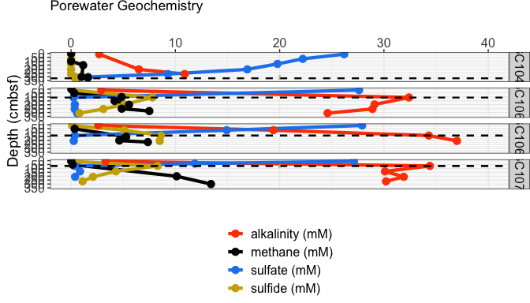
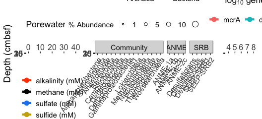
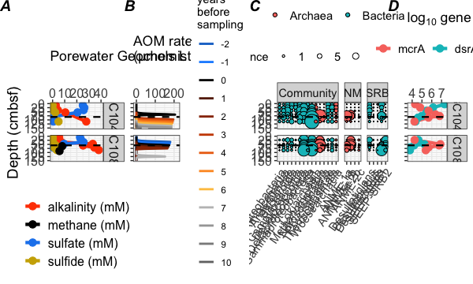
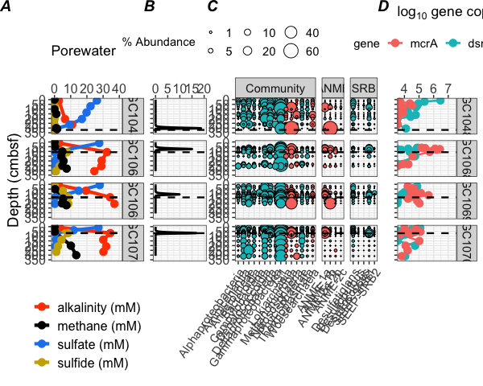

core\_info\_and\_panel\_figures\_8.20
================
Scott Klasek
8/26/2020

## load necessary libraries

``` r
library(tidyverse)
```

    ## ── Attaching packages ───────────────────────────────────────────────────────────────────────────────────────────────────────────────────────────── tidyverse 1.3.0 ──

    ## ✓ ggplot2 3.3.2     ✓ purrr   0.3.3
    ## ✓ tibble  2.1.3     ✓ dplyr   0.8.4
    ## ✓ tidyr   1.0.2     ✓ stringr 1.4.0
    ## ✓ readr   1.3.1     ✓ forcats 0.4.0

    ## Warning: package 'ggplot2' was built under R version 3.6.2

    ## ── Conflicts ──────────────────────────────────────────────────────────────────────────────────────────────────────────────────────────────── tidyverse_conflicts() ──
    ## x dplyr::filter() masks stats::filter()
    ## x dplyr::lag()    masks stats::lag()

``` r
library(phyloseq)
library(png)
library(grid)
library(RCurl)
```

    ## 
    ## Attaching package: 'RCurl'

    ## The following object is masked from 'package:tidyr':
    ## 
    ##     complete

``` r
library(egg)
```

    ## Loading required package: gridExtra

    ## 
    ## Attaching package: 'gridExtra'

    ## The following object is masked from 'package:dplyr':
    ## 
    ##     combine

``` r
library(here)
```

    ## here() starts at /Users/scottklasek/Desktop/svalflux

``` r
sessioninfo <- sessionInfo()
```

## import and graph porewater data

``` r
# import the porewater data
porewater <- read.csv(file="porewater.csv")

# subset by core flowtype 
pore.1029 <- subset(porewater, porewater$stage=="seep") 
pore.fi <- subset(porewater, porewater$stage=="inc") 
pore.ss <- subset(porewater, porewater$stage=="ss")

# seep site
ggp.1029 <- ggplot(pore.1029,aes(depth,value,color=species))
hydrate <- readPNG("figures/hydrates_symbol.png") # import hydrate symbol
hydrateg <- rasterGrob(hydrate, interpolate=TRUE) # raster-grob the hydrate symbol
worms <- readPNG("figures/pingo_tubeworms.png") # import tubeworm symbol
wormsg <- rasterGrob(worms, interpolate=TRUE) # raster-grob the tubeworm symbol
gg.porewater.1029 <- ggp.1029+geom_line(size=1.5)+
  geom_point(size=3)+
  coord_flip()+
  ggtitle("Porewater Geochemistry")+
  scale_y_continuous("",limits = c(0,40),position = "right")+
  scale_x_reverse("Depth (cmbsf)",breaks=c(0,5,10,15,20,25,30,35),limits=c(35,0))+
  scale_color_manual("",values=c("orangered1","black","dodgerblue2","gold3"),guide=guide_legend())+
  annotation_custom(hydrateg, xmin = -37, xmax = -27, ymin = 0, ymax = 15)+
  annotation_custom(wormsg, xmin = -11, xmax = Inf, ymin = 13, ymax = 25)+
  theme_bw()+
  theme(legend.position = "bottom", legend.direction = "vertical",axis.text=element_text(size=12),legend.text=element_text(size=11),axis.title=element_text(size=14))

# non-steady-state
ggp.fi <- ggplot(pore.fi,aes(depth,value,color=species))
gg.porewater.nss <- ggp.fi+geom_line(size=1.5)+
  geom_point(size=3)+
  geom_vline(aes(xintercept=smt),linetype="dashed",size=0.8)+
  coord_flip()+
  facet_grid(core~.)+
  scale_y_continuous("",limits = c(0,40),position = "right")+
  scale_x_reverse("Depth (cmbsf)",breaks=c(0,25,50,75,100,125,150),limits=c(150,0))+
  scale_color_manual("",values=c("orangered1","black","dodgerblue2","gold3"))+
  labs(title="Porewater Geochemistry")+
  theme_bw()+
  theme(axis.text=element_text(size=12),strip.text.y = element_text(size=12),title=element_text(size=11),axis.title=element_text(size=14),legend.text = element_text(size=12),legend.title = element_text(size=12),legend.direction = "vertical",legend.position = "bottom",plot.margin=margin(0,0,0,0.25,"cm"))

# steady-state
biofilm <- readPNG("figures/biofilm_symbol.png") # import biofilm symbol
# we need to insert biofilms into certain facets (but not others) because we didn't find biofilms in every core. 
# the function below is from here: https://stackoverflow.com/questions/44688623/adding-custom-images-to-ggplot-facets 
annotation_custom2 <- 
function (grob, xmin = -Inf, xmax = Inf, ymin = -Inf, ymax = Inf, data){ layer(data = data, stat = StatIdentity, position = PositionIdentity, 
        geom = ggplot2:::GeomCustomAnn,
        inherit.aes = TRUE, params = list(grob = grob, 
                                          xmin = xmin, xmax = xmax, 
                                          ymin = ymin, ymax = ymax))}
# create the facet-specific biofilm annotations:
biofilm1070 <- annotation_custom2(rasterGrob(biofilm, interpolate=TRUE), xmin=-105, xmax=-25, ymin=10, ymax=30, data=pore.ss[1,])
biofilm1048 <- annotation_custom2(rasterGrob(biofilm, interpolate=TRUE), xmin=-350, xmax=-270, ymin=10, ymax=30, data=pore.ss[78,])

ggp.ss <- ggplot(pore.ss,aes(depth,value,color=species))
gg.porewater.ss <- ggp.ss+geom_line(size=1.5)+
  geom_point(size=3)+
  geom_vline(aes(xintercept=smt),linetype="dashed",size=0.8)+
  coord_flip()+
  facet_grid(core~.)+
  scale_y_continuous("",limits = c(0,40),position = "right")+
  scale_x_reverse("Depth (cmbsf)",breaks=c(0,50,100,150,200,250,300,350),limits=c(350,0))+
  scale_color_manual("",values=c("orangered1","black","dodgerblue2","gold3"))+
  labs(title="Porewater Geochemistry")+
  theme_bw()+
  theme(axis.text=element_text(size=12),strip.text.y = element_text(size=12),title=element_text(size=11),axis.title=element_text(size=14),legend.text = element_text(size=12),legend.title = element_text(size=12),legend.direction = "vertical",legend.position = "bottom",plot.margin=margin(0,0,0,0.25,"cm"))
gg.porewater.ss <- gg.porewater.ss + biofilm1070 + biofilm1048
gg.porewater.ss
```

<!-- -->

## import and graph aom rate data

``` r
aomrates <- read.csv(file="~/Desktop/svalflux/aomrates2020update.csv") # import rate data

# subset by methane flux condition
aomrates.inc <- subset(aomrates, aomrates$core=="GC1045"|aomrates$core=="GC1081")
aomrates.ss <- subset(aomrates, aomrates$core=="GC1068"|aomrates$core=="GC1069"|aomrates$core=="GC1070"|aomrates$core=="GC1048")
aomrates.seep <- subset(aomrates, aomrates$core=="PC1029")

# graph seep rates
aom1029 <- ggplot(aomrates.seep, aes(depth,aom))
raom1029 <- aom1029+geom_line(size=1.5)+
  coord_flip()+
  scale_y_continuous("",position="right", breaks=c(0,2000,4000,6000,8000))+
  scale_x_reverse("",breaks=c(0,5,10,15,20,25,30,35),limits=c(35,0))+
  labs(title=expression("AOM rate (µmols L"^{-1}*" day"^{-1}*")"))+
  theme_bw()+
  theme(axis.text=element_text(size=12),legend.text=element_text(size=11),axis.title=element_text(size=14))

# graph non-steady-state rates 
aomrates.inc$yrsbp <- factor(aomrates.inc$yrsbp,levels=c(-2,-1,0,1,2,3,4,5,6,7,8,9,10)) 
aom.nss <- ggplot(aomrates.inc,aes(depth,aom,color=yrsbp))
raom.nss <- aom.nss+geom_line(size=1)+
  scale_color_manual("years \nbefore \nsampling",values=c("dodgerblue3","dodgerblue1","black","#662506","#993404","#cc4c02","#ec7014","#fe9929","#fec44f","grey75","grey65","grey55","grey45"))+
  geom_vline(aes(xintercept=smt),linetype="dashed",size=0.8)+
  coord_flip()+
  facet_grid(core~.)+
  labs(title=expression("AOM rate\n(µmols L"^{-1}*" day"^{-1}*")"))+
  scale_y_continuous("",breaks=c(0,100,200),limits = c(-5,220),position = "right")+
  scale_x_reverse("",breaks=c(0,25,50,75,100,125,150),limits=c(150,0))+
  theme_bw()+
  theme(axis.text=element_text(size=12),strip.text.y = element_blank(),strip.background = element_blank(),axis.text.y=element_blank(),title=element_text(size=11),plot.margin=margin(1,0,0,-0.25,"cm"))

# graph steady-state rates
aom.ss <- ggplot(aomrates.ss, aes(depth,aom))
raom.ss <- aom.ss+geom_line(size=1)+
  geom_vline(aes(xintercept=smt),linetype="dashed",size=0.8)+
  coord_flip()+
  facet_grid(core~.)+
  scale_y_continuous("",limits = c(0,20),position = "right")+
  scale_x_reverse("",breaks=c(0,50,100,150,200,250,300,350),limits=c(350,0))+
  theme_bw()+
  labs(title=expression("AOM rate \n(µmols L"^{-1}*" day"^{-1}*")"))+
  theme(axis.text=element_text(size=12),strip.text.y = element_blank(),strip.background = element_blank(),axis.text.y=element_blank(),title=element_text(size=11),plot.margin=margin(1,0,0,-0.25,"cm"))
```

## import bubble plots

``` r
bp.seep <- readRDS(file = "figures/bp.seep") 
bp.fluxincreasing <- readRDS(file = "figures/bp.fluxincreasing") 
bp.steadystate <- readRDS(file = "figures/bp.steadystate") 
```

## import phyloseq object

ps.frdp from sequence\_processing Rmd script

``` r
ps.frdp <- readRDS(file="ps.frdp") # imports the final phyloseq object
```

## graph ddpcr data (already in phyloseq object)

``` r
# first make a dataframe with gene counts in long format
core <- rep(sample_data(ps.frdp)$core, times=2) # repeat core data for each gene
depth <- rep(sample_data(ps.frdp)$depth, times=2) # repeat depth 
smt <- rep(sample_data(ps.frdp)$smt, times=2) # repeat smt
genecount <- c(sample_data(ps.frdp)$dsrab, sample_data(ps.frdp)$mcra) # combine gene counts into one vector, mcra first
gene <- c(rep("dsrAB", each=76), rep("mcrA", each=76)) # create vector with type of gene being counted
gene <- factor(gene, levels = c("mcrA", "dsrAB"))
stage <- rep(sample_data(ps.frdp)$stage, times=2) # repeat stage
ddpcr.all <- data.frame(core, depth, smt, stage, genecount, gene) # make data frame
ddpcr.all$logcopies <- log10(ddpcr.all$genecount) # transform gene counts to log

# subset by stage of methane flux
dd.pcr.fi <- subset(ddpcr.all, ddpcr.all$stage=="fluxincreasing")
dd.pcr.ss <- subset(ddpcr.all, ddpcr.all$stage=="steadystate")
dd.pcr.seep <- subset(ddpcr.all, ddpcr.all$stage=="seep")
dd.pcr.seep <- dd.pcr.seep %>% drop_na(genecount) # omit NA gene counts

# seep ddPCR plot
dd1029 <- ggplot(dd.pcr.seep, aes(depth, logcopies, color=gene))
dd.seep <- dd1029+geom_line(size=1.5)+
  geom_point(size=3)+
  coord_flip()+
  scale_y_continuous("",breaks=c(4,5,6,7,8),limits = c(3.7,8.5),position="right")+
  scale_x_reverse("",breaks=c(0,5,10,15,20,25,30,35),limits=c(35,0))+
  scale_color_discrete("")+
  theme_bw()+
  labs(title=expression(paste("log"[10]," gene copies")))+
  theme(legend.position = "top",axis.text.x=element_text(size=12),
        legend.text=element_text(size=11),axis.title=element_text(size=8),
        axis.text.y=element_blank())

# non-steady-state ddPCR plot
ddfi<- ggplot(dd.pcr.fi, aes(depth, logcopies, color=gene))
dd.fi <- ddfi+geom_line(size=1.5)+
  geom_point(size=3)+
  coord_flip()+
  scale_y_continuous("", breaks=c(4,5,6,7), limits = c(3.7,7.4), position="right")+
  scale_x_reverse("", breaks=c(0,25,50,75,100,125,150), limits=c(150,0))+
  scale_color_discrete("")+
  geom_vline(aes(xintercept=smt),linetype="dashed",size=0.8)+
  facet_grid(core~.)+
  theme_bw()+
  labs(title=expression(paste("log"[10]," gene copies")))+
  theme(legend.position = "top",axis.text=element_text(size=12),legend.text=element_text(size=11),
        axis.title=element_text(size=8),axis.text.y=element_blank(), strip.text = element_text(size = 11))

# steady-state ddPCR plot
dd.pcr.ss <- dd.pcr.ss %>% drop_na(genecount) # omit NA gene counts (leaving in counts below detection)

ddss<- ggplot(dd.pcr.ss, aes(depth, logcopies, color=gene))
dd.ss <- ddss+geom_line(size=0.9)+
  geom_point(size=3)+
  coord_flip()+
  scale_y_continuous("", breaks=c(4,5,6,7), limits = c(3.7,7.4), position="right")+
  scale_x_reverse("", breaks=c(0,50,100,150,200,250,300,350), limits=c(350,0))+
  geom_vline(aes(xintercept=smt), linetype="dashed",size=0.8)+
  facet_grid(core~.)+
  theme_bw()+
  labs(title=expression(paste("log"[10]," gene copies")))+
  theme(legend.position = "top",axis.text=element_text(size=12),legend.text=element_text(size=11),
        axis.title=element_text(size=8),axis.text.y=element_blank(), strip.text = element_text(size = 11))
```

## create and export panel figures

``` r
# Figure 2 (Seep)
fig1029 <- ggarrange(gg.porewater.1029, bp.seep, dd.seep, widths=c(1.1,2.5,0.7),ncol = 3,nrow = 1,labels=c("A","B","C"))
```

<!-- -->

``` r
fig1029
```

<!-- -->

``` r
fig1029 <- saveRDS(fig1029, "figures/figure2") # export
```

``` r
# Figure 3 (Non-steady-state sites)
fig.nss <- ggarrange(gg.porewater.nss, raom.nss, bp.fluxincreasing, dd.fi, ncol = 4, nrow = 1,
  widths = c(2.4,2.1,5,1.8),labels=c("A","B","C","D"))
```

    ## Warning: Removed 62 row(s) containing missing values (geom_path).

<!-- -->

``` r
fig.nss
```

<!-- -->

``` r
fig.nss <- saveRDS(fig.nss, "figures/figure3") # export
```

``` r
# Figure 4 (Steady-state sites)
fig.ss <- ggarrange(gg.porewater.ss, raom.ss, bp.steadystate, dd.ss,
                        ncol = 4, nrow = 1,widths = c(2.4,1.8,4.8,2),labels=c("A","B","C","D"))
```

    ## Warning: Removed 1 row(s) containing missing values (geom_path).

    ## Warning: Removed 4 rows containing missing values (geom_point).

<!-- -->

``` r
fig.ss
```

<!-- -->

``` r
fig.ss <- saveRDS(fig.ss, "figures/figure4") # export
```
