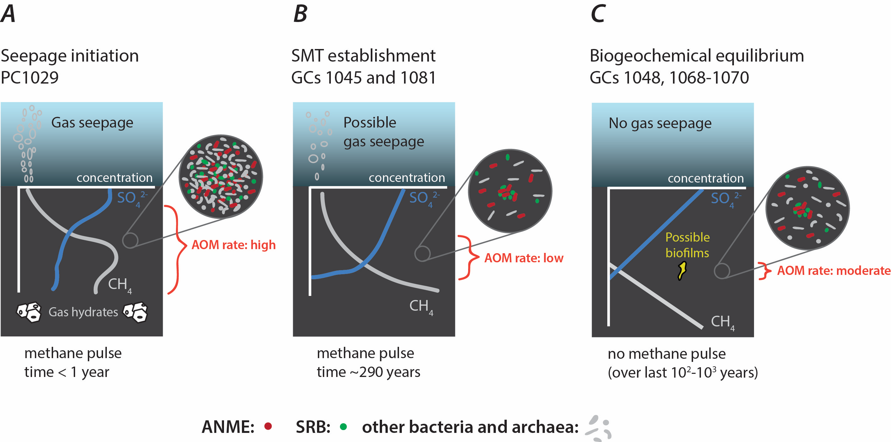

```{r, echo=FALSE}
# this chunk imports figures that have been exported from other documents into /figures
figure2 <- readRDS(file = "figures/figure2") 
figure3 <- readRDS(file = "figures/figure3") 
figure4 <- readRDS(file = "figures/figure4") 
figure5 <- readRDS(file = "figures/figure5") # biomarkers
figure6 <- readRDS(file = "figures/figure6") # alpha diversity 
ord1.p.stage <- readRDS(file = "figures/ord1.p.stage") # figure 7A ordination
ord1.p.zone <- readRDS(file = "figures/ord1.p.zone") # figure 7B ordination

figureS1flux <- readRDS(file = "figures/figureS1flux")
figureS3ratemcrAplot <- readRDS(file = "figures/figureS3ratemcrAplot")
figureS3ssjust <- readRDS(file = "figures/figureS3ssjust")

coreinfo <- readRDS(file = "figures/coreinfo")
inc.core <- readRDS(file = "figures/inc.core")
```

## Data repository

I've uploaded this data to my Github page. This repository is private, but (fingers crossed) upon publication, I can set it to public so that anyone who wants to reproduce this work or make similar figures can look at the code, import the data, and easily do so. 

## The map is unchanged:

![Figure 1. Bathymetric map of Storfjordrenna gas hydrate mounds and modeling approach. (A) Storfjordrenna is located south of the Svalbard Archipelago. Locations of cores and gas hydrate mounds (GHMs) are shown. White polygons indicate areas of seafloor gas release observed at the time of the cruise. All cores were collected from GHMs, with the exception of the reference core GC1048, which was sampled 400 m west of GHM5. The schematic in (B) depicts sulfate and methane concentrations throughout a sediment column at a steady-state condition. As methane flux increases, (C), SR-AOM is stimulated at shallower depths and sulfate profiles show a concave-up curvature. After decades of steadily increasing methane flux at a particular area, (D), diffusion modeling can be used to estimate how quickly the methane front traveled the distance between the current and prior sulfate depletion depths (indicated by the orange bracket).](figures/F1.png)

## Panel figures

Porewater, microbial community, and gene count data from the seep site (core PC1029). AOM rate data has been removed.   

```{r echo=FALSE, fig.width=9, fig.height=5, fig.align="center"}
grid::grid.draw(figure2)
```

Figure 2. Geochemical, numerical, microbial community, and gene abundance data from an active seep site. Push core PC1029 is located at the seep in the center of GHM3. (A) shows porewater sulfate, sulfide, and alkalinity, and (B) present-day modeled AOM rates. (C) depicts percent abundances of dominant bacterial and archaeal classes within the microbial community (left panel), dominant anaerobic methanotrophic archaeal (ANME) families (center panel) and sulfate-reducing bacterial (SRB) genera (right panel). (D) shows copy numbers of mcrA and dsrAB genes per gram bulk sediment, with values below the detectable limit (10^3 g-1) indicated by X’s. Gas hydrate nodules several cm in diameter (A) were recovered in a replicate core at 40-50 cm below seafloor.

And from cores where methane flux is increasing (GC1045 and GC1081):

```{r echo=FALSE, fig.width=13, fig.height=6, fig.align="center"}
grid::grid.draw(figure3)
```


Figure 3. Geochemical, numerical, microbial community, and gene abundance data from two sites showing non-steady-state sulfate-methane dynamics. Gravity cores GC1045 and GC1081 are located at GHMs 3 and 4, respectively. Sulfate-methane transition depths are indicated by dashed lines. (A) shows porewater sulfate, sulfide, and alkalinity, and (B) the temporal progression of modeled AOM rates from 10 years ago to up to 2 years into the future. (C) indicates percent abundances of dominant bacterial and archaeal classes, dominant anaerobic methanotrophic archaeal (ANME) familes, and sulfate-reducing bacterial (SRB) genera. (D) shows copy numbers of mcrA and dsrAB genes per gram bulk sediment.

And from four steady-state cores:

```{r echo=FALSE, fig.width=11.5, fig.height=10, fig.align="center"}
grid::grid.draw(figure4)
```

Figure 4. Geochemical, numerical, microbial community, and gene abundance data from four sites showing steady-state sulfate-methane dynamics. GC1068–1070 are from GHM5, and reference core GC1048 is located to the west of GHM5. Sulfate-methane transition depths are indicated by dashed lines. (A) shows porewater sulfate, sulfide, and alkalinity, and (B) present-day modeled AOM rates. (C) indicates percent abundances of dominant bacterial and archaeal classes, dominant anaerobic methanotrophic archaeal (ANME) familes, and sulfate-reducing bacterial (SRB) genera.(D) shows copy numbers of mcrA and dsrAB genes per gram bulk sediment, with values below the detectable limit (103 g-1) indicated by X’s. Macroscopic translucent-to-yellow biofilms, shown as yellow symbols in panel (A), were observed at SMT depths in two cores (symbol size not to scale with depth axis).

## Differentially abundant ASVs across zones and methane flux types:

This plot shows differentially abundant ASVs, replacing the old figure S2. Each point represents an ASV whose relative abundance is different between communities in cores of different methane stages (more abundant in one stage as compared to the other two combined). These stages are further subset into above-SMT and below-SMT communities and facetted into taxonomic Families (for ANMEs), Genera (for Deltaproteobacteria), or classes (for all others). NAs at each taxonomic category of plotting were omitted from this graph. Note there were no samples taken below SMTZ at the seep.   

As before, we still observe ASV-scale niche differences among ANME and SRB subpopulations, but this plot allows us to see a few other things: 
1) ASVs associated with seepage are often dominant within communities, and include JS1 Atribacteria, several Gammaproteobacteria and Campylobacteria, and many genera of Deltaproteobacteria   
2) Calditrichia may be associated with recent upwards methane migration   
3) Many ASVs of Aminicenantia and Dehalococcoidia are indicative of steady-state sulfate reduction zones   
4) Far fewer biomarkers distinguish stages below the SMTZ (and none are unique to below-SMTZ) but Lokiarchaea may be one key taxon associated with steady-state methanogenic zones.   

```{r, fig.height=6.5, fig.width=8, echo=FALSE, fig.align="center"}
figure5
```

Update this figure legend below!
Figure 5. Differentially abundant ASVs between sites where methane flux is increasing (non-steady-state) and sites at geochemical steady-state, facetted horizontally on the right by communities from above (A) or below (B) the sulfate-methane transition zone. Alpha=0.01, with a Benjamini-Hochberg correction for multiple comparisons. Panel (A) shows ASVs colored by Class, with Methanomicrobia and Deltaproteobacteria shown in further detail in panels (B) and (C) and colored by Order and Family, respectively.

### Alpha-diversity (diversity within communities)

This figure is essentially the same, but I'm wondering if it's fair to include PC1029 samples in A if we can't really estimate a peak AOM rate... Think about this  some more.   
```{r, echo=FALSE,  fig.width=6, fig.height=5, fig.align="center"}
grid::grid.draw(figure6) 
```

Update this figure legend below.  
Figure 6. Microbial community diversity patterns across peak modeled AOM depths. Shannon diversity indices of microbial communities for individual samples plotted by their distance above (positive) or below (negative) the depths corresponding to present-day maximum AOM rates across all cores. Cores are divided by panel based on whether sulfate-methane dynamics are (A) non-steady-state, or (B) at steady-state. Dotted horizontal lines show the distance interval corresponding to samples from non-steady-state cores. Multiple R2 and slope p-values are shown for linear regressions of points within these intervals. These analyses suggest microbial community diversity correlates better with the peak AOM depth in non-steady-state cores than in the others.


### Beta-diversity (diversity between communities)

The two most helpful categories that explain the most of the variance within these microbial communities are methane stage and redox zone. There is a significant interaction among them too.   

```{r, echo=FALSE, fig.width=6, fig.height=4.5, fig.align="center"}
library(patchwork)
ord1.p.stage + ord1.p.zone
```

Update this figure legend below.  

Figure 7. Nonmetric Multidimensional Scaling (NMDS) ordination of unweighted Unifrac distances between all communities. Distances were calculated based on a variance-stabilizing log transformation with negative values removed. Pairwise t-tests verify that community structure is distinct among all redox zones. This remains true even when separating communities from steady-state and non-steady-state sites, and when comparing analogous redox zones between steady-state and non-steady-state sites (will discuss this more in the text).


### Conceptual figure still needs some slight modifications:
Just to show we're not insinuating a successional progression.



Figure 8. Conceptual depiction of microbial community changes concurrent with evolving methane supply at Storfjordrenna GHMs. Methane and sulfate profiles are shown in gray and blue lines, respectively, with microbial community changes indicated by blowup circles. ANME and SRB represent red and green circles, with all other bacteria and archaea in gray (cell shapes represent diversity of other taxa). (A) Gas hydrates at the upper limit of stability dissociate and aqueous methane diffuses upwards, stimulating AOM and drawing down sulfate while some of the methane escapes as bubbles of free gas. (B) Once sulfate drops below 1 mM, microbial diversity, rates of AOM, and the thickness of the AOM zone decrease. Non-steady-state conditions are still observed in sulfate-methane dynamics. (C) By the time a steady-state sulfate profile is reached, methane flux is no longer increasing. Gas seepage has stopped, microbial diversity rebounds, and the AOM zone is constrained to a thinner depth, but peak AOM rates are higher and can support the growth of macroscopic biofilms.


### Supplemental Figures

Still need to redo the text for all these...    

```{r, echo=FALSE}
figureS1flux
```
Figure S1. Present-day upwards methane flux integrated from modeled AOM rates at all cores. Because sulfate did not drop to 0 mM in PC1029, the amount shown here represents a lower boundary.

```{r, echo=FALSE}
figureS3ratemcrAplot
```

Figure S2. Regression of mcrA gene copy numbers (per gram bulk sediment) to modeled AOM rates shows a linear relationship across samples from all cores (log-log transformation). Samples that did not contain detectable mcrA were not included. 

```{r, echo=FALSE}
figureS3ssjust
```

Figure S3. Empirically-measured sulfate porewater profiles from cores taken from steady-state areas, shown with modeled sulfate profiles assuming a non-steady state scenario where methane flux is increasing. The discrepancies in the shapes of these two profiles for these four cores is evidence that they are not experiencing a recent increase in methane flux, and are thus characterized as steady-state.

### Supplemental Tables

These are also unchanged.

```{r, echo=FALSE}
coreinfo
```

Table S1. Latitude, longitude, water depth, core recovery, and sulfate-methane transition depth of all cores analyzed in this study.


```{r, echo=FALSE}
inc.core
```

Table S2. Increases in methane flux over the past two decades for cores GC1045 and GC1081 and corresponding depths of modeled peak AOM rates. Fluxes are integrated from AOM rate data, using cell widths of 2.5 cm. (Peak AOM depths also at 2.5 cm resolution).