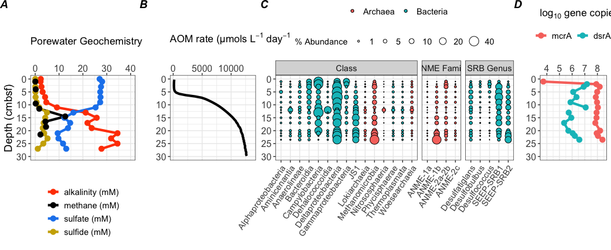
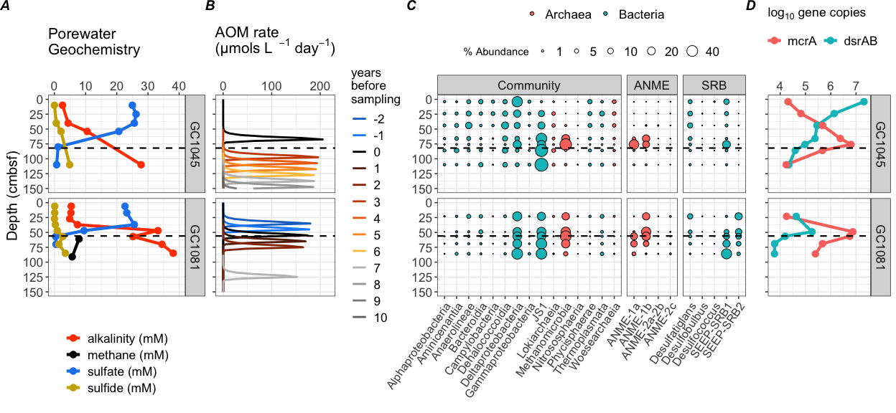
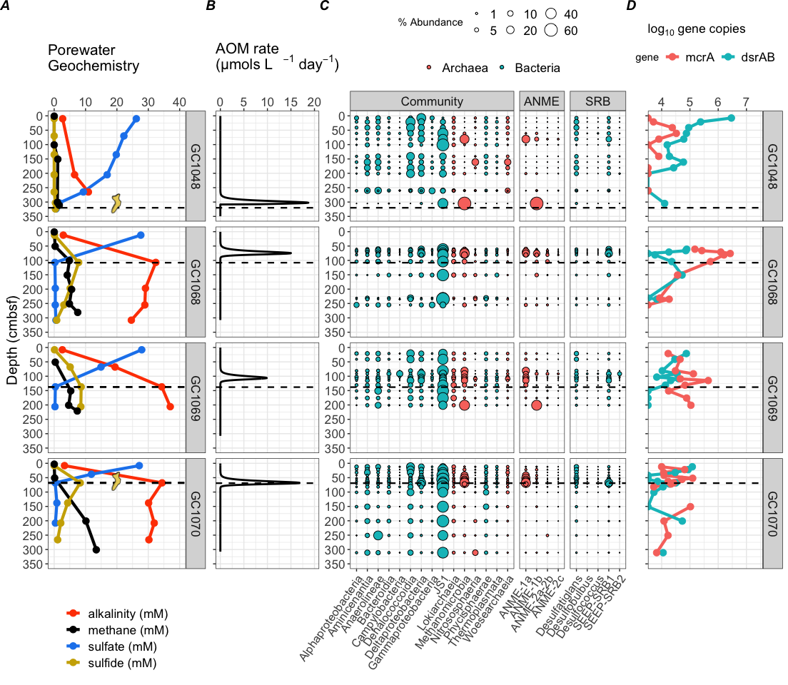
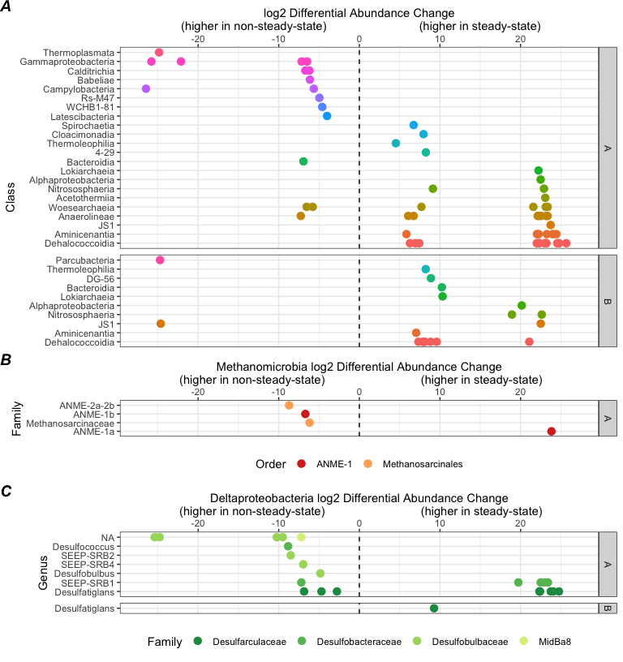
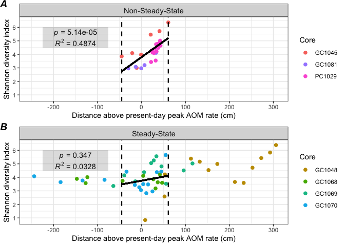
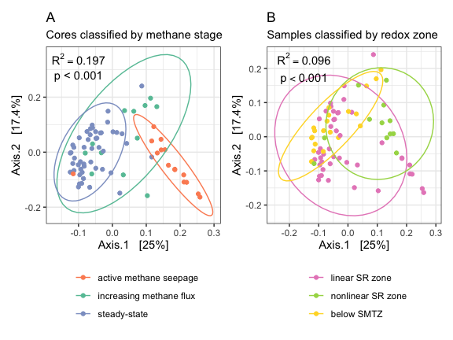
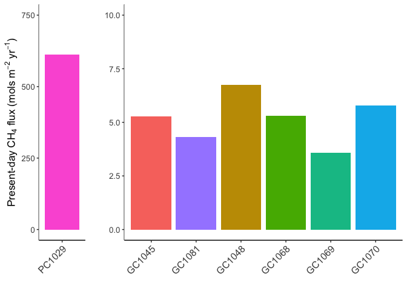
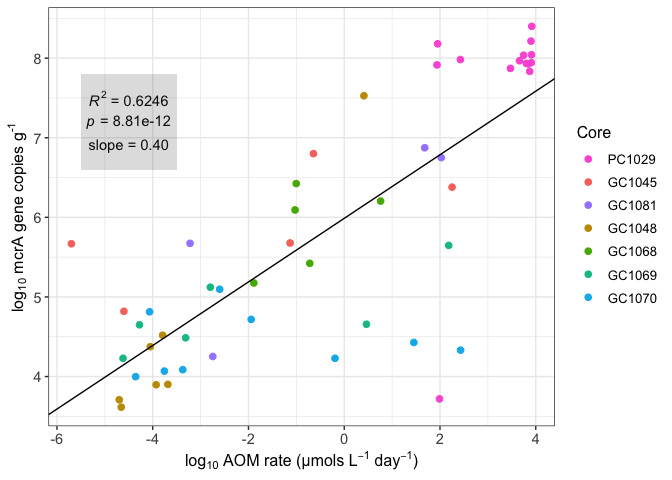
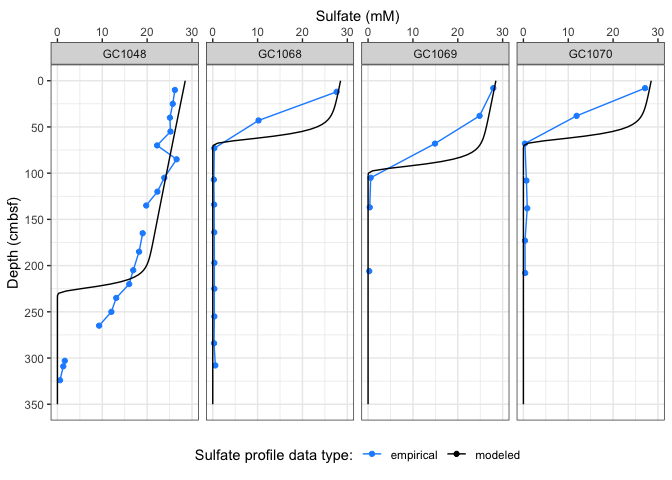

Storfjordrenna Manuscript – Updated Figures
================
Scott Klasek
2-17-20

### Update

It’s been a while, and lately I’ve been working in R to create
reproducible data analyses. I’ve also uploaded this data to my Github
page. This repository is private, but (fingers crossed) upon
publication, I can set it to public so that anyone who wants to
reproduce this work or make similar figures can look at the code, import
the data, and easily do so. (Does this sound good?)

Besides this, the only difference in the data is that I’ve used a
[different algorithm,
dada2](https://www.nature.com/articles/nmeth.3869), to infer microbial
“species”. Instead of OTUs (Operational Taxonomic Units) that
represent somewhat arbitrary clusterings of sequences that are 97%
similar to one another, these ASVs (Amplicon Sequence Variants) are
exact sequence variants whose errors during sequencing have been
identified and corrected using a machine-learning denoising algorithm.
This has an impact on the number of unique sequences I end up with:
originally I got 24,000 OTUs, but after reprocessing the data, I now end
up with 16,000 ASVs. However it doesn’t really change the big picture
much.

Soon I’ll send out a google drive link where we can all edit the most
recent version of the manuscript. I remember we discussed having a
separate text section for the supplementals where a lot of the model
assumptions and justifications could be explained in adequate detail.

(As a side note, I discovered Zotero integrates with Google docs now.
You can even import Word docs with Zotero citations into Google docs and
they will convert usually without much hassle. Personally, now I don’t
see any reason to use Word anymore).

Anyway, here is the latest version of all the figures:

### The map is unchanged:

![Figure 1. Bathymetric map of Storfjordrenna gas hydrate mounds and
modeling approach. (A) Storfjordrenna is located south of the Svalbard
Archipelago. Locations of cores and gas hydrate mounds (GHMs) are shown.
White polygons indicate areas of seafloor gas release observed at the
time of the cruise. All cores were collected from GHMs, with the
exception of the reference core GC1048, which was sampled 400 m west of
GHM5. The schematic in (B) depicts sulfate and methane concentrations
throughout a sediment column at a steady-state condition. As methane
flux increases, (C), SR-AOM is stimulated at shallower depths and
sulfate profiles show a concave-up curvature. After decades of steadily
increasing methane flux at a particular area, (D), diffusion modeling
can be used to estimate how quickly the methane front traveled the
distance between the current and prior sulfate depletion depths
(indicated by the orange bracket).](figures/F1.png)

### Panel figures

The only change I’ve made is that I’ve subset ANME and SRB as their own
panels in the bubble plots, because their taxonomic categories are
different.

Here’s the porewater, modeled rate, microbial community, and gene count
data from the seep (core
PC1029):

Figure 2. Geochemical, numerical, microbial community, and gene
abundance data from an active seep site. Push core PC1029 is located at
the seep in the center of GHM3. (A) shows porewater sulfate, sulfide,
and alkalinity, and (B) present-day modeled AOM rates. (C) depicts
percent abundances of dominant bacterial and archaeal classes within the
microbial community (left panel), dominant anaerobic methanotrophic
archaeal (ANME) families (center panel) and sulfate-reducing bacterial
(SRB) genera (right panel). (D) shows copy numbers of mcrA and dsrAB
genes per gram bulk sediment, with values below the detectable limit
(10^3 g-1) indicated by X’s. Gas hydrate nodules several cm in diameter
(A) were recovered in a replicate core at 40-50 cm below seafloor.

And from cores where methane flux is increasing (GC1045 and
GC1081):

Figure 3. Geochemical, numerical, microbial community, and gene
abundance data from two sites showing non-steady-state sulfate-methane
dynamics. Gravity cores GC1045 and GC1081 are located at GHMs 3 and 4,
respectively. Sulfate-methane transition depths are indicated by dashed
lines. (A) shows porewater sulfate, sulfide, and alkalinity, and (B) the
temporal progression of modeled AOM rates from 10 years ago to up to 2
years into the future. (C) indicates percent abundances of dominant
bacterial and archaeal classes, dominant anaerobic methanotrophic
archaeal (ANME) familes, and sulfate-reducing bacterial (SRB) genera.
(D) shows copy numbers of mcrA and dsrAB genes per gram bulk sediment.

And from four steady-state
cores:

Figure 4. Geochemical, numerical, microbial community, and gene
abundance data from four sites showing steady-state sulfate-methane
dynamics. GC1068–1070 are from GHM5, and reference core GC1048 is
located to the west of GHM5. Sulfate-methane transition depths are
indicated by dashed lines. (A) shows porewater sulfate, sulfide, and
alkalinity, and (B) present-day modeled AOM rates. (C) indicates percent
abundances of dominant bacterial and archaeal classes, dominant
anaerobic methanotrophic archaeal (ANME) familes, and sulfate-reducing
bacterial (SRB) genera.(D) shows copy numbers of mcrA and dsrAB genes
per gram bulk sediment, with values below the detectable limit (103 g-1)
indicated by X’s. Macroscopic translucent-to-yellow biofilms, shown as
yellow symbols in panel (A), were observed at SMT depths in two cores
(symbol size not to scale with depth axis).

### Differentially abundant ASVs across zones and methane flux types:

This plot shows differentially abundant ASVs, replacing the old figure
S2. Each point represents a highly-abundant ASV (one of the top 1000 in
the dataset) whose relative abundance is different between steady-state
or non-steady-state communities. This is further subset into above-SMT
and below-SMT communities (A and B vertical panels). I see similar
patterns as in the previous figure S2. But interestingly, the ANME-1a on
the right side of panel B is not actually one of the two major ANME-1a
ASVs in the dataset– those two are not differentially abundant. So this
might hint at ASV-scale niche differences in this subpopulation that
would otherwise be undetected with OTUs.

<!-- -->

Figure 5. Common ASVs (the top 1000 in this dataset) that are
differentially abundant between sites where methane flux is increasing
(non-steady-state) and sites at geochemical steady-state, facetted
horizontally on the right by communities from above (A) or below (B) the
sulfate-methane transition zone. Alpha=0.01, with a Benjamini-Hochberg
correction for multiple comparisons. Panel (A) shows ASVs colored by
Class, with Methanomicrobia and Deltaproteobacteria shown in further
detail in panels (B) and (C) and colored by Order and Family,
respectively.

### Alpha-diversity (diversity within communities)

Even though community richness has changed because of processing ASVs
instead of OTUs, the alpha-diversity patterns (factoring in evenness)
are unchanged. Communities from non-steady-state sites show decreasing
alpha diversity across the peak AOM rate, whereas steady-state
communities are unchanged.
<!-- -->

Figure 6. Microbial community diversity patterns across peak modeled AOM
depths. Shannon diversity indices of microbial communities for
individual samples plotted by their distance above (positive) or below
(negative) the depths corresponding to present-day maximum AOM rates
across all cores. Cores are divided by panel based on whether
sulfate-methane dynamics are (A) non-steady-state, or (B) at
steady-state. Dotted horizontal lines show the distance interval
corresponding to samples from non-steady-state cores. Multiple R2 and
slope p-values are shown for linear regressions of points within these
intervals. These analyses suggest microbial community diversity
correlates better with the peak AOM depth in non-steady-state cores than
in the others.

### Beta-diversity (diversity between communities)

I didn’t get any ordinations to work on this dataset before, but I’ve
tried several on the recent dataset using several combinations of
transformations, distance metrics, and ordinations. NMDS with unweighted
Unifrac works well here. Pairwise comparisons between all core types
(steady-state or non-steady-state) and redox zones shows that every
community category is different. (This is not what I found earlier,
where below-SMT communities were not different between non-steady-state
and steady-state sites… and nonlinear SR zone communities were not
different from below-SMT ones in non-steady-state sites). This
ordination below (and mentioning a few t-tests in the text) will replace
the old Figure 6.

<!-- -->

Figure 7. Nonmetric Multidimensional Scaling (NMDS) ordination of
unweighted Unifrac distances between all communities. Distances were
calculated based on a variance-stabilizing log transformation with
negative values removed. Pairwise t-tests verify that community
structure is distinct among all redox zones. This remains true even when
separating communities from steady-state and non-steady-state sites, and
when comparing analogous redox zones between steady-state and
non-steady-state sites (will discuss this more in the text).

### Conceptual figure is unchanged:

Figure 8. Conceptual depiction of microbial community changes concurrent
with evolving methane supply at Storfjordrenna GHMs. Methane and sulfate
profiles are shown in gray and blue lines, respectively, with microbial
community changes indicated by blowup circles. ANME and SRB represent
red and green circles, with all other bacteria and archaea in gray (cell
shapes represent diversity of other taxa). (A) Gas hydrates at the upper
limit of stability dissociate and aqueous methane diffuses upwards,
stimulating AOM and drawing down sulfate while some of the methane
escapes as bubbles of free gas. (B) Once sulfate drops below 1 mM,
microbial diversity, rates of AOM, and the thickness of the AOM zone
decrease. Non-steady-state conditions are still observed in
sulfate-methane dynamics. (C) By the time a steady-state sulfate profile
is reached, methane flux is no longer increasing. Gas seepage has
stopped, microbial diversity rebounds, and the AOM zone is constrained
to a thinner depth, but peak AOM rates are higher and can support the
growth of macroscopic biofilms.

### Supplemental Figures

These remain unchanged.

<!-- -->
Figure S1. Present-day upwards methane flux integrated from modeled AOM
rates at all cores. Because sulfate did not drop to 0 mM in PC1029, the
amount shown here represents a lower boundary.

<!-- -->

Figure S2. Regression of mcrA gene copy numbers (per gram bulk sediment)
to modeled AOM rates shows a linear relationship across samples from all
cores (log-log transformation). Samples that did not contain detectable
mcrA were not included.

    ## Warning: Removed 5 rows containing missing values (geom_point).

<!-- -->

Figure S3. Empirically-measured sulfate porewater profiles from cores
taken from steady-state areas, shown with modeled sulfate profiles
assuming a non-steady state scenario where methane flux is increasing.
The discrepancies in the shapes of these two profiles for these four
cores is evidence that they are not experiencing a recent increase in
methane flux, and are thus characterized as steady-state.

### Supplemental Tables

These are also unchanged.

    ##     Core   Latitude  Longitude Water depth (m) Core recovery (cm)
    ## 1 PC1029  76 06.398  15 58.151             381                 27
    ## 2 GC1045  76 06.347  15 57.959             387                130
    ## 3 GC1081 76 07.022  16 02.593              369                102
    ## 4 GC1048 76 06.737  15 59.845              387                335
    ## 5 GC1068 76 06.739  16 00.311              384                295
    ## 6 GC1069 76 06.719  16 00.334              383                227
    ## 7 GC1070 76 06.703  16 00.162              385                326
    ##   SMT depth (cm)
    ## 1             NA
    ## 2             82
    ## 3             56
    ## 4            320
    ## 5            108
    ## 6            138
    ## 7             69

Table S1. Latitude, longitude, water depth, core recovery, and
sulfate-methane transition depth of all cores analyzed in this
    study.

    ##      Core Year before sampling CH4 flux mols m^-2 yr ^-1 Peak AOM depth (cm)
    ## 1  GC1045                   21                     3.674               280.0
    ## 2  GC1045                   20                     3.744               270.0
    ## 3  GC1045                   19                     3.808               257.5
    ## 4  GC1045                   18                     3.874               247.5
    ## 5  GC1045                   17                     3.944               237.5
    ## 6  GC1045                   16                     4.021               227.5
    ## 7  GC1045                   15                     4.101               217.5
    ## 8  GC1045                   14                     4.184               207.5
    ## 9  GC1045                   13                     4.268               197.5
    ## 10 GC1045                   12                     4.351               187.5
    ## 11 GC1045                   11                     4.433               177.5
    ## 12 GC1045                   10                     4.514               167.5
    ## 13 GC1045                    9                     4.593               157.5
    ## 14 GC1045                    8                     4.671               147.5
    ## 15 GC1045                    7                     4.749               137.5
    ## 16 GC1045                    6                     4.826               127.5
    ## 17 GC1045                    5                     4.902               117.5
    ## 18 GC1045                    4                     4.978               107.5
    ## 19 GC1045                    3                     5.054                97.5
    ## 20 GC1045                    0                     5.279                67.5
    ## 21 GC1081                   22                     2.930               275.0
    ## 22 GC1081                   17                     3.253               225.0
    ## 23 GC1081                   12                     3.589               175.0
    ## 24 GC1081                    7                     3.899               125.0
    ## 25 GC1081                    2                     4.207                75.0
    ## 26 GC1081                    1                     4.267                65.0
    ## 27 GC1081                    0                     4.325                55.0
    ## 28 GC1081                   -1                     4.379                45.0
    ## 29 GC1081                   -2                     4.430                35.0

Table S2. Increases in methane flux over the past two decades for cores
GC1045 and GC1081 and corresponding depths of modeled peak AOM rates.
Fluxes are integrated from AOM rate data, using cell widths of 2.5 cm.
(Peak AOM depths also at 2.5 cm resolution).
