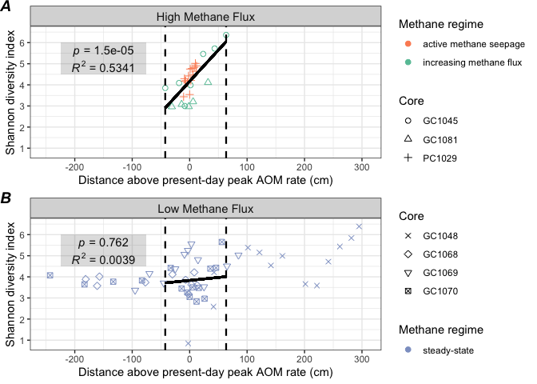
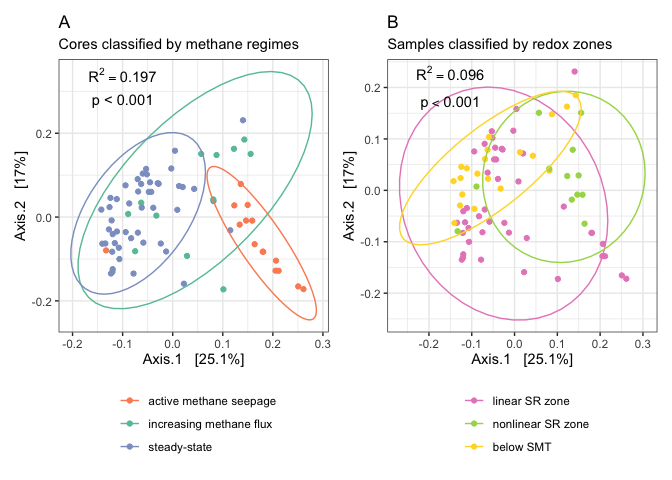

4\_community\_analysis
================
Scott Klasek
6/9/2021

Figures 6 and 7: ordinations, alpha and beta diversity, as well as
PERMANOVA tests between communities from different methane states &
geochemical zones.

## load necessary libraries and data

``` r
library(phyloseq)
library(tidyverse)
library(egg)
library(lemon)
library(gridExtra)
library(grid)
library(patchwork)
library(vegan)
library(DESeq2)
library(here)
sessioninfo <- sessionInfo()
ps.frdp <- readRDS(file="/Users/scottklasek/Desktop/svalflux/data/ps.frdp") # imports the final phyloseq object
```

## alpha diversity

``` r
# subset by high flux vs low flux 
ps.frdp.ss <- subset_samples(ps.frdp, sample_data(ps.frdp)$stage=="steadystate") # subsetsall steady-state samples
ps.frdp.nss.seep <- subset_samples(ps.frdp, sample_data(ps.frdp)$stage!="steadystate") # subsets the non-steady-state samples and the seep

alphadiv.ss <- estimate_richness(ps.frdp.ss, split = TRUE, measures=c("Shannon","InvSimpson","Observed")) # calculate tables of alpha diversity
```

    ## Warning in estimate_richness(ps.frdp.ss, split = TRUE, measures = c("Shannon", : The data you have provided does not have
    ## any singletons. This is highly suspicious. Results of richness
    ## estimates (for example) are probably unreliable, or wrong, if you have already
    ## trimmed low-abundance taxa from the data.
    ## 
    ## We recommended that you find the un-trimmed data and retry.

``` r
alphadiv.nss <- estimate_richness(ps.frdp.nss.seep, split = TRUE, measures=c("Shannon","InvSimpson","Observed"))
```

    ## Warning in estimate_richness(ps.frdp.nss.seep, split = TRUE, measures = c("Shannon", : The data you have provided does not have
    ## any singletons. This is highly suspicious. Results of richness
    ## estimates (for example) are probably unreliable, or wrong, if you have already
    ## trimmed low-abundance taxa from the data.
    ## 
    ## We recommended that you find the un-trimmed data and retry.

``` r
alphadiv.ss$depth <- substring(rownames(alphadiv.ss), 8,12) # pull out depth values from the sample names
alphadiv.ss$depth <- as.numeric(alphadiv.ss$depth) # convert them to numeric
alphadiv.nss$depth <- substring(rownames(alphadiv.nss), 8,12)
alphadiv.nss$depth <- as.numeric(alphadiv.nss$depth)

alphadiv.ss$core <- substring(rownames(alphadiv.ss), 1,6) # pull out core names from sample names
alphadiv.nss$core <- substring(rownames(alphadiv.nss), 1,6)

alphadiv.nss$peakaom <- NA # creates a NA value for peak AOM depth
alphadiv.ss$peakaom <- NA
alphadiv.nss[which(alphadiv.nss$core=="GC1081"),6] <- 55 # add in peak AOM depths for all cores
alphadiv.nss[which(alphadiv.nss$core=="GC1045"),6] <- 67.5
alphadiv.nss[which(alphadiv.nss$core=="PC1029"),6] <- 13
alphadiv.ss[which(alphadiv.ss$core=="GC1068"),6] <- 74
alphadiv.ss[which(alphadiv.ss$core=="GC1069"),6] <- 106
alphadiv.ss[which(alphadiv.ss$core=="GC1070"),6] <- 68
alphadiv.ss[which(alphadiv.ss$core=="GC1048"),6] <- 302.5
alphadiv.ss$dist_above_peakaom <- alphadiv.ss$peakaom-alphadiv.ss$depth # calculate distance above/below peak AOM
alphadiv.nss$dist_above_peakaom <- alphadiv.nss$peakaom-alphadiv.nss$depth 

alphadiv.ss.range <- subset(alphadiv.ss, dist_above_peakaom < 63.5 & dist_above_peakaom > -42.5) # subset the dataframe to include steady-state samples from depths across the SMT that correspond to depths of non-steady-state samples

nss.lm <- lm(alphadiv.nss$Shannon~alphadiv.nss$dist_above_peakaom) # linear model of shannon alpha diversity over distance to SMT for non-steady-state cores
ss.lm <- lm(alphadiv.ss$Shannon~alphadiv.ss$dist_above_peakaom) # linear model of shannon alpha diversity over distance to SMT for non-steady-state cores
ss.lm.range <- lm(alphadiv.ss.range$Shannon~alphadiv.ss.range$dist_above_peakaom)
summary(nss.lm) # summarizes the linear regression: slope is 0.029618, intercept is 4.167367, both are significant. Multiple R^2 is 0.5341, p value of slope is 1.5e-05
```

    ## 
    ## Call:
    ## lm(formula = alphadiv.nss$Shannon ~ alphadiv.nss$dist_above_peakaom)
    ## 
    ## Residuals:
    ##     Min      1Q  Median      3Q     Max 
    ## -1.1542 -0.3540  0.2308  0.4062  0.9431 
    ## 
    ## Coefficients:
    ##                                 Estimate Std. Error t value Pr(>|t|)    
    ## (Intercept)                     4.168572   0.115451  36.107  < 2e-16 ***
    ## alphadiv.nss$dist_above_peakaom 0.029654   0.005539   5.353  1.5e-05 ***
    ## ---
    ## Signif. codes:  0 '***' 0.001 '**' 0.01 '*' 0.05 '.' 0.1 ' ' 1
    ## 
    ## Residual standard error: 0.5956 on 25 degrees of freedom
    ## Multiple R-squared:  0.5341, Adjusted R-squared:  0.5155 
    ## F-statistic: 28.66 on 1 and 25 DF,  p-value: 1.498e-05

``` r
summary(ss.lm) # slope is significant considering all the points across depth 
```

    ## 
    ## Call:
    ## lm(formula = alphadiv.ss$Shannon ~ alphadiv.ss$dist_above_peakaom)
    ## 
    ## Residuals:
    ##     Min      1Q  Median      3Q     Max 
    ## -3.1827 -0.5436  0.1470  0.5018  1.5107 
    ## 
    ## Coefficients:
    ##                                Estimate Std. Error t value Pr(>|t|)    
    ## (Intercept)                    4.037319   0.128234  31.484  < 2e-16 ***
    ## alphadiv.ss$dist_above_peakaom 0.003532   0.001071   3.298  0.00186 ** 
    ## ---
    ## Signif. codes:  0 '***' 0.001 '**' 0.01 '*' 0.05 '.' 0.1 ' ' 1
    ## 
    ## Residual standard error: 0.8853 on 47 degrees of freedom
    ## Multiple R-squared:  0.188,  Adjusted R-squared:  0.1707 
    ## F-statistic: 10.88 on 1 and 47 DF,  p-value: 0.001859

``` r
summary(ss.lm.range) # slope is 0.002780, intercept is 3.831772, slope not significant across the SMT range. Multiple R^2 is 0.003901, p value of slope is 0.762
```

    ## 
    ## Call:
    ## lm(formula = alphadiv.ss.range$Shannon ~ alphadiv.ss.range$dist_above_peakaom)
    ## 
    ## Residuals:
    ##      Min       1Q   Median       3Q      Max 
    ## -2.97997 -0.52032 -0.08007  0.57834  1.71744 
    ## 
    ## Coefficients:
    ##                                      Estimate Std. Error t value Pr(>|t|)    
    ## (Intercept)                          3.832791   0.219654  17.449 3.86e-15 ***
    ## alphadiv.ss.range$dist_above_peakaom 0.002792   0.009073   0.308    0.761    
    ## ---
    ## Signif. codes:  0 '***' 0.001 '**' 0.01 '*' 0.05 '.' 0.1 ' ' 1
    ## 
    ## Residual standard error: 1.051 on 24 degrees of freedom
    ## Multiple R-squared:  0.00393,    Adjusted R-squared:  -0.03757 
    ## F-statistic: 0.0947 on 1 and 24 DF,  p-value: 0.7609

``` r
# assign facet grid labels and methane flux stages
alphadiv.nss$core_flowtype_label <- "High Methane Flux"
alphadiv.ss$core_flowtype_label <- "Low Methane Flux"
alphadiv.nss$stage <- "Non-steady-state"
alphadiv.nss[which(alphadiv.nss$core=="PC1029"),9] <- "Seep"
alphadiv.ss$stage <- "Steady-state"

alphadiv.nss$stage <- factor(alphadiv.nss$stage, levels=c("Seep", "Non-steady-state"))

plotrichness.ss <- ggplot(alphadiv.ss, aes(dist_above_peakaom, Shannon, color=stage, shape=core)) 
ssplot <- plotrichness.ss+
  geom_point(size=2)+
  facet_grid(~core_flowtype_label)+
  scale_y_continuous("Shannon diversity index", breaks=c(1,2,3,4,5,6), limits = c(0.8,6.5))+
  scale_x_continuous("Distance above present-day peak AOM rate (cm)", limits = c(-250,306))+
  scale_color_manual("", values=c("#8da0cb"))+
  scale_shape_manual("Core",values = c(4:7))+
  geom_vline(aes(xintercept=-42.5), linetype="dashed", size=0.8)+
  geom_vline(aes(xintercept=63.5), linetype="dashed", size=0.8)+
  geom_segment(x=-42.5,y=3.713622,xend=63.5,yend=4.008302, color="black", size=1)+
  theme_bw()+ # now for some reason you need to put the theme_bw() ahead of the theme() or nothing in theme() will work
  theme(strip.text = element_text(size = 11))+
  annotate("text", x = -150, y = 4.9, label = "paste(italic(R) ^ 2, \" = 0.0039\")", parse = TRUE)+
  annotate("text", x = -150, y = 5.6, label = "paste(italic(p), \" = 0.762\")", parse = TRUE)+
  annotate("rect", xmin = -225, xmax = -75, ymin = 4.5, ymax = 6, alpha = .2)

plotrichness.nss <- ggplot(alphadiv.nss, aes(dist_above_peakaom, Shannon, color=stage, shape=core))
nssplot <- plotrichness.nss+
  geom_point(size=2)+
  facet_grid(~core_flowtype_label)+
  scale_y_continuous("Shannon diversity index", breaks=c(1,2,3,4,5,6), limits = c(0.8,6.5))+
  scale_x_continuous("Distance above present-day peak AOM rate (cm)", limits = c(-250,306))+
  scale_color_manual("", values=c("#fc8d62", "#66c2a5"))+
  scale_shape_manual("Core", values = c(1:3))+
  geom_vline(aes(xintercept=-42.5), linetype="dashed", size=0.8)+
  geom_vline(aes(xintercept=63.5), linetype="dashed", size=0.8)+
  geom_segment(x=-42.5,y=2.908602,xend=63.5,yend=6.04811, color="black", size=1)+
  theme_bw()+ # now for some reason you need to put the theme_bw() ahead of the theme() or nothing in theme() will work
  theme(strip.text = element_text(size = 11))+
  annotate("text", x = -150, y = 4.9, label = "paste(italic(R) ^ 2, \" = 0.5341\")", parse = TRUE)+
  annotate("text", x = -150, y = 5.6, label = "paste(italic(p), \" = 1.5e-05\")", parse = TRUE)+
  annotate("rect", xmin = -225, xmax = -75, ymin = 4.5, ymax = 6, alpha = .2)

# now let's remove GC1048 samples
alphadiv.ss.no48 <- alphadiv.ss %>% filter(core!="GC1048")
summary(lm(alphadiv.ss.no48$Shannon ~ alphadiv.ss.no48$dist_above_peakaom)) # regression of shannon div by peak aom on ss cores without GC1048 
```

    ## 
    ## Call:
    ## lm(formula = alphadiv.ss.no48$Shannon ~ alphadiv.ss.no48$dist_above_peakaom)
    ## 
    ## Residuals:
    ##      Min       1Q   Median       3Q      Max 
    ## -1.25709 -0.52188 -0.03168  0.32873  1.49045 
    ## 
    ## Coefficients:
    ##                                     Estimate Std. Error t value Pr(>|t|)    
    ## (Intercept)                         4.062029   0.126068  32.221   <2e-16 ***
    ## alphadiv.ss.no48$dist_above_peakaom 0.002043   0.001527   1.338     0.19    
    ## ---
    ## Signif. codes:  0 '***' 0.001 '**' 0.01 '*' 0.05 '.' 0.1 ' ' 1
    ## 
    ## Residual standard error: 0.6984 on 34 degrees of freedom
    ## Multiple R-squared:  0.05002,    Adjusted R-squared:  0.02208 
    ## F-statistic:  1.79 on 1 and 34 DF,  p-value: 0.1898

``` r
yint.no.48 <- summary(lm(alphadiv.ss.no48$Shannon ~ alphadiv.ss.no48$dist_above_peakaom))$coefficients[1,1] # the y intercept
slope.no.48 <- summary(lm(alphadiv.ss.no48$Shannon ~ alphadiv.ss.no48$dist_above_peakaom))$coefficients[2,1] # the slope
pval.no.48 <- summary(lm(alphadiv.ss.no48$Shannon ~ alphadiv.ss.no48$dist_above_peakaom))$coefficients[2,4] # the pvalue
r2.no.48 <- summary(lm(alphadiv.ss.no48$Shannon ~ alphadiv.ss.no48$dist_above_peakaom))$r.squared # the rsquared 

ssplot.no.48 <- ggplot(alphadiv.ss.no48, aes(dist_above_peakaom, Shannon, color=stage, shape=core))+
  geom_point(size=2)+
  facet_grid(~core_flowtype_label)+
  scale_y_continuous("Shannon diversity index", breaks=c(1,2,3,4,5,6), limits = c(0.8,6.5))+
  scale_x_continuous("Distance above present-day peak AOM rate (cm)", limits = c(-250,306))+
  scale_color_manual("", values=c("#8da0cb"))+
  scale_shape_manual("Core",values = c(4:6))+
  geom_vline(aes(xintercept=-42.5), linetype="dashed", size=0.8)+
  geom_vline(aes(xintercept=63.5), linetype="dashed", size=0.8)+
  geom_segment(x=-42.5,y=(slope.no.48*-42.8+yint.no.48),xend=63.5,yend=(slope.no.48*63.5+yint.no.48), color="black", size=1)+
  theme_bw()+ # now for some reason you need to put the theme_bw() ahead of the theme() or nothing in theme() will work
  theme(strip.text = element_text(size = 11))+
  annotate("text", x = -150, y = 4.9, label = "paste(italic(R) ^ 2, \" = 0.050\")", parse = TRUE)+
  annotate("text", x = -150, y = 5.6, label = "paste(italic(p), \" = 0.190\")", parse = TRUE)+
  annotate("rect", xmin = -225, xmax = -75, ymin = 4.5, ymax = 6, alpha = .2)

div.fig.no48 <- ggarrange(nssplot, ssplot.no.48, heights = c(1,1), ncol=1, nrow=2, labels = c("A", "B")) # Figure 6
```

<!-- -->

## beta diversity

#### transforming ASV table

``` r
# Hellinger transformation
otu.hel <- otu_table(decostand(otu_table(ps.frdp), method = "hellinger"), taxa_are_rows=FALSE)
ps.hel <- phyloseq(tax_table(ps.frdp),
                    sample_data(ps.frdp),
                    otu_table(otu.hel),
                    phy_tree(ps.frdp),
                    refseq(ps.frdp)) 

# get rid of that GC1048 core we don't liike it anymore
ps.frdp.no48 <- subset_samples(ps.frdp, core!="GC1048") 
otu.hel.no48 <- otu_table(decostand(otu_table(ps.frdp.no48), method = "hellinger"), taxa_are_rows=FALSE)
ps.hel.no48 <- phyloseq(tax_table(ps.frdp.no48),
                    sample_data(ps.frdp.no48),
                    otu_table(otu.hel.no48),
                    phy_tree(ps.frdp.no48),
                    refseq(ps.frdp.no48)) 
```

#### permanova tests

Testing the influence of stage (seep, non-steady-state, and
steady-state) and geochemical zone (linear sulfate-reduction zone,
non-steady-state reduction zone, and
below-sulfate-methane-transition-zone) on community composition  
\* Note I search/replaced ps.hel with ps.hel.no48 to omit GC1048 in this
analysis \*

``` r
sample_data(ps.hel.no48)$smtpos <- ifelse(sample_data(ps.hel.no48)$geochem_zone == "linear SR zone","above SMTZ",
                              ifelse(sample_data(ps.hel.no48)$geochem_zone == "nonlinear SR zone","above SMTZ",
                              ifelse(sample_data(ps.hel.no48)$geochem_zone == "below SMTZ", "below SMTZ", NA))) # writing above-below smtz as another categorical variable
metadata.ps.hel.no48 <- as(sample_data(ps.hel.no48), "data.frame") #  create sample data dataframe

# binary jaccard
dm.jac <- phyloseq::distance(ps.frdp.no48, method = "jaccard", binary = TRUE) # makes binary Jaccard distance matrix (no need to transform)
adonis(dm.jac ~ geochem_zone*stage, data=metadata.ps.hel.no48)
```

    ## 
    ## Call:
    ## adonis(formula = dm.jac ~ geochem_zone * stage, data = metadata.ps.hel.no48) 
    ## 
    ## Permutation: free
    ## Number of permutations: 999
    ## 
    ## Terms added sequentially (first to last)
    ## 
    ##                    Df SumsOfSqs MeanSqs F.Model      R2 Pr(>F)    
    ## geochem_zone        2    1.8462 0.92308  2.5178 0.07068  0.001 ***
    ## stage               2    2.5656 1.28282  3.4990 0.09823  0.001 ***
    ## geochem_zone:stage  2    1.1770 0.58852  1.6052 0.04506  0.003 ** 
    ## Residuals          56   20.5310 0.36663         0.78603           
    ## Total              62   26.1199                 1.00000           
    ## ---
    ## Signif. codes:  0 '***' 0.001 '**' 0.01 '*' 0.05 '.' 0.1 ' ' 1

``` r
# Bray-Curtis
dm.bc <- phyloseq::distance(ps.hel.no48, method = "bray") # makes bray-curtis distance matrix
adonis(dm.bc ~ geochem_zone*stage, data=metadata.ps.hel.no48)
```

    ## 
    ## Call:
    ## adonis(formula = dm.bc ~ geochem_zone * stage, data = metadata.ps.hel.no48) 
    ## 
    ## Permutation: free
    ## Number of permutations: 999
    ## 
    ## Terms added sequentially (first to last)
    ## 
    ##                    Df SumsOfSqs MeanSqs F.Model      R2 Pr(>F)    
    ## geochem_zone        2    2.2852 1.14262  4.7054 0.11150  0.001 ***
    ## stage               2    3.4929 1.74643  7.1920 0.17042  0.001 ***
    ## geochem_zone:stage  2    1.1190 0.55951  2.3041 0.05460  0.001 ***
    ## Residuals          56   13.5984 0.24283         0.66348           
    ## Total              62   20.4955                 1.00000           
    ## ---
    ## Signif. codes:  0 '***' 0.001 '**' 0.01 '*' 0.05 '.' 0.1 ' ' 1

``` r
# unweighted Unifrac
set.seed(1)
dm.hel.unifrac <- UniFrac(ps.hel.no48, weighted = FALSE, normalized = TRUE,  parallel = FALSE, fast = TRUE) # create weighted Unifrac distance matrix
```

    ## Warning in UniFrac(ps.hel.no48, weighted = FALSE, normalized = TRUE, parallel
    ## = FALSE, : Randomly assigning root as -- ASV4959 -- in the phylogenetic tree in
    ## the data you provided.

``` r
adonis(dm.hel.unifrac ~ geochem_zone*stage, data=metadata.ps.hel.no48) 
```

    ## 
    ## Call:
    ## adonis(formula = dm.hel.unifrac ~ geochem_zone * stage, data = metadata.ps.hel.no48) 
    ## 
    ## Permutation: free
    ## Number of permutations: 999
    ## 
    ## Terms added sequentially (first to last)
    ## 
    ##                    Df SumsOfSqs MeanSqs F.Model      R2 Pr(>F)    
    ## geochem_zone        2    1.4650 0.73249  2.9255 0.07939  0.001 ***
    ## stage               2    2.0643 1.03217  4.1223 0.11187  0.001 ***
    ## geochem_zone:stage  2    0.9023 0.45115  1.8018 0.04890  0.002 ** 
    ## Residuals          56   14.0215 0.25038         0.75984           
    ## Total              62   18.4531                 1.00000           
    ## ---
    ## Signif. codes:  0 '***' 0.001 '**' 0.01 '*' 0.05 '.' 0.1 ' ' 1

``` r
# weighted Unifrac 
set.seed(1)
dm.hel.wunifrac <- UniFrac(ps.hel.no48, weighted = TRUE, normalized = TRUE,  parallel = FALSE, fast = TRUE) # create weighted Unifrac distance matrix
```

    ## Warning in UniFrac(ps.hel.no48, weighted = TRUE, normalized = TRUE, parallel =
    ## FALSE, : Randomly assigning root as -- ASV4959 -- in the phylogenetic tree in
    ## the data you provided.

``` r
adonis(dm.hel.wunifrac ~ geochem_zone*stage, data=metadata.ps.hel.no48) # geochem zone is 9.6%
```

    ## 
    ## Call:
    ## adonis(formula = dm.hel.wunifrac ~ geochem_zone * stage, data = metadata.ps.hel.no48) 
    ## 
    ## Permutation: free
    ## Number of permutations: 999
    ## 
    ## Terms added sequentially (first to last)
    ## 
    ##                    Df SumsOfSqs  MeanSqs F.Model      R2 Pr(>F)    
    ## geochem_zone        2   0.33887 0.169437  5.4065 0.11637  0.001 ***
    ## stage               2   0.62514 0.312569  9.9736 0.21468  0.001 ***
    ## geochem_zone:stage  2   0.19291 0.096455  3.0778 0.06625  0.001 ***
    ## Residuals          56   1.75501 0.031339         0.60270           
    ## Total              62   2.91193                  1.00000           
    ## ---
    ## Signif. codes:  0 '***' 0.001 '**' 0.01 '*' 0.05 '.' 0.1 ' ' 1

``` r
# other variables are all significant, but possibly redundant:
adonis(dm.hel.wunifrac ~ stage, data=metadata.ps.hel.no48) #  stage alone is 19.9%
```

    ## 
    ## Call:
    ## adonis(formula = dm.hel.wunifrac ~ stage, data = metadata.ps.hel.no48) 
    ## 
    ## Permutation: free
    ## Number of permutations: 999
    ## 
    ## Terms added sequentially (first to last)
    ## 
    ##           Df SumsOfSqs MeanSqs F.Model      R2 Pr(>F)    
    ## stage      2   0.72654 0.36327  9.9736 0.24951  0.001 ***
    ## Residuals 60   2.18539 0.03642         0.75049           
    ## Total     62   2.91193                 1.00000           
    ## ---
    ## Signif. codes:  0 '***' 0.001 '**' 0.01 '*' 0.05 '.' 0.1 ' ' 1

``` r
adonis(dm.hel.wunifrac ~ core_flowtype, data=metadata.ps.hel.no48) # significant, but at 13% is less than stage (which it is redundant with)
```

    ## 
    ## Call:
    ## adonis(formula = dm.hel.wunifrac ~ core_flowtype, data = metadata.ps.hel.no48) 
    ## 
    ## Permutation: free
    ## Number of permutations: 999
    ## 
    ## Terms added sequentially (first to last)
    ## 
    ##               Df SumsOfSqs MeanSqs F.Model      R2 Pr(>F)    
    ## core_flowtype  1   0.51038 0.51038  12.964 0.17527  0.001 ***
    ## Residuals     61   2.40155 0.03937         0.82473           
    ## Total         62   2.91193                 1.00000           
    ## ---
    ## Signif. codes:  0 '***' 0.001 '**' 0.01 '*' 0.05 '.' 0.1 ' ' 1

``` r
adonis(dm.hel.wunifrac ~ SO4_mM, data=metadata.ps.hel.no48) # SO4 more than geochem zone (maybe more helpful, too? but redundant)
```

    ## 
    ## Call:
    ## adonis(formula = dm.hel.wunifrac ~ SO4_mM, data = metadata.ps.hel.no48) 
    ## 
    ## Permutation: free
    ## Number of permutations: 999
    ## 
    ## Terms added sequentially (first to last)
    ## 
    ##           Df SumsOfSqs MeanSqs F.Model      R2 Pr(>F)    
    ## SO4_mM     1   0.40849 0.40849  9.9533 0.14028  0.001 ***
    ## Residuals 61   2.50345 0.04104         0.85972           
    ## Total     62   2.91193                 1.00000           
    ## ---
    ## Signif. codes:  0 '***' 0.001 '**' 0.01 '*' 0.05 '.' 0.1 ' ' 1

``` r
adonis(dm.hel.wunifrac ~ HS_mM, data=metadata.ps.hel.no48) # significant but redundant
```

    ## 
    ## Call:
    ## adonis(formula = dm.hel.wunifrac ~ HS_mM, data = metadata.ps.hel.no48) 
    ## 
    ## Permutation: free
    ## Number of permutations: 999
    ## 
    ## Terms added sequentially (first to last)
    ## 
    ##           Df SumsOfSqs  MeanSqs F.Model      R2 Pr(>F)    
    ## HS_mM      1   0.27394 0.273942  6.3345 0.09408  0.001 ***
    ## Residuals 61   2.63799 0.043246         0.90592           
    ## Total     62   2.91193                  1.00000           
    ## ---
    ## Signif. codes:  0 '***' 0.001 '**' 0.01 '*' 0.05 '.' 0.1 ' ' 1

``` r
adonis(dm.hel.wunifrac ~ Alk_mM, data=metadata.ps.hel.no48) # significant but redundant
```

    ## 
    ## Call:
    ## adonis(formula = dm.hel.wunifrac ~ Alk_mM, data = metadata.ps.hel.no48) 
    ## 
    ## Permutation: free
    ## Number of permutations: 999
    ## 
    ## Terms added sequentially (first to last)
    ## 
    ##           Df SumsOfSqs  MeanSqs F.Model     R2 Pr(>F)    
    ## Alk_mM     1   0.31506 0.315057  7.4006 0.1082  0.001 ***
    ## Residuals 61   2.59688 0.042572         0.8918           
    ## Total     62   2.91193                  1.0000           
    ## ---
    ## Signif. codes:  0 '***' 0.001 '**' 0.01 '*' 0.05 '.' 0.1 ' ' 1

``` r
adonis(dm.hel.wunifrac ~ core, data=metadata.ps.hel.no48) # core matters more than any other, but "core" itself is a meaningless variable
```

    ## 
    ## Call:
    ## adonis(formula = dm.hel.wunifrac ~ core, data = metadata.ps.hel.no48) 
    ## 
    ## Permutation: free
    ## Number of permutations: 999
    ## 
    ## Terms added sequentially (first to last)
    ## 
    ##           Df SumsOfSqs  MeanSqs F.Model      R2 Pr(>F)    
    ## core       5    1.0829 0.216581  6.7496 0.37189  0.001 ***
    ## Residuals 57    1.8290 0.032088         0.62811           
    ## Total     62    2.9119                  1.00000           
    ## ---
    ## Signif. codes:  0 '***' 0.001 '**' 0.01 '*' 0.05 '.' 0.1 ' ' 1

``` r
adonis(dm.hel.wunifrac ~ pingo, data=metadata.ps.hel.no48) # gas hydrate mound the cores are sampled from matters more as well, but also a meaningless variable
```

    ## 
    ## Call:
    ## adonis(formula = dm.hel.wunifrac ~ pingo, data = metadata.ps.hel.no48) 
    ## 
    ## Permutation: free
    ## Number of permutations: 999
    ## 
    ## Terms added sequentially (first to last)
    ## 
    ##           Df SumsOfSqs MeanSqs F.Model      R2 Pr(>F)    
    ## pingo      2   0.70137 0.35069  9.5184 0.24086  0.001 ***
    ## Residuals 60   2.21056 0.03684         0.75914           
    ## Total     62   2.91193                 1.00000           
    ## ---
    ## Signif. codes:  0 '***' 0.001 '**' 0.01 '*' 0.05 '.' 0.1 ' ' 1

``` r
adonis(dm.hel.wunifrac ~ smtzposition, data=metadata.ps.hel.no48) # above/below SMT explains only 5%
```

    ## 
    ## Call:
    ## adonis(formula = dm.hel.wunifrac ~ smtzposition, data = metadata.ps.hel.no48) 
    ## 
    ## Permutation: free
    ## Number of permutations: 999
    ## 
    ## Terms added sequentially (first to last)
    ## 
    ##              Df SumsOfSqs  MeanSqs F.Model      R2 Pr(>F)    
    ## smtzposition  1   0.22311 0.223108  5.0615 0.07662  0.001 ***
    ## Residuals    61   2.68883 0.044079         0.92338           
    ## Total        62   2.91193                  1.00000           
    ## ---
    ## Signif. codes:  0 '***' 0.001 '**' 0.01 '*' 0.05 '.' 0.1 ' ' 1

``` r
adonis(dm.hel.wunifrac ~ geochem_zone*core, data=metadata.ps.hel.no48) # no significant interaction between core and geochem zone
```

    ## 
    ## Call:
    ## adonis(formula = dm.hel.wunifrac ~ geochem_zone * core, data = metadata.ps.hel.no48) 
    ## 
    ## Permutation: free
    ## Number of permutations: 999
    ## 
    ## Terms added sequentially (first to last)
    ## 
    ##                   Df SumsOfSqs  MeanSqs F.Model      R2 Pr(>F)    
    ## geochem_zone       2   0.33887 0.169437  6.1510 0.11637  0.001 ***
    ## core               5   0.95800 0.191601  6.9556 0.32899  0.001 ***
    ## geochem_zone:core  5   0.23774 0.047547  1.7261 0.08164  0.007 ** 
    ## Residuals         50   1.37732 0.027546         0.47299           
    ## Total             62   2.91193                  1.00000           
    ## ---
    ## Signif. codes:  0 '***' 0.001 '**' 0.01 '*' 0.05 '.' 0.1 ' ' 1

``` r
adonis(dm.hel.wunifrac ~ stage * geochem_zone, data=metadata.ps.hel.no48)
```

    ## 
    ## Call:
    ## adonis(formula = dm.hel.wunifrac ~ stage * geochem_zone, data = metadata.ps.hel.no48) 
    ## 
    ## Permutation: free
    ## Number of permutations: 999
    ## 
    ## Terms added sequentially (first to last)
    ## 
    ##                    Df SumsOfSqs MeanSqs F.Model      R2 Pr(>F)    
    ## stage               2   0.72654 0.36327 11.5915 0.24951  0.001 ***
    ## geochem_zone        2   0.23747 0.11873  3.7886 0.08155  0.001 ***
    ## stage:geochem_zone  2   0.19291 0.09646  3.0778 0.06625  0.002 ** 
    ## Residuals          56   1.75501 0.03134         0.60270           
    ## Total              62   2.91193                 1.00000           
    ## ---
    ## Signif. codes:  0 '***' 0.001 '**' 0.01 '*' 0.05 '.' 0.1 ' ' 1

Using the weighted Unifrac distance, both geochem\_zone & stage were
significant (stage explaining 16-17% of variance, while zone 8-9%).
Interactions were also significant at around 4.9%. This did not vary by
the transformation type (I tried variance-stabilizing transformation as
well and got nearly the same results). Bray-Curtis, unweighted Unifrac,
and Jaccard distance metrics showed the same patterns, though they
respectively explained decreasing amounts of variance overall. So it
seems relative abundances are a bit more influential than taxonomy alone
in explaining differences between these communities, though they both
help.

Pingo (which Gas Hydrate Mound a sample was collected from) explains a
bit more variance than does stage, and Core does even more. But it is a
confounding variable (each pingo is at a separate methane flux stage),
and which particular pingo a sample comes from offers no real helpful
information. Core also confounds with pingo, core\_flowtype, stage, etc.
Even though core was the single variable that explained more of the
variance than any other, geochem\_zone\*stage explained slightly more.
Furthermore, core and geochem\_zone do not have a significant
interaction.

When we drop GC1048 from this analysis, the relative contribution of
variation from these variables changes, of course, but the overall
picture is the same.

#### ordinations

weighted Unifrac with Hellinger transformation  
\* Note I search/replaced ps.hel with ps.hel.no48 to omit GC1048 in this
analysis \*

``` r
# make better labels for plotting
sample_data(ps.hel.no48)$stage <- ifelse(sample_data(ps.hel.no48)$stage == "seep", "Seep",
                        ifelse(sample_data(ps.hel.no48)$stage == "fluxincreasing", "Non-steady-state",
                        ifelse(sample_data(ps.hel.no48)$stage == "steadystate", "Steady-state", NA)))
sample_data(ps.hel.no48)$stage <- factor(sample_data(ps.hel.no48)$stage, levels=c("Seep", "Non-steady-state", "Steady-state"))

sample_data(ps.hel.no48)$geochem_zone <- ifelse(sample_data(ps.hel.no48)$geochem_zone == "lin", "linear SR zone",
                        ifelse(sample_data(ps.hel.no48)$geochem_zone == "nss", "nonlinear SR zone",
                        ifelse(sample_data(ps.hel.no48)$geochem_zone == "below", "below SMT", NA)))

sample_data(ps.hel.no48)$geochem_zone <- factor(sample_data(ps.hel.no48)$geochem_zone, levels = c("linear SR zone", "nonlinear SR zone", "below SMT")) # reorder 

# trying NMDS and PCoAs
set.seed(1)
ord.ps.hel.no48.wuni.nmds <- ordinate(ps.hel.no48, "NMDS", "unifrac", weighted=TRUE) # Stress = 0.135
```

    ## Warning in UniFrac(physeq, ...): Randomly assigning root as -- ASV4959 -- in the
    ## phylogenetic tree in the data you provided.

    ## Run 0 stress 0.1175544 
    ## Run 1 stress 0.125966 
    ## Run 2 stress 0.125966 
    ## Run 3 stress 0.1175546 
    ## ... Procrustes: rmse 0.0002571072  max resid 0.001888338 
    ## ... Similar to previous best
    ## Run 4 stress 0.1259661 
    ## Run 5 stress 0.1259661 
    ## Run 6 stress 0.125966 
    ## Run 7 stress 0.1175544 
    ## ... Procrustes: rmse 3.58613e-05  max resid 0.0002351392 
    ## ... Similar to previous best
    ## Run 8 stress 0.1175546 
    ## ... Procrustes: rmse 9.775297e-05  max resid 0.000707745 
    ## ... Similar to previous best
    ## Run 9 stress 0.1175543 
    ## ... New best solution
    ## ... Procrustes: rmse 6.747611e-05  max resid 0.000486538 
    ## ... Similar to previous best
    ## Run 10 stress 0.1175544 
    ## ... Procrustes: rmse 0.0001314911  max resid 0.0009659014 
    ## ... Similar to previous best
    ## Run 11 stress 0.1259661 
    ## Run 12 stress 0.1175545 
    ## ... Procrustes: rmse 0.000128951  max resid 0.0009437902 
    ## ... Similar to previous best
    ## Run 13 stress 0.1259662 
    ## Run 14 stress 0.1175543 
    ## ... Procrustes: rmse 2.020449e-05  max resid 0.0001330201 
    ## ... Similar to previous best
    ## Run 15 stress 0.1175544 
    ## ... Procrustes: rmse 9.340294e-05  max resid 0.0006748745 
    ## ... Similar to previous best
    ## Run 16 stress 0.1175543 
    ## ... Procrustes: rmse 4.223294e-05  max resid 0.0003051741 
    ## ... Similar to previous best
    ## Run 17 stress 0.1175544 
    ## ... Procrustes: rmse 0.0001192438  max resid 0.0008631083 
    ## ... Similar to previous best
    ## Run 18 stress 0.1175544 
    ## ... Procrustes: rmse 6.363453e-05  max resid 0.0004545593 
    ## ... Similar to previous best
    ## Run 19 stress 0.1175545 
    ## ... Procrustes: rmse 0.00015643  max resid 0.001148075 
    ## ... Similar to previous best
    ## Run 20 stress 0.1175543 
    ## ... Procrustes: rmse 5.097954e-05  max resid 0.0003725416 
    ## ... Similar to previous best
    ## *** Solution reached

``` r
set.seed(1)
ord.ps.hel.no48.wuni.pcoa <- ordinate(ps.hel.no48, "PCoA", "unifrac", weighted=TRUE)
```

    ## Warning in UniFrac(physeq, ...): Randomly assigning root as -- ASV4959 -- in the
    ## phylogenetic tree in the data you provided.

``` r
# plotting ordinations by stage 
lb1 <- paste("R^2 == 0.250")
ord1.p.stage <- plot_ordination(ps.hel.no48, ord.ps.hel.no48.wuni.pcoa, color = "stage")+
  stat_ellipse()+
  scale_color_manual("",values = c("#fc8d62", "#66c2a5", "#8da0cb"))+
  ggtitle("A")+
  annotate(geom="text", x=-0.1, y=0.28, label="p < 0.001") +
  annotate(geom="text", x=-0.1, y=0.34, label=lb1, parse=TRUE)+
  theme_bw()+
  theme(legend.position = "bottom")+
  guides(col = guide_legend(ncol = 1))

# plotting ordinations by redox zone 
lb2 <- paste("R^2 == 0.116")
ord1.p.zone<- plot_ordination(ps.hel.no48, ord.ps.hel.no48.wuni.pcoa, color = "geochem_zone")+
  stat_ellipse()+
  scale_color_manual("",values = c("#e78ac3","#a6d854","#ffd92f"))+
  ggtitle("B")+
  annotate(geom="text", x=-0.15, y=0.17, label="p < 0.001", parse=TRUE)+
  annotate(geom="text", x=-0.15, y=0.23, label=lb2, parse=TRUE)+
  theme_bw()+
  theme(legend.position = "bottom")+
  guides(col = guide_legend(ncol = 1))

# showing them both together
ord.fig <- ord1.p.stage + ord1.p.zone
ord.fig
```

<!-- -->
The PCoA has fewer outliers, and explains 25% x 17.4% variance on the
two major axes, so I’ll stick with that over NMDS.

Can also add the sections “more permanovas” from lines 844-920, and
possibly beta-diversity from lines 938-974. Just to be thorough…

## follow-up tests on beta-diversity

``` r
# omitting below-SMT samples, is there still a difference by stage?
ps.hel.above <- subset_samples(ps.hel, geochem_zone!="below SMT") # subset
set.seed(1)
dm.hel.above.wunifrac <- UniFrac(ps.hel.above, weighted = TRUE, normalized = TRUE,  parallel = FALSE, fast = TRUE) # run unifrac
metadata.ps.hel.above <- data.frame(sample_data(ps.hel.above)) # write metadata data frame
adonis(dm.hel.above.wunifrac ~ stage, data=metadata.ps.hel.above) # yes there is a difference: R2, p are 0.21521,  0.001 ***

# considering only below-SMT samples, is there still a difference by stage?
ps.hel.below <- subset_samples(ps.hel, geochem_zone=="below SMT") # subset
nsamples(ps.hel.below)
set.seed(1)
dm.hel.below.wunifrac <- UniFrac(ps.hel.below, weighted = TRUE, normalized = TRUE,  parallel = FALSE, fast = TRUE) # run unifrac
metadata.ps.hel.below <- data.frame(sample_data(ps.hel.below)) # write metadata data frame
adonis(dm.hel.below.wunifrac ~ stage, data=metadata.ps.hel.below) # yes there is a difference: R2, p are 0.18597  0.003 **

# differences between the two stages steady-state and fluxincreasing? 
ps.hel.gc <- subset_samples(ps.hel, stage!="active methane seepage") # subset
nsamples(ps.hel.gc)
set.seed(1)
dm.hel.gc.wunifrac <- UniFrac(ps.hel.gc, weighted = TRUE, normalized = TRUE,  parallel = FALSE, fast = TRUE) # run unifrac
metadata.ps.hel.gc <- data.frame(sample_data(ps.hel.gc)) # write metadata data frame
adonis(dm.hel.gc.wunifrac ~ stage, data=metadata.ps.hel.gc) # there is a difference: R2, p are 0.06055  0.001 ***

# differences between the two stages (steady-state and fluxincreasing) when only considering above-SMT samples? 
ps.hel.above.gc <- subset_samples(ps.hel.above, stage!="active methane seepage") # subset
nsamples(ps.hel.above.gc)
set.seed(11)
dm.hel.above.gc.wunifrac <- UniFrac(ps.hel.above.gc, weighted = TRUE, normalized = TRUE,  parallel = FALSE, fast = TRUE) # run unifrac
metadata.ps.hel.above.gc <- data.frame(sample_data(ps.hel.above.gc)) # write metadata data frame
adonis(dm.hel.above.gc.wunifrac ~ stage, data=metadata.ps.hel.above.gc) #  there is barely a difference: R2, p are 0.04448  0.056 (Honestly, if you really like p < 0.05, significance depends on which set.seed you use)

# differences between linear SR and non-steady-state SR across both seep and fluxincreasing?
ps.hel.above.flux <- subset_samples(ps.hel, stage!="steady-state" & geochem_zone!="below SMT") # subset
nsamples(ps.hel.above.flux)
set.seed(1)
dm.hel.above.flux.wunifrac <- UniFrac(ps.hel.above.flux, weighted = TRUE, normalized = TRUE,  parallel = FALSE, fast = TRUE) # run unifrac
metadata.ps.hel.above.flux <- data.frame(sample_data(ps.hel.above.flux)) # write metadata data frame
adonis(dm.hel.above.flux.wunifrac ~ geochem_zone, data=metadata.ps.hel.above.flux) #  there is a difference: R2, p are 0.16792  0.004 **

# differences between linear SR and non-steady-state SR across seep only?
ps.hel.above.fluxseep <- subset_samples(ps.hel.above.flux, stage=="Seep") # subset
nsamples(ps.hel.above.fluxseep)
set.seed(1)
dm.hel.above.fluxseep.wunifrac <- UniFrac(ps.hel.above.fluxseep, weighted = TRUE, normalized = TRUE,  parallel = FALSE, fast = TRUE) # run unifrac
metadata.ps.hel.above.fluxseep <- data.frame(sample_data(ps.hel.above.fluxseep)) # write metadata data frame
adonis(dm.hel.above.fluxseep.wunifrac ~ geochem_zone, data=metadata.ps.hel.above.fluxseep) #  there is a difference: R2, p are 0.34069  0.002 **

# differences between linear SR and non-steady-state SR across fluxincreasing only?
ps.hel.above.fluxinc <- subset_samples(ps.hel.above.flux, stage=="Non-steady-state") # subset
nsamples(ps.hel.above.fluxinc) # there are only 8 samples
set.seed(1)
dm.hel.above.fluxinc.wunifrac <- UniFrac(ps.hel.above.fluxinc, weighted = TRUE, normalized = TRUE,  parallel = FALSE, fast = TRUE) # run unifrac
metadata.ps.hel.above.fluxinc <- data.frame(sample_data(ps.hel.above.fluxinc)) # write metadata data frame
adonis(dm.hel.above.fluxinc.wunifrac ~ geochem_zone, data=metadata.ps.hel.above.fluxinc) #  there is barely a difference: R2, p are 0.30173, 0.046 * (Honestly, if you really like p < 0.05, significance might depend on which set.seed you use)

# differences between non-steady-state SR and below-SMT across fluxincreasing only?
ps.hel.fluxinc.lower <- subset_samples(ps.hel, stage=="Non-steady-state" & geochem_zone!="linear SR zone") # subset
nsamples(ps.hel.fluxinc.lower)# only 12 samples
set.seed(1)
dm.hel.fluxinc.lower.wunifrac <- UniFrac(ps.hel.fluxinc.lower, weighted = TRUE, normalized = TRUE,  parallel = FALSE, fast = TRUE) # run unifrac
metadata.ps.hel.fluxinc.lower <- data.frame(sample_data(ps.hel.fluxinc.lower)) # write metadata data frame
adonis(dm.hel.fluxinc.lower.wunifrac ~ geochem_zone, data=metadata.ps.hel.fluxinc.lower) #  there is NO difference: R2, p are 0.12485  0.435 

# differences between linear SR and below-SMT?
ps.hel.fluxinc.d <- subset_samples(ps.hel, stage=="Non-steady-state" & geochem_zone!="nonlinear SR zone") # subset
nsamples(ps.hel.fluxinc.d)# only 12 samples
set.seed(1)
dm.hel.fluxinc.d.wunifrac <- UniFrac(ps.hel.fluxinc.d, weighted = TRUE, normalized = TRUE,  parallel = FALSE, fast = TRUE) # run unifrac
metadata.ps.hel.fluxinc.d <- data.frame(sample_data(ps.hel.fluxinc.d)) # write metadata data frame
adonis(dm.hel.fluxinc.d.wunifrac ~ geochem_zone, data=metadata.ps.hel.fluxinc.d) # yes difference 0.42094  0.023 *

# following this up with an ordination of fluxincreasing GC samples and color by geochem_zone
ps.hel.fluxinc <- subset_samples(ps.hel, stage=="Non-steady-state") # subset
nsamples(ps.hel.fluxinc)
ord.ps.helfluxinc.wuni.pcoa <- ordinate(ps.hel.fluxinc, "PCoA", "unifrac", weighted=TRUE) # ordinate
plot_ordination(ps.hel.fluxinc, ord.ps.helfluxinc.wuni.pcoa, color = "geochem_zone")+stat_ellipse() # from the very few samples we have here, the idea that the linear SR zone is the outlier is supported

# t-tests of beta-diversity between stages
ps.hel.seep <- subset_samples(ps.hel, stage=="Seep") # subset
ps.hel.fluxinc
ps.hel.ss <- subset_samples(ps.hel, stage=="Steady-state")

set.seed(1)
dm.seep <- UniFrac(ps.hel.seep, weighted=TRUE, normalized=TRUE, parallel=FALSE, fast=TRUE) # calculate distance matrices for beta-diversity calculations
set.seed(1)
dm.fluxinc <- UniFrac(ps.hel.fluxinc, weighted=TRUE, normalized=TRUE, parallel=FALSE, fast=TRUE)
set.seed(1)
dm.ss <- UniFrac(ps.hel.ss, weighted=TRUE, normalized=TRUE, parallel=FALSE, fast=TRUE)

bdiv.seep <- as.vector(dm.seep) # rewrite the triangle distance matrices as vectors
bdiv.fluxinc <- as.vector(dm.fluxinc) 
bdiv.ss <- as.vector(dm.ss) 

t.test(bdiv.seep, bdiv.ss) 
t.test(bdiv.fluxinc, bdiv.ss) 
t.test(bdiv.fluxinc, bdiv.seep)
```

``` r
# omitting GC1048
# first see difference between stages
set.seed(1)
dm.hel.no48.wunifrac <- UniFrac(ps.hel.no48, weighted = TRUE, normalized = TRUE,  parallel = FALSE, fast = TRUE) # run unifrac
```

    ## Warning in UniFrac(ps.hel.no48, weighted = TRUE, normalized = TRUE, parallel =
    ## FALSE, : Randomly assigning root as -- ASV4959 -- in the phylogenetic tree in
    ## the data you provided.

``` r
metadata.ps.hel.no48 <- data.frame(sample_data(ps.hel.no48)) # write metadata data frame
adonis(dm.hel.no48.wunifrac ~ stage, data=metadata.ps.hel.no48) # difference by stage: R2, p are 0.24951,  0.001 ***
```

    ## 
    ## Call:
    ## adonis(formula = dm.hel.no48.wunifrac ~ stage, data = metadata.ps.hel.no48) 
    ## 
    ## Permutation: free
    ## Number of permutations: 999
    ## 
    ## Terms added sequentially (first to last)
    ## 
    ##           Df SumsOfSqs MeanSqs F.Model      R2 Pr(>F)    
    ## stage      2   0.72654 0.36327  9.9736 0.24951  0.001 ***
    ## Residuals 60   2.18539 0.03642         0.75049           
    ## Total     62   2.91193                 1.00000           
    ## ---
    ## Signif. codes:  0 '***' 0.001 '**' 0.01 '*' 0.05 '.' 0.1 ' ' 1

``` r
adonis(dm.hel.no48.wunifrac ~ geochem_zone, data=metadata.ps.hel.no48) # difference by zone: R2, p are 0.116,  0.001 ***
```

    ## 
    ## Call:
    ## adonis(formula = dm.hel.no48.wunifrac ~ geochem_zone, data = metadata.ps.hel.no48) 
    ## 
    ## Permutation: free
    ## Number of permutations: 999
    ## 
    ## Terms added sequentially (first to last)
    ## 
    ##              Df SumsOfSqs  MeanSqs F.Model      R2 Pr(>F)    
    ## geochem_zone  2   0.33887 0.169437   3.951 0.11637  0.001 ***
    ## Residuals    60   2.57306 0.042884         0.88363           
    ## Total        62   2.91193                  1.00000           
    ## ---
    ## Signif. codes:  0 '***' 0.001 '**' 0.01 '*' 0.05 '.' 0.1 ' ' 1

``` r
# then examine differences by stage if we removed the seep samples
ps.hel.no48.no.seep <- subset_samples(ps.hel.no48, stage!="Seep")
set.seed(1)
dm.hel.no48.no.seep.wunifrac <- UniFrac(ps.hel.no48.no.seep, weighted = TRUE, normalized = TRUE,  parallel = FALSE, fast = TRUE) # run unifrac
```

    ## Warning in UniFrac(ps.hel.no48.no.seep, weighted = TRUE, normalized = TRUE, :
    ## Randomly assigning root as -- ASV4959 -- in the phylogenetic tree in the data
    ## you provided.

``` r
metadata.ps.hel.no48.no.seep <- data.frame(sample_data(ps.hel.no48.no.seep)) # write metadata data frame
adonis(dm.hel.no48.no.seep.wunifrac ~ stage, data=metadata.ps.hel.no48.no.seep) # difference by stage: R2, p are 0.087,  0.001 ***
```

    ## 
    ## Call:
    ## adonis(formula = dm.hel.no48.no.seep.wunifrac ~ stage, data = metadata.ps.hel.no48.no.seep) 
    ## 
    ## Permutation: free
    ## Number of permutations: 999
    ## 
    ## Terms added sequentially (first to last)
    ## 
    ##           Df SumsOfSqs  MeanSqs F.Model      R2 Pr(>F)    
    ## stage      1   0.16618 0.166182   4.407 0.08743  0.001 ***
    ## Residuals 46   1.73461 0.037709         0.91257           
    ## Total     47   1.90079                  1.00000           
    ## ---
    ## Signif. codes:  0 '***' 0.001 '**' 0.01 '*' 0.05 '.' 0.1 ' ' 1

``` r
# differences by stage, only above SMT 
ps.hel.no48.above.smt <- subset_samples(ps.hel.no48, geochem_zone!="below SMT")
set.seed(1)
dm.hel.no48.above.smt.wunifrac <- UniFrac(ps.hel.no48.above.smt, weighted = TRUE, normalized = TRUE,  parallel = FALSE, fast = TRUE) # run unifrac
```

    ## Warning in UniFrac(ps.hel.no48.above.smt, weighted = TRUE, normalized = TRUE, :
    ## Randomly assigning root as -- ASV4959 -- in the phylogenetic tree in the data
    ## you provided.

``` r
metadata.ps.hel.no48.above.smt <- data.frame(sample_data(ps.hel.no48.above.smt)) # write metadata data frame
adonis(dm.hel.no48.above.smt.wunifrac ~ stage, data=metadata.ps.hel.no48.above.smt) # difference by stage: R2, p are 0.2939,  0.001 ***
```

    ## 
    ## Call:
    ## adonis(formula = dm.hel.no48.above.smt.wunifrac ~ stage, data = metadata.ps.hel.no48.above.smt) 
    ## 
    ## Permutation: free
    ## Number of permutations: 999
    ## 
    ## Terms added sequentially (first to last)
    ## 
    ##           Df SumsOfSqs  MeanSqs F.Model     R2 Pr(>F)    
    ## stage      2   0.53677 0.268384  8.3247 0.2939  0.001 ***
    ## Residuals 40   1.28957 0.032239         0.7061           
    ## Total     42   1.82634                  1.0000           
    ## ---
    ## Signif. codes:  0 '***' 0.001 '**' 0.01 '*' 0.05 '.' 0.1 ' ' 1

``` r
# differences by stage, only below SMT
ps.hel.no48.below.smt <- subset_samples(ps.hel.no48, geochem_zone=="below SMT")
set.seed(1)
dm.hel.no48.below.smt.wunifrac <- UniFrac(ps.hel.no48.below.smt, weighted = TRUE, normalized = TRUE,  parallel = FALSE, fast = TRUE) # run unifrac
```

    ## Warning in UniFrac(ps.hel.no48.below.smt, weighted = TRUE, normalized = TRUE, :
    ## Randomly assigning root as -- ASV4959 -- in the phylogenetic tree in the data
    ## you provided.

``` r
metadata.ps.hel.no48.below.smt <- data.frame(sample_data(ps.hel.no48.below.smt)) # write metadata data frame
adonis(dm.hel.no48.below.smt.wunifrac ~ stage, data=metadata.ps.hel.no48.below.smt) # difference by stage: R2, p are 0.18066,  0.004 ***
```

    ## 
    ## Call:
    ## adonis(formula = dm.hel.no48.below.smt.wunifrac ~ stage, data = metadata.ps.hel.no48.below.smt) 
    ## 
    ## Permutation: free
    ## Number of permutations: 999
    ## 
    ## Terms added sequentially (first to last)
    ## 
    ##           Df SumsOfSqs  MeanSqs F.Model      R2 Pr(>F)   
    ## stage      1   0.15582 0.155818  3.9689 0.18066  0.004 **
    ## Residuals 18   0.70667 0.039259         0.81934          
    ## Total     19   0.86248                  1.00000          
    ## ---
    ## Signif. codes:  0 '***' 0.001 '**' 0.01 '*' 0.05 '.' 0.1 ' ' 1

``` r
# differences by zone if we removed linear SR zone or below-SMT
run.permanova.zone <- function(phyloseq){
  set.seed(1)
  unifrac <- UniFrac(phyloseq, weighted = TRUE, normalized = TRUE,  parallel = FALSE, fast = TRUE)
  metadata <- data.frame(sample_data(phyloseq))
  adonistest <- adonis(unifrac ~ geochem_zone, data=metadata)
  return(adonistest)
}
run.permanova.zone(subset_samples(ps.hel.no48, geochem_zone!="below SMT")) # omitting below SMT, non-steady-state vs linear SR zone accounts for 6.3% of variability, p = 0.02
```

    ## Warning in UniFrac(phyloseq, weighted = TRUE, normalized = TRUE, parallel =
    ## FALSE, : Randomly assigning root as -- ASV4959 -- in the phylogenetic tree in
    ## the data you provided.

    ## 
    ## Call:
    ## adonis(formula = unifrac ~ geochem_zone, data = metadata) 
    ## 
    ## Permutation: free
    ## Number of permutations: 999
    ## 
    ## Terms added sequentially (first to last)
    ## 
    ##              Df SumsOfSqs  MeanSqs F.Model      R2 Pr(>F)  
    ## geochem_zone  1   0.11577 0.115766  2.7747 0.06339   0.02 *
    ## Residuals    41   1.71058 0.041721         0.93661         
    ## Total        42   1.82634                  1.00000         
    ## ---
    ## Signif. codes:  0 '***' 0.001 '**' 0.01 '*' 0.05 '.' 0.1 ' ' 1

``` r
run.permanova.zone(subset_samples(ps.hel.no48, geochem_zone!="linear SR zone")) # omitting linear SR zone, non-steady-state vs below-SMT accounts for 15% of variability, p < 0.001
```

    ## Warning in UniFrac(phyloseq, weighted = TRUE, normalized = TRUE, parallel =
    ## FALSE, : Randomly assigning root as -- ASV4959 -- in the phylogenetic tree in
    ## the data you provided.

    ## 
    ## Call:
    ## adonis(formula = unifrac ~ geochem_zone, data = metadata) 
    ## 
    ## Permutation: free
    ## Number of permutations: 999
    ## 
    ## Terms added sequentially (first to last)
    ## 
    ##              Df SumsOfSqs  MeanSqs F.Model      R2 Pr(>F)    
    ## geochem_zone  1   0.21712 0.217125  5.3623 0.15164  0.001 ***
    ## Residuals    30   1.21473 0.040491         0.84836           
    ## Total        31   1.43185                  1.00000           
    ## ---
    ## Signif. codes:  0 '***' 0.001 '**' 0.01 '*' 0.05 '.' 0.1 ' ' 1

``` r
# pingo, core differences
adonis(dm.hel.no48.wunifrac ~ pingo, data=metadata.ps.hel.no48) # difference by zone: R2, p are 0.116,  0.001 ***
```

    ## 
    ## Call:
    ## adonis(formula = dm.hel.no48.wunifrac ~ pingo, data = metadata.ps.hel.no48) 
    ## 
    ## Permutation: free
    ## Number of permutations: 999
    ## 
    ## Terms added sequentially (first to last)
    ## 
    ##           Df SumsOfSqs MeanSqs F.Model      R2 Pr(>F)    
    ## pingo      2   0.70137 0.35069  9.5184 0.24086  0.001 ***
    ## Residuals 60   2.21056 0.03684         0.75914           
    ## Total     62   2.91193                 1.00000           
    ## ---
    ## Signif. codes:  0 '***' 0.001 '**' 0.01 '*' 0.05 '.' 0.1 ' ' 1

``` r
adonis(dm.hel.no48.wunifrac ~ core, data=metadata.ps.hel.no48)
```

    ## 
    ## Call:
    ## adonis(formula = dm.hel.no48.wunifrac ~ core, data = metadata.ps.hel.no48) 
    ## 
    ## Permutation: free
    ## Number of permutations: 999
    ## 
    ## Terms added sequentially (first to last)
    ## 
    ##           Df SumsOfSqs  MeanSqs F.Model      R2 Pr(>F)    
    ## core       5    1.0829 0.216581  6.7496 0.37189  0.001 ***
    ## Residuals 57    1.8290 0.032088         0.62811           
    ## Total     62    2.9119                  1.00000           
    ## ---
    ## Signif. codes:  0 '***' 0.001 '**' 0.01 '*' 0.05 '.' 0.1 ' ' 1

Conclusions: all stages are distinctly different from one another. This
is true even when considering only above-SMTZ or below-SMTZ samples,
though remember that seep stages did not have below-SMTZ samples. The
weakest difference (just not quite statistically significant) was
between above-SMTZ samples when comparing fluxincreasing and
steady-state directly.

There appear to be differences between steady-state and non-steady-state
regions of sulfate-reduction zones, though these difference only tested
significant in PC1029 samples. In fluxincreasing cores, samples from the
nonlinear SR zone clustered closer with below SMTZ samples than those
from linear SR zones, suggesting they have begun to change towards
below-SMTZ communities. However, there are only 12 samples here and we’d
need more to make this conclusion for sure.

There is also evidence for lower beta-diversity among seep samples than
among the other two stages, suggesting there is some aspect of community
convergence (not that surprising). But remember, this stage is
represented by only one core, and we saw a lot of inter-core variance.
