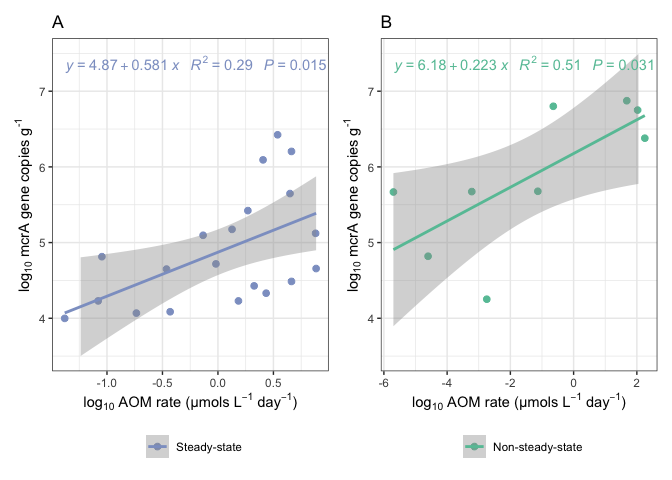

Supplemental figures and tables
================
Scott Klasek
6/10/2021

Supplemental figures S5-S8 and tables S1 & S2 are presented here. Other
figures/tables include:

Figure S1- modeling setup  
Figure S2- porewater ammonium concentrations and expected POCSR from
Storfjordrenna cores described in this study and elsewhere  
Figure S3- microbial community and porewater data from GC1048, which is
shown
[here](https://github.com/sklasek/svalflux/blob/master/markdowns/3_core_info_and_panel_figures.md)  
Figure S4- siboglinid tube pictures from cores at GHM3 seep site  
Table S3- compilation of porewater ammonium concentration data from
Storfjordrenna GHMs

## load necessary libraries and data

``` r
library(phyloseq)
library(vegan)
```

    ## Loading required package: permute

    ## Loading required package: lattice

    ## This is vegan 2.5-7

``` r
library(DESeq2)
```

    ## Loading required package: S4Vectors

    ## Loading required package: stats4

    ## Loading required package: BiocGenerics

    ## Loading required package: parallel

    ## 
    ## Attaching package: 'BiocGenerics'

    ## The following objects are masked from 'package:parallel':
    ## 
    ##     clusterApply, clusterApplyLB, clusterCall, clusterEvalQ,
    ##     clusterExport, clusterMap, parApply, parCapply, parLapply,
    ##     parLapplyLB, parRapply, parSapply, parSapplyLB

    ## The following objects are masked from 'package:stats':
    ## 
    ##     IQR, mad, sd, var, xtabs

    ## The following objects are masked from 'package:base':
    ## 
    ##     anyDuplicated, append, as.data.frame, basename, cbind, colnames,
    ##     dirname, do.call, duplicated, eval, evalq, Filter, Find, get, grep,
    ##     grepl, intersect, is.unsorted, lapply, Map, mapply, match, mget,
    ##     order, paste, pmax, pmax.int, pmin, pmin.int, Position, rank,
    ##     rbind, Reduce, rownames, sapply, setdiff, sort, table, tapply,
    ##     union, unique, unsplit, which.max, which.min

    ## 
    ## Attaching package: 'S4Vectors'

    ## The following object is masked from 'package:base':
    ## 
    ##     expand.grid

    ## Loading required package: IRanges

    ## 
    ## Attaching package: 'IRanges'

    ## The following object is masked from 'package:phyloseq':
    ## 
    ##     distance

    ## Loading required package: GenomicRanges

    ## Loading required package: GenomeInfoDb

    ## Loading required package: SummarizedExperiment

    ## Loading required package: MatrixGenerics

    ## Loading required package: matrixStats

    ## 
    ## Attaching package: 'MatrixGenerics'

    ## The following objects are masked from 'package:matrixStats':
    ## 
    ##     colAlls, colAnyNAs, colAnys, colAvgsPerRowSet, colCollapse,
    ##     colCounts, colCummaxs, colCummins, colCumprods, colCumsums,
    ##     colDiffs, colIQRDiffs, colIQRs, colLogSumExps, colMadDiffs,
    ##     colMads, colMaxs, colMeans2, colMedians, colMins, colOrderStats,
    ##     colProds, colQuantiles, colRanges, colRanks, colSdDiffs, colSds,
    ##     colSums2, colTabulates, colVarDiffs, colVars, colWeightedMads,
    ##     colWeightedMeans, colWeightedMedians, colWeightedSds,
    ##     colWeightedVars, rowAlls, rowAnyNAs, rowAnys, rowAvgsPerColSet,
    ##     rowCollapse, rowCounts, rowCummaxs, rowCummins, rowCumprods,
    ##     rowCumsums, rowDiffs, rowIQRDiffs, rowIQRs, rowLogSumExps,
    ##     rowMadDiffs, rowMads, rowMaxs, rowMeans2, rowMedians, rowMins,
    ##     rowOrderStats, rowProds, rowQuantiles, rowRanges, rowRanks,
    ##     rowSdDiffs, rowSds, rowSums2, rowTabulates, rowVarDiffs, rowVars,
    ##     rowWeightedMads, rowWeightedMeans, rowWeightedMedians,
    ##     rowWeightedSds, rowWeightedVars

    ## Loading required package: Biobase

    ## Welcome to Bioconductor
    ## 
    ##     Vignettes contain introductory material; view with
    ##     'browseVignettes()'. To cite Bioconductor, see
    ##     'citation("Biobase")', and for packages 'citation("pkgname")'.

    ## 
    ## Attaching package: 'Biobase'

    ## The following object is masked from 'package:MatrixGenerics':
    ## 
    ##     rowMedians

    ## The following objects are masked from 'package:matrixStats':
    ## 
    ##     anyMissing, rowMedians

    ## The following object is masked from 'package:phyloseq':
    ## 
    ##     sampleNames

``` r
library(tidyverse)
```

    ## ── Attaching packages ─────────────────────────────────────── tidyverse 1.3.0 ──

    ## ✓ ggplot2 3.3.3     ✓ purrr   0.3.4
    ## ✓ tibble  3.1.0     ✓ dplyr   1.0.5
    ## ✓ tidyr   1.1.3     ✓ stringr 1.4.0
    ## ✓ readr   1.4.0     ✓ forcats 0.5.1

    ## ── Conflicts ────────────────────────────────────────── tidyverse_conflicts() ──
    ## x dplyr::collapse()   masks IRanges::collapse()
    ## x dplyr::combine()    masks Biobase::combine(), BiocGenerics::combine()
    ## x dplyr::count()      masks matrixStats::count()
    ## x dplyr::desc()       masks IRanges::desc()
    ## x tidyr::expand()     masks S4Vectors::expand()
    ## x dplyr::filter()     masks stats::filter()
    ## x dplyr::first()      masks S4Vectors::first()
    ## x dplyr::lag()        masks stats::lag()
    ## x ggplot2::Position() masks BiocGenerics::Position(), base::Position()
    ## x purrr::reduce()     masks GenomicRanges::reduce(), IRanges::reduce()
    ## x dplyr::rename()     masks S4Vectors::rename()
    ## x dplyr::slice()      masks IRanges::slice()

``` r
library(patchwork)
library(ggpmisc)
```

    ## 
    ## Attaching package: 'ggpmisc'

    ## The following object is masked from 'package:ggplot2':
    ## 
    ##     annotate

``` r
library(tables)
```

    ## 
    ## Attaching package: 'tables'

    ## The following object is masked from 'package:S4Vectors':
    ## 
    ##     Factor

``` r
library(here)
```

    ## here() starts at /Users/scottklasek/Desktop/svalflux

``` r
sessioninfo <- sessionInfo()
ps.frdp <- readRDS(file="/Users/scottklasek/Desktop/svalflux/data/ps.frdp") # imports the final phyloseq object
```

## Fig. S5, regression of mcrA counts vs modeled AOM rates

I have omitted GC1048 samples from here.

``` r
mcra.aom <- read.csv(file="/Users/scottklasek/Desktop/svalflux/data/mcra.aomrate.2021.csv") # import csv
mcra.aom$logaom <- log10(mcra.aom$aom) # calculate log of AOM rates
mcra.aom$logmcra <- log10(mcra.aom$mcra) # calculate log of mcrA gene abundances

# assign stages or whatever we end up calling them
mcra.aom$stage <- "Steady-state"
mcra.aom[which(mcra.aom$core=="GC1045"),"stage"] <- "Non-steady-state"
mcra.aom[which(mcra.aom$core=="GC1081"),"stage"] <- "Non-steady-state"

mcra.aom.no48 <- mcra.aom %>% filter(core !="GC1048") # remove GC1048

# linear model steady-state
ss.lm <- lm(mcra.aom.no48 %>% filter(core_flowtype=="ss") %>% pull(logmcra) ~ 
           mcra.aom.no48 %>% filter(core_flowtype=="ss") %>% pull(logaom))  # steady-state regression
summary(ss.lm)
```

    ## 
    ## Call:
    ## lm(formula = mcra.aom.no48 %>% filter(core_flowtype == "ss") %>% 
    ##     pull(logmcra) ~ mcra.aom.no48 %>% filter(core_flowtype == 
    ##     "ss") %>% pull(logaom))
    ## 
    ## Residuals:
    ##      Min       1Q   Median       3Q      Max 
    ## -0.79377 -0.56079 -0.04376  0.39413  1.23916 
    ## 
    ## Coefficients:
    ##                                                                  Estimate
    ## (Intercept)                                                        4.8726
    ## mcra.aom.no48 %>% filter(core_flowtype == "ss") %>% pull(logaom)   0.5811
    ##                                                                  Std. Error
    ## (Intercept)                                                          0.1437
    ## mcra.aom.no48 %>% filter(core_flowtype == "ss") %>% pull(logaom)     0.2159
    ##                                                                  t value
    ## (Intercept)                                                       33.920
    ## mcra.aom.no48 %>% filter(core_flowtype == "ss") %>% pull(logaom)   2.692
    ##                                                                  Pr(>|t|)    
    ## (Intercept)                                                        <2e-16 ***
    ## mcra.aom.no48 %>% filter(core_flowtype == "ss") %>% pull(logaom)   0.0149 *  
    ## ---
    ## Signif. codes:  0 '***' 0.001 '**' 0.01 '*' 0.05 '.' 0.1 ' ' 1
    ## 
    ## Residual standard error: 0.6414 on 18 degrees of freedom
    ## Multiple R-squared:  0.287,  Adjusted R-squared:  0.2474 
    ## F-statistic: 7.246 on 1 and 18 DF,  p-value: 0.01491

``` r
# plot steady-state
ss.df <- mcra.aom.no48 %>% filter(core_flowtype=="ss")
ss.mcra <- ggplot(ss.df, aes(logaom,logmcra,color=stage))+
  geom_point(size=2)+
  geom_smooth(method = "lm")+
  scale_color_manual("", values = "#8da0cb")+
  scale_x_continuous(expression('log'[10]*" AOM rate (µmols L"^{-1}*" day"^{-1}*")"))+
  scale_y_continuous(expression('log'[10]*' mcrA gene copies g'^{"-1"}), limits = c(3.5, 7.5))+
  theme(axis.title=element_text(size = 12), axis.text = element_text(size = 11),
        legend.title = element_text(size = 12), legend.text = element_text(size = 10))+
  stat_poly_eq(formula = ss.df$logmcra ~ ss.df$logaom, 
                aes(label = paste(..eq.label.., ..rr.label.., stat(p.value.label), sep = "~~~")), 
                parse = TRUE) +  
  theme_bw()+theme(legend.position = "bottom")+ggtitle("A")

# linear model non-steady-state
nss.lm <- lm(mcra.aom.no48 %>% filter(core_flowtype=="inc") %>% pull(logmcra) ~ 
           mcra.aom.no48 %>% filter(core_flowtype=="inc") %>% pull(logaom))  # non-steady-state regression
summary(nss.lm)
```

    ## 
    ## Call:
    ## lm(formula = mcra.aom.no48 %>% filter(core_flowtype == "inc") %>% 
    ##     pull(logmcra) ~ mcra.aom.no48 %>% filter(core_flowtype == 
    ##     "inc") %>% pull(logaom))
    ## 
    ## Residuals:
    ##     Min      1Q  Median      3Q     Max 
    ## -1.3127 -0.2991  0.1226  0.3229  0.7676 
    ## 
    ## Coefficients:
    ##                                                                   Estimate
    ## (Intercept)                                                        6.17646
    ## mcra.aom.no48 %>% filter(core_flowtype == "inc") %>% pull(logaom)  0.22284
    ##                                                                   Std. Error
    ## (Intercept)                                                          0.25503
    ## mcra.aom.no48 %>% filter(core_flowtype == "inc") %>% pull(logaom)    0.08286
    ##                                                                   t value
    ## (Intercept)                                                        24.218
    ## mcra.aom.no48 %>% filter(core_flowtype == "inc") %>% pull(logaom)   2.689
    ##                                                                   Pr(>|t|)    
    ## (Intercept)                                                       5.21e-08 ***
    ## mcra.aom.no48 %>% filter(core_flowtype == "inc") %>% pull(logaom)   0.0311 *  
    ## ---
    ## Signif. codes:  0 '***' 0.001 '**' 0.01 '*' 0.05 '.' 0.1 ' ' 1
    ## 
    ## Residual standard error: 0.6885 on 7 degrees of freedom
    ## Multiple R-squared:  0.5082, Adjusted R-squared:  0.4379 
    ## F-statistic: 7.233 on 1 and 7 DF,  p-value: 0.03111

``` r
# plot non-steady-state
nss.df <- mcra.aom.no48 %>% filter(core_flowtype=="inc")
nss.mcra <- ggplot(nss.df, aes(logaom,logmcra,color=stage))+
  geom_point(size=2)+
  geom_smooth(method = "lm")+
  scale_color_manual("", values = "#66c2a5")+
  scale_x_continuous(expression('log'[10]*" AOM rate (µmols L"^{-1}*" day"^{-1}*")"))+
  scale_y_continuous(expression('log'[10]*' mcrA gene copies g'^{"-1"}), limits = c(3.5, 7.5))+
  theme(axis.title=element_text(size = 12), axis.text = element_text(size = 11),
        legend.title = element_text(size = 12), legend.text = element_text(size = 10))+
  stat_poly_eq(formula = nss.df$logmcra ~ nss.df$logaom, 
                aes(label = paste(..eq.label.., ..rr.label.., stat(p.value.label), sep = "~~~")), 
                parse = TRUE) +  
  theme_bw()+theme(legend.position = "bottom")+ggtitle("B")

ss.mcra + nss.mcra
```

    ## `geom_smooth()` using formula 'y ~ x'
    ## `geom_smooth()` using formula 'y ~ x'

<!-- -->
Figure S3. Regression of mcrA gene copy numbers (per gram bulk sediment)
to modeled AOM rates shows a linear relationship across samples from all
cores (log-log transformation). Samples are colored according to stages
of methane dynamics, and those that did not contain detectable mcrA were
omitted.

## Fig. S6 shows differentially abundant ASVs across methane flux stages and above/below the SMTZ

We have 63 samples: 15 from seep, 36 from steady-state, and 12 from
flux-increasing stages. There are no seep samples from below-SMTZ, 15
from steady-state, and 4 from flux-increasing. In an ideal world, we
would have a more balanced sample design for assessing ASVs that are
differentially abundant between these three stages (above the SMTZ) and
between the latter two stages (below SMTZ). However, DESeq2 is able to
handle imbalances in group numbers fairly robustly:
<https://support.bioconductor.org/p/115433/>

``` r
# enter logical metadata categories corresponding to whether sample stage is seep or increasing flux or steady-state

sample_data(ps.frdp)$is.seep <- FALSE
sample_data(ps.frdp)[which(sample_data(ps.frdp)$stage=="seep"),22] <- TRUE
sample_data(ps.frdp)$is.flux <- FALSE
sample_data(ps.frdp)[which(sample_data(ps.frdp)$stage=="fluxincreasing"),23] <- TRUE
sample_data(ps.frdp)$is.ss <- FALSE
sample_data(ps.frdp)[which(sample_data(ps.frdp)$stage=="steadystate"),24] <- TRUE

# here is where I omit GC1048
ps.frdp.no48 <- subset_samples(ps.frdp, core!="GC1048")
ps.frdp.no48
```

    ## phyloseq-class experiment-level object
    ## otu_table()   OTU Table:         [ 16489 taxa and 63 samples ]
    ## sample_data() Sample Data:       [ 63 samples by 24 sample variables ]
    ## tax_table()   Taxonomy Table:    [ 16489 taxa by 6 taxonomic ranks ]
    ## phy_tree()    Phylogenetic Tree: [ 16489 tips and 16487 internal nodes ]
    ## refseq()      DNAStringSet:      [ 16489 reference sequences ]

``` r
# subset the phyloseq object by above/below SMTZ
ps.above <- subset_samples(ps.frdp.no48, smtzposition=="above") 
ps.below <- subset_samples(ps.frdp.no48, smtzposition=="below") 

# make the same phyloseq object, but otu table with relative abundance instead of raw counts
ps.above.ra <- transform_sample_counts(ps.above, function(OTU) OTU/sum(OTU))
ps.below.ra <- transform_sample_counts(ps.below, function(OTU) OTU/sum(OTU))

# define a function which will make a table out of deseq biomarker results, and return taxonomy and relative abundance info 
table.stage.from.deseq <- function(deseq, relabundps, group){
  de.results <- DESeq(deseq, test = "Wald", fitType = "parametric", sfType = "poscounts")
  de.results.table <- results(de.results, cooksCutoff = FALSE)
  de.results.table <- de.results.table[which(de.results.table$padj < 0.05), ]
  meanabund.vector <- vector("numeric", length(rownames(de.results.table)))
  for (i in rownames(de.results.table)) {meanabund.vector[[i]] <- mean(otu_table(relabundps)[which(sample_data(relabundps)$stage==group),i])}
  meanabund.vector <- meanabund.vector[(0.5*length(meanabund.vector)+1):length(meanabund.vector)] 
  de.results.table <- cbind(as(meanabund.vector, "matrix"), as(de.results.table, "data.frame"), as(tax_table(relabundps)[rownames(de.results.table), ], "matrix"))
  colnames(de.results.table)[1] <- "relabund"
  return(de.results.table)
}

# then convert phyloseq object to deseq, and run the function for each stage of methane dynamics
de.above.is.seep <- phyloseq_to_deseq2(ps.above, ~ is.seep)
```

    ## converting counts to integer mode

``` r
de.results.table.above.seep <- table.stage.from.deseq(deseq = de.above.is.seep, relabundps = ps.above.ra, group = "seep") 
```

    ## estimating size factors

    ## estimating dispersions

    ## gene-wise dispersion estimates

    ## mean-dispersion relationship

    ## final dispersion estimates

    ## fitting model and testing

    ## -- replacing outliers and refitting for 3435 genes
    ## -- DESeq argument 'minReplicatesForReplace' = 7 
    ## -- original counts are preserved in counts(dds)

    ## estimating dispersions

    ## fitting model and testing

``` r
de.above.is.flux <- phyloseq_to_deseq2(ps.above, ~ is.flux)
```

    ## converting counts to integer mode

``` r
de.results.table.above.flux <- table.stage.from.deseq(deseq = de.above.is.flux, relabundps = ps.above.ra, group = "fluxincreasing") 
```

    ## estimating size factors

    ## estimating dispersions

    ## gene-wise dispersion estimates

    ## mean-dispersion relationship

    ## final dispersion estimates

    ## fitting model and testing

    ## -- replacing outliers and refitting for 3664 genes
    ## -- DESeq argument 'minReplicatesForReplace' = 7 
    ## -- original counts are preserved in counts(dds)

    ## estimating dispersions

    ## fitting model and testing

``` r
de.above.is.ss <- phyloseq_to_deseq2(ps.above, ~ is.ss)
```

    ## converting counts to integer mode

``` r
de.results.table.above.ss <- table.stage.from.deseq(deseq = de.above.is.ss, relabundps = ps.above.ra, group = "steadystate") 
```

    ## estimating size factors

    ## estimating dispersions

    ## gene-wise dispersion estimates

    ## mean-dispersion relationship

    ## final dispersion estimates

    ## fitting model and testing

    ## -- replacing outliers and refitting for 3957 genes
    ## -- DESeq argument 'minReplicatesForReplace' = 7 
    ## -- original counts are preserved in counts(dds)

    ## estimating dispersions

    ## fitting model and testing

``` r
de.below.is.flux <- phyloseq_to_deseq2(ps.below, ~ is.flux)
```

    ## converting counts to integer mode

``` r
de.results.table.below.flux <- table.stage.from.deseq(deseq = de.below.is.flux, relabundps = ps.below.ra, group = "fluxincreasing") 
```

    ## estimating size factors

    ## estimating dispersions

    ## gene-wise dispersion estimates

    ## mean-dispersion relationship

    ## final dispersion estimates

    ## fitting model and testing

    ## -- replacing outliers and refitting for 1316 genes
    ## -- DESeq argument 'minReplicatesForReplace' = 7 
    ## -- original counts are preserved in counts(dds)

    ## estimating dispersions

    ## fitting model and testing

``` r
de.below.is.ss <- phyloseq_to_deseq2(ps.below, ~ is.ss)
```

    ## converting counts to integer mode

``` r
de.results.table.below.ss <- table.stage.from.deseq(deseq = de.below.is.ss, relabundps = ps.below.ra, group = "steadystate") 
```

    ## estimating size factors

    ## estimating dispersions

    ## gene-wise dispersion estimates

    ## mean-dispersion relationship

    ## final dispersion estimates

    ## fitting model and testing

    ## -- replacing outliers and refitting for 1316 genes
    ## -- DESeq argument 'minReplicatesForReplace' = 7 
    ## -- original counts are preserved in counts(dds)

    ## estimating dispersions

    ## fitting model and testing

``` r
# assign category for each de.results.table
de.results.table.above.seep$de.group <- "above.seep"
de.results.table.above.flux$de.group <- "above.flux"
de.results.table.above.ss$de.group <- "above.ss"
de.results.table.below.flux$de.group <- "below.flux"
de.results.table.below.ss$de.group <- "below.ss"

# rewrite ASV numbers so rbind will not rename duplicates
de.results.table.above.seep$asv <- rownames(de.results.table.above.seep)
de.results.table.above.flux$asv <- rownames(de.results.table.above.flux)
de.results.table.above.ss$asv <- rownames(de.results.table.above.ss)
de.results.table.below.flux$asv <- rownames(de.results.table.below.flux)
de.results.table.below.ss$asv <- rownames(de.results.table.below.ss)

# merge the biomarkers from each block into a single data frame
all.biomarkers <- rbind(as(de.results.table.above.seep, "data.frame"), 
                        as(de.results.table.above.flux, "data.frame"), 
                        as(de.results.table.above.ss, "data.frame"),
                        as(de.results.table.below.flux, "data.frame"),
                        as(de.results.table.below.ss, "data.frame")) 

# select only the ones more abundant in the blocks (as opposed to less)
all.biomarkers <- subset(all.biomarkers, log2FoldChange>0) 

# add in metadata about SMT position only, and stage only
all.biomarkers$smtpos <- "above"
all.biomarkers[which(all.biomarkers$de.group=="below.flux"),16] <- "below"
all.biomarkers[which(all.biomarkers$de.group=="below.ss"),16] <- "below"
all.biomarkers$stage <- "increasing methane flux"
all.biomarkers[which(all.biomarkers$de.group=="above.seep"),17] <- "active methane seepage"
all.biomarkers[which(all.biomarkers$de.group=="above.ss"),17] <- "steady-state"
all.biomarkers[which(all.biomarkers$de.group=="below.ss"),17] <- "steady-state"

# subset all.biomarkers dataframe by categories we want to graph at
most.biomarkers <- all.biomarkers %>% filter(Class!="Deltaproteobacteria" & Class!="Methanomicrobia") # remove Deltaproteobacteria & ANMEs because we'll graph them at higher taxonomic resolution, also removes NAs
anme.biomarkers <- all.biomarkers %>% filter(Class == "Methanomicrobia") # subset ANMEs only (all Methanomicrobial biomarkers are ANME in this dataset)
delta.biomarkers <- all.biomarkers %>% filter(Class == "Deltaproteobacteria" & is.na(Genus)==FALSE) # subset Deltaproteobacteria only

# when plotting, facet by more than two stages: Plotting most biomarkers at the class level, but ANMEs at Family and Deltas at Genus
most.biomarkers$plotlevel <- "Community"
anme.biomarkers$plotlevel <- "ANME"
delta.biomarkers$plotlevel <- "SRB"
most.biomarkers$taxlevel <- most.biomarkers$Class
anme.biomarkers$taxlevel <- anme.biomarkers$Family
delta.biomarkers$taxlevel <- delta.biomarkers$Genus
biomarkers.to.plot <- rbind(most.biomarkers, anme.biomarkers, delta.biomarkers) # combine all subsetted dataframes for plotting

gg.all.biom <- ggplot(biomarkers.to.plot, aes(x=factor(taxlevel, levels = rev(levels(factor(taxlevel)))), y=log2FoldChange, color=Kingdom)) + 
  geom_point(aes(size = relabund*100, fill=Kingdom), color="black", pch=21) +
  scale_size_area("Percent abundance", max_size = max(all.biomarkers$relabund)*700, breaks=c(0.1, 0.3, 1, 3))+
  scale_fill_discrete("Domain")+
  scale_x_discrete("")+
  scale_y_continuous("log2 Differential Abundance Change", position = "right", limits = c(0,27)) +
  facet_grid(smtpos+plotlevel~stage, scales = "free", space = "free") +
  coord_flip() +
  theme_bw()+
  theme(strip.text.x = element_text(size=11), strip.text.y = element_text(size=8),
        axis.text.x = element_text(size=10), legend.position = "bottom", legend.box = "vertical")
gg.all.biom # export dimensions 6.3 x 6.9
```

<!-- -->

``` r
biomarkers.to.plot %>% filter(Phylum=="Atribacteria") %>% select(Class, stage) # shows biomarker ASVs for different stages and positions relative to SMT
```

    ##         Class                   stage
    ## ASV24     JS1  active methane seepage
    ## ASV38     JS1 increasing methane flux
    ## ASV3031   JS1            steady-state
    ## ASV91     JS1 increasing methane flux
    ## ASV681    JS1            steady-state

``` r
length(which(tax_table(ps.frdp)[,3]=="Calditrichia")) # shows numbers ASVs from a certain taxa
```

    ## [1] 87

``` r
# how many ASVs are differentially abundant? what average %s are they of communities across stages?
length(unique(biomarkers.to.plot$asv))
```

    ## [1] 76

``` r
sum(biomarkers.to.plot %>% filter(stage=="active methane seepage") %>% select(relabund))*100 # 17.4%
```

    ## [1] 17.4108

``` r
sum(biomarkers.to.plot %>% filter(stage=="steady-state") %>% select(relabund))*100 # 6.9%
```

    ## [1] 6.874786

``` r
sum(biomarkers.to.plot %>% filter(stage=="increasing methane flux") %>% select(relabund))*100 # 1.6%
```

    ## [1] 1.622178

``` r
# how many total ANME ASVs in the dataset?
nrow(data.frame(tax_table(ps.frdp.no48)) %>% filter(Order=="ANME-1" | Family=="ANME-2a-2b"| Family=="ANME-2c" | Genus=="ANME-3"))
```

    ## [1] 41

(Made this figure a little easier to read in Affinity Designer).

## Fig. S7, ordination of just increasing-flux cores by geochem\_zone

``` r
# transform the phyloseq object
otu.hel <- otu_table(decostand(otu_table(ps.frdp), method = "hellinger"), taxa_are_rows=FALSE)
ps.hel <- phyloseq(tax_table(ps.frdp),
                    sample_data(ps.frdp),
                    otu_table(otu.hel),
                    phy_tree(ps.frdp),
                    refseq(ps.frdp)) 

# make better labels for plotting
sample_data(ps.hel)$stage <- ifelse(sample_data(ps.hel)$stage == "seep", "active methane seepage",
                        ifelse(sample_data(ps.hel)$stage == "fluxincreasing", "increasing methane flux",
                        ifelse(sample_data(ps.hel)$stage == "steadystate", "steady-state", NA)))
sample_data(ps.hel)$geochem_zone <- ifelse(sample_data(ps.hel)$geochem_zone == "lin", "linear SR zone",
                        ifelse(sample_data(ps.hel)$geochem_zone == "nss", "nonlinear SR zone",
                        ifelse(sample_data(ps.hel)$geochem_zone == "below", "below SMT", NA)))
sample_data(ps.hel)$geochem_zone <- factor(sample_data(ps.hel)$geochem_zone, levels = c("linear SR zone", "nonlinear SR zone", "below SMT")) 

ps.hel.fluxinc <- subset_samples(ps.hel, stage=="increasing methane flux") # subset for samples experiencing methane flux increase
ord.ps.helfluxinc.wuni.pcoa <- ordinate(ps.hel.fluxinc, "PCoA", "unifrac", weighted=TRUE) # ordinate
```

    ## Warning in UniFrac(physeq, ...): Randomly assigning root as -- ASV4052 -- in the
    ## phylogenetic tree in the data you provided.

``` r
fluxord <- plot_ordination(ps.hel.fluxinc, ord.ps.helfluxinc.wuni.pcoa, color = "geochem_zone")+
  scale_color_manual("Redox zones",values = c("#e78ac3","#a6d854","#ffd92f"))+
  stat_ellipse()+
  theme_bw()
fluxord 
```

<!-- -->
From the very few samples we have here, the idea that the linear SR zone
is the outlier is supported.

## Figure S8 [network here](https://github.com/sklasek/svalflux/blob/master/markdowns/7_network.md).

## Table S1: table of core info

``` r
coreinfo <- read.csv(file="/Users/scottklasek/Desktop/svalflux/data/coreinfo.csv") # import csv
names(coreinfo)[1:6] <- c("Core", "Latitude", "Longitude", "Water depth (m)", "Core recovery (cm)", "SMT depth (cm)")
flux <- c("~100 (estimated, see text)", 5.28, 4.22, 0.41, 1.30, 1.30, 1.30)
coreinfo <- cbind(coreinfo, flux)
colnames(coreinfo)[7] <- "Methane flux (mol m-2 yr-1) at time of sampling"
coreinfo
```

    ##     Core   Latitude  Longitude Water depth (m) Core recovery (cm)
    ## 1 PC1029  76 06.398  15 58.151             381                 27
    ## 2 GC1045  76 06.347  15 57.959             387                130
    ## 3 GC1081 76 07.022  16 02.593              369                102
    ## 4 GC1048 76 06.737  15 59.845              387                335
    ## 5 GC1068 76 06.739  16 00.311              384                295
    ## 6 GC1069 76 06.719  16 00.334              383                227
    ## 7 GC1070 76 06.703  16 00.162              385                326
    ##   SMT depth (cm) Methane flux (mol m-2 yr-1) at time of sampling
    ## 1             NA                      ~100 (estimated, see text)
    ## 2             82                                            5.28
    ## 3             56                                            4.22
    ## 4            320                                            0.41
    ## 5            108                                             1.3
    ## 6            138                                             1.3
    ## 7             69                                             1.3

Table S1. Latitude, longitude, water depth, core recovery, and
sulfate-methane transition depth of all cores analyzed in this study.

## Table S2: methane flux histories

``` r
inc.core <- read.csv(file="/Users/scottklasek/Desktop/svalflux/data/increasing.core.flux.table.csv") # import csv
names(inc.core)[2:4] <- c("Year before sampling", "CH4 flux mols m^-2 yr ^-1", "Peak AOM depth (cm)") # rename columns to be more legible
inc.core
```

    ##      Core Year before sampling CH4 flux mols m^-2 yr ^-1 Peak AOM depth (cm)
    ## 1  GC1045                   21                     3.674               280.0
    ## 2  GC1045                   20                     3.744               270.0
    ## 3  GC1045                   19                     3.808               257.5
    ## 4  GC1045                   18                     3.874               247.5
    ## 5  GC1045                   17                     3.944               237.5
    ## 6  GC1045                   16                     4.021               227.5
    ## 7  GC1045                   15                     4.101               217.5
    ## 8  GC1045                   14                     4.184               207.5
    ## 9  GC1045                   13                     4.268               197.5
    ## 10 GC1045                   12                     4.351               187.5
    ## 11 GC1045                   11                     4.433               177.5
    ## 12 GC1045                   10                     4.514               167.5
    ## 13 GC1045                    9                     4.593               157.5
    ## 14 GC1045                    8                     4.671               147.5
    ## 15 GC1045                    7                     4.749               137.5
    ## 16 GC1045                    6                     4.826               127.5
    ## 17 GC1045                    5                     4.902               117.5
    ## 18 GC1045                    4                     4.978               107.5
    ## 19 GC1045                    3                     5.054                97.5
    ## 20 GC1045                    0                     5.279                67.5
    ## 21 GC1081                   22                     2.930               275.0
    ## 22 GC1081                   17                     3.253               225.0
    ## 23 GC1081                   12                     3.589               175.0
    ## 24 GC1081                    7                     3.899               125.0
    ## 25 GC1081                    2                     4.207                75.0
    ## 26 GC1081                    1                     4.267                65.0
    ## 27 GC1081                    0                     4.325                55.0
    ## 28 GC1081                   -1                     4.379                45.0
    ## 29 GC1081                   -2                     4.430                35.0

Table S2. Increases in methane flux over the past two decades for cores
GC1045 and GC1081 and corresponding depths of modeled peak AOM rates.
Fluxes are integrated from AOM rate data, using cell widths of 2.5 cm.
(Peak AOM depths also at 2.5 cm resolution).

## session info

``` r
sessioninfo
```

    ## R version 4.0.3 (2020-10-10)
    ## Platform: x86_64-apple-darwin17.0 (64-bit)
    ## Running under: macOS Catalina 10.15.7
    ## 
    ## Matrix products: default
    ## BLAS:   /Library/Frameworks/R.framework/Versions/4.0/Resources/lib/libRblas.dylib
    ## LAPACK: /Library/Frameworks/R.framework/Versions/4.0/Resources/lib/libRlapack.dylib
    ## 
    ## locale:
    ## [1] en_US.UTF-8/en_US.UTF-8/en_US.UTF-8/C/en_US.UTF-8/en_US.UTF-8
    ## 
    ## attached base packages:
    ## [1] parallel  stats4    stats     graphics  grDevices utils     datasets 
    ## [8] methods   base     
    ## 
    ## other attached packages:
    ##  [1] here_1.0.1                  tables_0.9.6               
    ##  [3] ggpmisc_0.3.9               patchwork_1.1.1            
    ##  [5] forcats_0.5.1               stringr_1.4.0              
    ##  [7] dplyr_1.0.5                 purrr_0.3.4                
    ##  [9] readr_1.4.0                 tidyr_1.1.3                
    ## [11] tibble_3.1.0                ggplot2_3.3.3              
    ## [13] tidyverse_1.3.0             DESeq2_1.30.1              
    ## [15] SummarizedExperiment_1.20.0 Biobase_2.50.0             
    ## [17] MatrixGenerics_1.2.1        matrixStats_0.58.0         
    ## [19] GenomicRanges_1.42.0        GenomeInfoDb_1.26.2        
    ## [21] IRanges_2.24.1              S4Vectors_0.28.1           
    ## [23] BiocGenerics_0.36.0         vegan_2.5-7                
    ## [25] lattice_0.20-41             permute_0.9-5              
    ## [27] phyloseq_1.34.0            
    ## 
    ## loaded via a namespace (and not attached):
    ##  [1] colorspace_2.0-0       ellipsis_0.3.1         rprojroot_2.0.2       
    ##  [4] XVector_0.30.0         fs_1.5.0               rstudioapi_0.13       
    ##  [7] bit64_4.0.5            AnnotationDbi_1.52.0   fansi_0.4.2           
    ## [10] lubridate_1.7.10       xml2_1.3.2             codetools_0.2-18      
    ## [13] splines_4.0.3          cachem_1.0.4           geneplotter_1.68.0    
    ## [16] knitr_1.31             ade4_1.7-16            jsonlite_1.7.2        
    ## [19] broom_0.7.5            annotate_1.68.0        cluster_2.1.1         
    ## [22] dbplyr_2.1.0           compiler_4.0.3         httr_1.4.2            
    ## [25] backports_1.2.1        assertthat_0.2.1       Matrix_1.3-2          
    ## [28] fastmap_1.1.0          cli_2.4.0              htmltools_0.5.1.1     
    ## [31] prettyunits_1.1.1      tools_4.0.3            igraph_1.2.6          
    ## [34] gtable_0.3.0           glue_1.4.2             GenomeInfoDbData_1.2.4
    ## [37] reshape2_1.4.4         Rcpp_1.0.6             cellranger_1.1.0      
    ## [40] vctrs_0.3.7            Biostrings_2.58.0      rhdf5filters_1.2.0    
    ## [43] multtest_2.46.0        ape_5.4-1              nlme_3.1-152          
    ## [46] iterators_1.0.13       xfun_0.21              rvest_0.3.6           
    ## [49] lifecycle_1.0.0        XML_3.99-0.5           zlibbioc_1.36.0       
    ## [52] MASS_7.3-53.1          scales_1.1.1           hms_1.0.0             
    ## [55] biomformat_1.18.0      rhdf5_2.34.0           RColorBrewer_1.1-2    
    ## [58] yaml_2.2.1             memoise_2.0.0          stringi_1.5.3         
    ## [61] RSQLite_2.2.3          genefilter_1.72.1      foreach_1.5.1         
    ## [64] BiocParallel_1.24.1    rlang_0.4.10           pkgconfig_2.0.3       
    ## [67] bitops_1.0-6           evaluate_0.14          Rhdf5lib_1.12.1       
    ## [70] bit_4.0.4              tidyselect_1.1.0       plyr_1.8.6            
    ## [73] magrittr_2.0.1         R6_2.5.0               generics_0.1.0        
    ## [76] DelayedArray_0.16.2    DBI_1.1.1              withr_2.4.1           
    ## [79] pillar_1.6.0           haven_2.3.1            mgcv_1.8-34           
    ## [82] survival_3.2-7         RCurl_1.98-1.2         modelr_0.1.8          
    ## [85] crayon_1.4.1           utf8_1.2.1             rmarkdown_2.7         
    ## [88] progress_1.2.2         locfit_1.5-9.4         grid_4.0.3            
    ## [91] readxl_1.3.1           data.table_1.14.0      blob_1.2.1            
    ## [94] reprex_1.0.0           digest_0.6.27          xtable_1.8-4          
    ## [97] munsell_0.5.0
