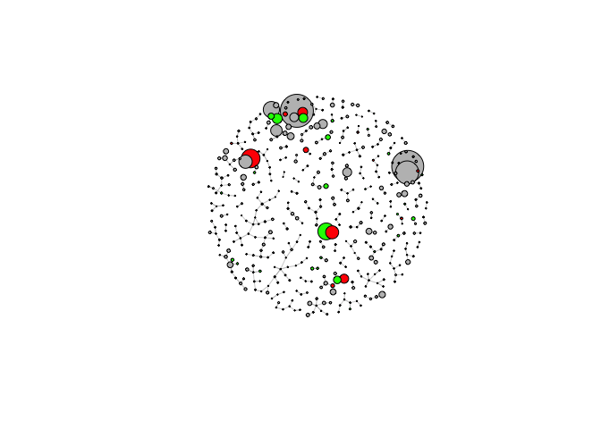
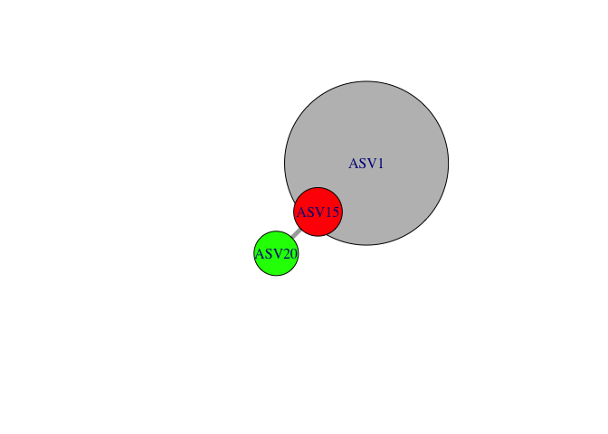
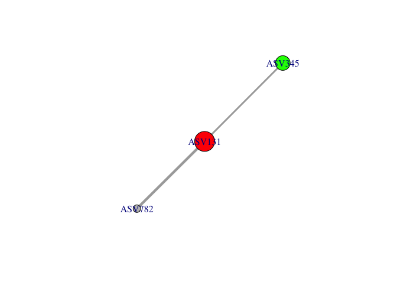
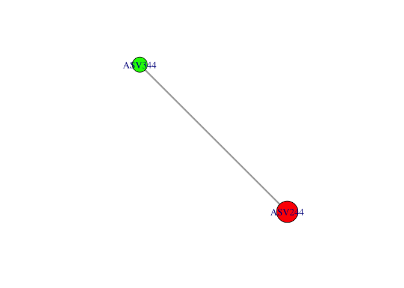
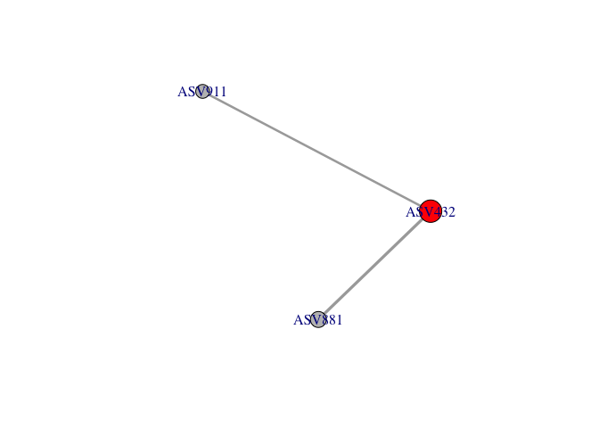
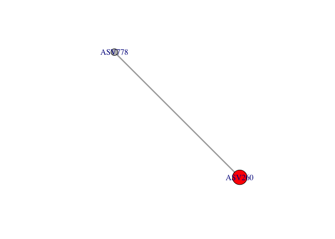

ANME-SRB Networks
================
Scott Klasek
4/26/2021

Motivation: Svalbard paper, still in review. Reviewer \#4 requests FISH
data as proof of ANME-SRB interactions. We don’t have FISH samples, the
best we can do is offer a network and infer interactions through
co-occurrences.

Approach: Use Flashweave to construct a co-occurence network (on MBL
server) on common ASVs across all samples, plot the strongest
connections between ASVs overall, and see whether the strongest
co-occurences to ANME are SRB.

### load libraries

``` r
library(tidyverse)
library(phyloseq)
library(patchwork)
library(here)
library(igraph)
```

### load data

``` r
# phyloseq objects
ps.frdp <- readRDS(file = "/Users/scottklasek/Desktop/svalflux/data/ps.frdp") # this is pruned, decontaminated, final phyloseq object
```

### functions

``` r
# asvcumulate calculates prevalence and cumulative abundance of ASVs, ranking by most common to least common, returning a dataframe
# input is a phyloseq object
asvcumulate <- function(ps){
  ps.cumul.abund <- data.frame(taxa_sums(ps)) # make a dataframe of the number of reads for each ASV across the dataset
  colnames(ps.cumul.abund)[1] <- "reads" # relabel the column
  ps.cumul.abund$pctreads <- 100*ps.cumul.abund$reads/sum(taxa_sums(ps)) # this column is the percent of reads in the entire dataset from each ASV
  asv.binary.ps <- data.frame(otu_table(ps)) # write ASV table to data frame
  asv.binary.ps[asv.binary.ps > 0] <- 1 # convert all reads to presence/absence
  asv.prevalence <- colSums(asv.binary.ps) # count the number of communities each ASV appears in 
  asv.pct.prevalence <- (asv.prevalence/nsamples(ps))*100 # convert this into percent
  ps.cumul.abund$pct_prevalence <- asv.pct.prevalence # add in prevalence information (what % of communities have this ASV in them)
  ps.cumul.abund <- ps.cumul.abund[order(-ps.cumul.abund$reads),] # this orders ASVs by most abundant to least (for the love of god, make sure you have more than one row in   your dataframe when you do this or you can kiss your sweet row names GOODBYE)
  ps.cumul.abund$csum <- cumsum(ps.cumul.abund$pctreads) # calculate cumulative sum
  ps.cumul.abund$rank <- c(1:nrow(ps.cumul.abund)) # define a rank to plot with
  return(ps.cumul.abund)
}

# add_pa_to_graph calculates percent abundances from a phyloseq object and adds them to an igraph
# it takes a phyloseq object, a subset of ASVs from that phyloseq object used to construct an igraph, and the igraph itself. 
# make sure not to give it the already-subsetted phyloseq object, otherwise percent abundances will be wrong.
add_pa_to_graph <- function(asvlist, ps, graph){ # add metadata_value if there is metadata
  ps.pa <- transform_sample_counts(ps, function(OTU) OTU/sum(OTU)*100) # convert into percent abundances
  ps.pa.pruned <- prune_taxa(asvlist, ps.pa) # remove the ASVs from asvlist from the phyloseq object
  mean.asv.abunds <- colSums(otu_table(ps.pa.pruned))/nrow(otu_table(ps.pa.pruned)) # write average percent abundance of each ASV (taxa should be columns)
  # metadata.columns <- length(which(V(graph)$mv > 0)) # skip if no metadata in graph
  # mean.asv.abunds <- c(mean.asv.abunds, rep(metadata_value, times=metadata.columns)) # add in values for the metadata columns or skip if no metadata in graph
  graph.pa <- set_vertex_attr(graph, "pa", index = V(graph), mean.asv.abunds) # set pa as an attribute of the graph
  return(graph.pa) # return the summary of the graph
}

# graph.subset.plot
# subsets an igraph based on whatever vertex you input and plots it all nice
graph.subset.plot <- function(graph, vertex){
  subset <- subgraph.edges(graph, E(graph)[from(V(graph)[label==vertex])])
  p <- plot(subset, edge.width=E(subset)$weight*5, 
     layout = layout_(subset, nicely()), 
     vertex.color=V(subset)$category, 
     vertex.size=(V(subset)$pa)^(1/2)*120)
  return(p)
}
```

### subset ASVs to construct our network from, and export data for Flashweave

``` r
# calculate and plot abundance and prevalence for each ASV
ps.all.asvc <- asvcumulate(ps.frdp) 
ggplot(ps.all.asvc[1:1000,], aes(rank, csum, color=pct_prevalence))+ # plot 
  geom_point(size=0.6)+
  scale_x_continuous("ASV rank")+
  scale_y_continuous("cumulative % of reads in Inoculated samples", limits = c(0,100))+
  scale_color_gradient2("% Prevalence", midpoint = 25, low = "red", mid = "white", high = "blue", space = "Lab" )+
  ggtitle("Top 1000 Svalbard ASVs across all samples")
```

<!-- -->

``` r
nsamples(ps.frdp) # some stats
```

    ## [1] 76

``` r
ntaxa(ps.frdp)
```

    ## [1] 16489

``` r
# select and keep only ASVs in 3 or more samples, and with abundances of > 0.01% (that corresponds to around 250 reads) 
select.asvs <- rownames(ps.all.asvc %>% filter(pct_prevalence > (2/76*100) & pctreads > 0.01))
ps.select.asvs <- prune_taxa(select.asvs, ps.frdp) # this keeps 844 ASVs

# keep only the metadata we want in the graph
sample_data(ps.select.asvs) <- data.frame(sample_data(ps.select.asvs)) %>% select(core, pingo, core_flowtype, geochem_zone, stage) # no NAs, good

# export the ASV count table for flashweave input
write.csv(otu_table(ps.select.asvs),"/Users/scottklasek/Desktop/svalflux/data/sval.asv.table.csv")

# write csv
write.csv(data.frame(sample_data(ps.select.asvs)), file = "/Users/scottklasek/Desktop/svalflux/data/sval.metadata.csv")
```

### run Flashweave

This is not being run locally on my computer because I don’t have
Flashweave. I’m uploading it to the server and running these commands
there.

``` bash
# upload these output files 
scp Desktop/svalflux/data/sval* sklasek@evol5.mbl.edu:/workspace/sklasek/svalbard

# navigate to the flashweave input directory
cd /workspace/sklasek/svalbard

# start Julia and activate FlashWeave
screen -S flashweave
module load julia
julia
using FlashWeave

# assign input file names 
data_path_i = "sval.asv.table.csv"
meta_data_path_i = "sval.metadata.csv"

# run flashweave
graph = learn_network(data_path_i, meta_data_path_i, sensitive=true, heterogeneous=false)
save_network("sval.graph.1.gml", graph)

# exit Julia
exit()

# download graph
scp barhal-01:/workspace/sklasek/svalbard/sval.graph.1.gml ~/Desktop/svalflux/data/
```

### import and inspect graph

``` r
sval.graph.1.gml <- read_graph(file = "/Users/scottklasek/Desktop/svalflux/data/sval.graph.1.gml", format = "gml") # import

summary(sval.graph.1.gml) # stats: 862 vertices, 1752 edges.
```

    ## IGRAPH 31f2c79 U-W- 862 1752 -- 
    ## + attr: id (v/n), label (v/c), mv (v/n), weight (e/n)

``` r
hist(degree(sval.graph.1.gml), breaks=20) # degree is the number of adjacent edges for each node
```

<!-- -->

``` r
E(sval.graph.1.gml)$weight %>% hist # weight is the strength of those edges. Most are weak positive. 
```

<!-- --> A normal
distribution of degrees, with a few outliers with &gt;8 connections.
These would be keystone species, possibly our ANME/SRB but could be
others. Evidence of ANME/SRB interactions would probably be in the edges
with the highest weights.

### Add ANME/SRB info and percent abundances into the graph

``` r
anme1.asvs <- rownames(data.frame(tax_table(ps.select.asvs)) %>% filter(Order=="ANME-1")) # here are the ANME-1 ASVs in our select ps object
anme2ab.asvs <- rownames(data.frame(tax_table(ps.select.asvs)) %>% filter(Family=="ANME-2a-2b")) # the ANME-2 ASVs
anme2c.asvs <- rownames(data.frame(tax_table(ps.select.asvs)) %>% filter(Family=="ANME-2c")) # the ANME-2 ASVs
anme3.asvs <- rownames(data.frame(tax_table(ps.select.asvs)) %>% filter(Genus=="ANME-3")) # the ANME-3 ASVs
all.anme.asvs <- c(anme1.asvs, anme2ab.asvs, anme2c.asvs, anme3.asvs) # all ANMEs 

seep.srb.asvs <- rownames(data.frame(tax_table(ps.select.asvs)) %>% filter(Genus=="SEEP-SRB1" | Genus=="SEEP-SRB2")) # seep SRBs
other.srb.asvs <- rownames(data.frame(tax_table(ps.select.asvs)) %>% filter(Genus=="Desulfatiglans" | Genus=="Desulfobulbus" | Genus=="Desulfococcus")) # other SRBs known to associate with ANMEs and plotted in figures
all.srb.asvs <- c(seep.srb.asvs, other.srb.asvs) # all SRBs

# get rid of metadata (for now)
sval.graph.1.nm.gml <- delete.vertices(sval.graph.1.gml, which(V(sval.graph.1.gml)$mv > 0))

# make a data frame of vertex ids and labels (ASV names) and assign a categorical column based on whether an ASV is an ANME, SRB, or neither
graph.data <- data.frame(V(sval.graph.1.nm.gml)$id, V(sval.graph.1.nm.gml)$label)
colnames(graph.data) <- c("id", "label")
graph.data$category <- rep("gray", times=nrow(graph.data)) # default value is "neither" 
graph.data[match(all.anme.asvs, graph.data$label),3] <- "red" # writes ANME over "neither" for all ANMEs in the list
graph.data[match(all.srb.asvs, graph.data$label),3] <- "green" # writes SRB over "neither" for all SRBs in the list

# write category info (ANME, SRB, or neither) into the graph
sval.graph.1.nm.gml <- set_vertex_attr(sval.graph.1.nm.gml, "category", index = V(sval.graph.1.nm.gml), graph.data$category)

# add percent abundances to graph
sval.graph.1.nm.pa.gml <- add_pa_to_graph(select.asvs, ps.frdp, sval.graph.1.nm.gml)
summary(sval.graph.1.nm.pa.gml)
```

    ## IGRAPH 08c7ee5 U-W- 844 1694 -- 
    ## + attr: id (v/n), label (v/c), mv (v/n), category (v/c), pa (v/n),
    ## | weight (e/n)

### plot the graph

``` r
# plot all ASVs
plot(sval.graph.1.nm.pa.gml, 
     layout = layout_(sval.graph.1.nm.pa.gml, nicely()), 
     vertex.color=V(sval.graph.1.nm.pa.gml)$category, 
     vertex.label = NA,
     vertex.size=(V(sval.graph.1.nm.pa.gml)$pa)^(1/3)*10, # cube root transform to minimize size differences in the nodes
     edge.width=E(sval.graph.1.nm.pa.gml)$weight) 
```

<!-- -->

``` r
# hard to see which weights are high/low. trim low weights
sval.graph.1.nm.pa.w.gml <- delete.edges(sval.graph.1.nm.pa.gml, which(E(sval.graph.1.nm.pa.gml)$weight <0.5))

# remove isolated nodes
isolated.vertices <- which(degree(sval.graph.1.nm.pa.w.gml)==0)
sval.graph.1.nm.pa.w.gml <- delete.vertices(sval.graph.1.nm.pa.w.gml, isolated.vertices)

# plot again
plot(sval.graph.1.nm.pa.w.gml, 
     layout = layout_(sval.graph.1.nm.pa.w.gml, nicely()), 
     vertex.color=V(sval.graph.1.nm.pa.w.gml)$category, 
     vertex.label = NA,
     vertex.size=(V(sval.graph.1.nm.pa.w.gml)$pa)^(1/2)*10, # square root transform to minimize size differences in the nodes
     edge.width=E(sval.graph.1.nm.pa.w.gml)$weight) 
```

<!-- -->

The first graph is a bit confusing because we can’t see the weights very
well and the layout is not great. After removing weights with values
under 0.6 (and removing the nodes that became isolated due to this)
graphing again yielded far fewer ASVs. Now we can interpret this graph.
Three of the top four ANME ASVs are connected to SRB, and the reciprocal
looks to be true as well. To tell who these are, I had to remove the
vertex.label=NA option while plotting and I zoomed in real close to read
ASV numbers. One cluster consists of ASVs 1, 15, and 20; another, ASVs 6
and 9; another, ASVs 30, 93, plus a few others.

### follow up on these clusters

Subset just the top ANMEs and whoever they’re connected to, plotting
weights so you can see them as thin/thick

``` r
strong.connection.anme.asvs <- intersect(all.anme.asvs, V(sval.graph.1.nm.pa.w.gml)$label) # the ANMEs that have strong connections in the graph
strong.connection.anme.asvs <- strong.connection.anme.asvs[which(strong.connection.anme.asvs!="ASV301")] # omit 301 because redundant
strong.connection.anme.asvs <- strong.connection.anme.asvs[which(strong.connection.anme.asvs!="ASV841")] # 841 is also redundant

data.frame(tax_table(ps.select.asvs))[c(strong.connection.anme.asvs, "ASV301", "ASV841"),] # taxonomies of strong connection ANMEs (adding back in the two previously omitted)
```

    ##        Kingdom        Phylum           Class             Order
    ## ASV4   Archaea Euryarchaeota Methanomicrobia            ANME-1
    ## ASV9   Archaea Euryarchaeota Methanomicrobia            ANME-1
    ## ASV15  Archaea Euryarchaeota Methanomicrobia            ANME-1
    ## ASV18  Archaea Euryarchaeota Methanomicrobia            ANME-1
    ## ASV131 Archaea Euryarchaeota Methanomicrobia            ANME-1
    ## ASV244 Archaea Euryarchaeota Methanomicrobia            ANME-1
    ## ASV432 Archaea Euryarchaeota Methanomicrobia            ANME-1
    ## ASV518 Archaea Euryarchaeota Methanomicrobia            ANME-1
    ## ASV34  Archaea Euryarchaeota Methanomicrobia Methanosarcinales
    ## ASV93  Archaea Euryarchaeota Methanomicrobia Methanosarcinales
    ## ASV79  Archaea Euryarchaeota Methanomicrobia Methanosarcinales
    ## ASV260 Archaea Euryarchaeota Methanomicrobia Methanosarcinales
    ## ASV301 Archaea Euryarchaeota Methanomicrobia Methanosarcinales
    ## ASV841 Archaea Euryarchaeota Methanomicrobia Methanosarcinales
    ##                    Family   Genus
    ## ASV4              ANME-1a    <NA>
    ## ASV9              ANME-1a    <NA>
    ## ASV15             ANME-1b    <NA>
    ## ASV18             ANME-1b    <NA>
    ## ASV131            ANME-1a    <NA>
    ## ASV244            ANME-1a    <NA>
    ## ASV432            ANME-1b    <NA>
    ## ASV518            ANME-1b    <NA>
    ## ASV34          ANME-2a-2b ANME-2b
    ## ASV93          ANME-2a-2b    <NA>
    ## ASV79             ANME-2c    <NA>
    ## ASV260 Methanosarcinaceae  ANME-3
    ## ASV301         ANME-2a-2b    <NA>
    ## ASV841            ANME-2c    <NA>

``` r
# par(mfrow=c(4,3))
for (i in strong.connection.anme.asvs) {graph.subset.plot(sval.graph.1.nm.pa.w.gml, i)} # graph them
```

<!-- --><!-- --><!-- --><!-- --><!-- --><!-- --><!-- --><!-- --><!-- --><!-- --><!-- --><!-- -->

Omitted two ANME ASVs above because they co-occur with other ANMEs and
would have been double-plotted here. From this plot we can conclude that
SRB make up many of the strongest connections to ANME, particularly
among high-abundance sequences. ASV50 may also be a SRB, see taxonomy
below.

Which SRB do ANMEs most strongly co-occur with? What other non-SRB?

``` r
srb.strong.connections <- c("ASV6", "ASV20", "ASV30", "ASV344", "ASV345")
data.frame(tax_table(ps.select.asvs))[srb.strong.connections,]
```

    ##         Kingdom         Phylum               Class             Order
    ## ASV6   Bacteria Proteobacteria Deltaproteobacteria Desulfobacterales
    ## ASV20  Bacteria Proteobacteria Deltaproteobacteria   Desulfarculales
    ## ASV30  Bacteria Proteobacteria Deltaproteobacteria Desulfobacterales
    ## ASV344 Bacteria Proteobacteria Deltaproteobacteria   Desulfarculales
    ## ASV345 Bacteria Proteobacteria Deltaproteobacteria   Desulfarculales
    ##                    Family          Genus
    ## ASV6   Desulfobacteraceae      SEEP-SRB1
    ## ASV20    Desulfarculaceae Desulfatiglans
    ## ASV30  Desulfobacteraceae      SEEP-SRB1
    ## ASV344   Desulfarculaceae Desulfatiglans
    ## ASV345   Desulfarculaceae Desulfatiglans

``` r
other.strong.connections <- c("ASV1", "ASV8", "ASV50", "ASV81", "ASV238", "ASV610", "ASV682", "ASV748", "ASV778", "ASV782", "ASV881", "ASV911")
data.frame(tax_table(ps.select.asvs))[other.strong.connections,]
```

    ##         Kingdom         Phylum               Class               Order
    ## ASV1   Bacteria   Atribacteria                 JS1                <NA>
    ## ASV8   Bacteria  Acidobacteria       Aminicenantia     Aminicenantales
    ## ASV50  Bacteria Proteobacteria Deltaproteobacteria   Desulfobacterales
    ## ASV81  Bacteria Actinobacteria      Acidimicrobiia     Actinomarinales
    ## ASV238 Bacteria Proteobacteria Deltaproteobacteria Syntrophobacterales
    ## ASV610 Bacteria Actinobacteria      Coriobacteriia               OPB41
    ## ASV682 Bacteria  Cloacimonetes       Cloacimonadia     Cloacimonadales
    ## ASV748 Bacteria  Bacteroidetes         Bacteroidia       Bacteroidales
    ## ASV778 Bacteria    Chloroflexi     Dehalococcoidia       Sh765B-AG-111
    ## ASV782 Bacteria    Chloroflexi        Anaerolineae      Thermoflexales
    ## ASV881 Bacteria Planctomycetes       Phycisphaerae               MSBL9
    ## ASV911 Bacteria     Firmicutes          Clostridia       Clostridiales
    ##                     Family        Genus
    ## ASV1                  <NA>         <NA>
    ## ASV8                  <NA>         <NA>
    ## ASV50     Desulfobulbaceae         <NA>
    ## ASV81                 <NA>         <NA>
    ## ASV238       Syntrophaceae         <NA>
    ## ASV610                <NA>         <NA>
    ## ASV682               MSBL8         <NA>
    ## ASV748 Bacteroidetes_BD2-2         <NA>
    ## ASV778                <NA>         <NA>
    ## ASV782     Thermoflexaceae Thermoflexus
    ## ASV881               SG8-4         <NA>
    ## ASV911                <NA>         <NA>

Seep-SRB1 and Desulfatiglans. And ASV50 is in Family Desulfobulbaceae,
but has no Genus ID. Other abundant ASVs that co-occur with ANME include
Atribacteria (JS1), Aminicenantales, and Actinomarinales (both Orders).

Top ANME-SRB pairs include ASVs 6/9 (ANME-1a and Seep-SRB1), ASVs 15/20
(ANME-1b and Desulfatiglans), ASVs 18/30 (ANME-1b and Seep-SRB1), ASVs
244/344 (ANME-1a and Desulfatiglans), ASVs 30/293 (ANME-2a-2b and
Seep-SRB1), and ASVs 131/345 (ANME-1a and Desulfatiglans). They don’t
seem to be too clade-specific.
