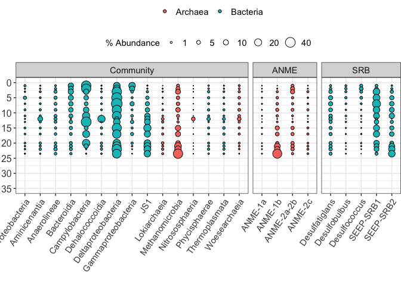
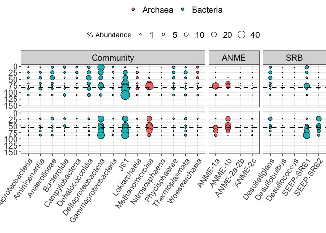
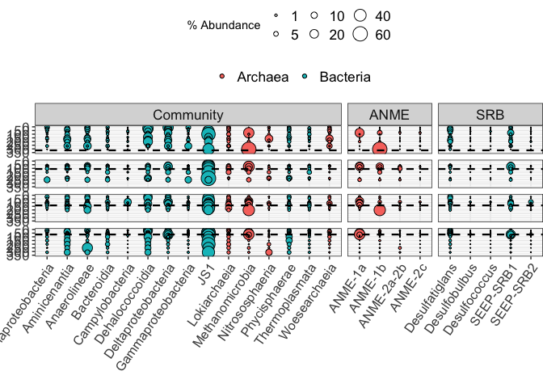

bubble\_plots\_8.20
================
Scott Klasek
8/26/2020

## recreate bubble plots from the phyloseq object

## load necessary libraries

``` r
library(tidyverse)
```

    ## ── Attaching packages ──────────────────────────────────────────────────────────────────────────────────────────────────────────────────────── tidyverse 1.3.0 ──

    ## ✓ ggplot2 3.3.2     ✓ purrr   0.3.3
    ## ✓ tibble  2.1.3     ✓ dplyr   0.8.4
    ## ✓ tidyr   1.0.2     ✓ stringr 1.4.0
    ## ✓ readr   1.3.1     ✓ forcats 0.4.0

    ## Warning: package 'ggplot2' was built under R version 3.6.2

    ## ── Conflicts ─────────────────────────────────────────────────────────────────────────────────────────────────────────────────────────── tidyverse_conflicts() ──
    ## x dplyr::filter() masks stats::filter()
    ## x dplyr::lag()    masks stats::lag()

``` r
library(phyloseq)
library(here)
```

    ## here() starts at /Users/scottklasek/Desktop/svalflux

``` r
sessioninfo <- sessionInfo()
```

## import phyloseq object

ps.frdp is from sequence\_processing Rmd script  
also calculate a few stats of abundant
ASVs

``` r
ps.frdp <- readRDS(file="/Users/scottklasek/Desktop/svalflux/data/ps.frdp") # imports the final phyloseq object

# what are the most abundant ASVs?
ps.ra <- transform_sample_counts(ps.frdp, function(OTU) OTU/sum(OTU))
asv.ras <- colSums(otu_table(ps.ra)*100/(nsamples(ps.ra))) # calculates the average percent abundance of each ASV in dataset
asvpcts <- data.frame(cbind(names(asv.ras), asv.ras, tax_table(ps.ra))) # combine taxonomy and percent abundances of most abundant ASVs
colnames(asvpcts)[1] <- "ASV" # rename column
colnames(asvpcts)[2] <- "percent_abundance" # rename column
asvpcts$percent_abundance <- as.numeric(as.character(asvpcts$percent_abundance)) # convert to numeric
asvpcts.abund <- asvpcts %>% filter(percent_abundance > 1) # select only the ones above 1% 
asvpcts.abund
```

    ##      ASV percent_abundance  Kingdom             Phylum               Class
    ## 1   ASV1          9.153714 Bacteria       Atribacteria                 JS1
    ## 2   ASV2          8.576176 Bacteria       Atribacteria                 JS1
    ## 3   ASV3          4.501283 Bacteria       Atribacteria                 JS1
    ## 4   ASV4          2.921338  Archaea      Euryarchaeota     Methanomicrobia
    ## 5   ASV5          2.209417 Bacteria Epsilonbacteraeota     Campylobacteria
    ## 6   ASV6          2.388554 Bacteria     Proteobacteria Deltaproteobacteria
    ## 7   ASV7          1.602793  Archaea      Euryarchaeota     Methanomicrobia
    ## 8   ASV8          1.494097 Bacteria      Acidobacteria       Aminicenantia
    ## 9   ASV9          1.427267  Archaea      Euryarchaeota     Methanomicrobia
    ## 10 ASV10          1.192114 Bacteria     Proteobacteria Deltaproteobacteria
    ## 11 ASV11          1.110465 Bacteria        Chloroflexi        Anaerolineae
    ## 12 ASV13          1.012734 Bacteria       Atribacteria                 JS1
    ##                Order             Family      Genus
    ## 1               <NA>               <NA>       <NA>
    ## 2               <NA>               <NA>       <NA>
    ## 3               <NA>               <NA>       <NA>
    ## 4             ANME-1            ANME-1a       <NA>
    ## 5  Campylobacterales      Sulfurovaceae Sulfurovum
    ## 6  Desulfobacterales Desulfobacteraceae  SEEP-SRB1
    ## 7             ANME-1            ANME-1b       <NA>
    ## 8    Aminicenantales               <NA>       <NA>
    ## 9             ANME-1            ANME-1a       <NA>
    ## 10 Desulfobacterales   Desulfobulbaceae  SEEP-SRB2
    ## 11    Anaerolineales    Anaerolineaceae       <NA>
    ## 12              <NA>               <NA>       <NA>

``` r
# how abundant are ANME and SRB?
asvANMEs <- asvpcts %>% filter(Family=="ANME-1a" | Family=="ANME-1b" | Family=="ANME-2a-2b" | Family=="ANME-2c")
sum(asvANMEs$percent_abundance) # ANME at 10.0%
```

    ## [1] 10.03321

``` r
asvSRBs <- asvpcts %>% filter(Genus=="SEEP-SRB1" | Genus=="SEEP-SRB2" | Genus=="Desulfatiglans" | Genus=="Desulfobulbus" | Genus=="Desulfococcus")
sum(asvSRBs$percent_abundance) # SRB at 12.0%
```

    ## [1] 12.00886

## Pull out and subset taxonomic and relative abundance data

Find the most abundant taxonomic classes, pull out their relative
abundances, create a dataframe of them. Then identify the most abundant
ANME and SRB and do the same thing. Add metadata and finally subset by
stage.

``` r
classes.ps.frdp <- unique(tax_table(ps.frdp)[,3]) # obtains the unique class names
classes.ps.frdp <- classes.ps.frdp[!is.na(classes.ps.frdp)] # removes the NA

mx.f.asv <- as.matrix(otu_table(ps.frdp)) # creates a matrix  from the phyloseq object
class.ra <- vector("list",0)
for (i in classes.ps.frdp) {class.ra[[i]] <- sum(mx.f.asv[,which(tax_table(ps.frdp)[,3]==i)])/(sum(otu_table(ps.frdp))/100)}
class.output <- cbind(class.ra) 
# cab print list of classes by their relative abundance: print(class.output) 
top.c <- c("JS1","Deltaproteobacteria","Methanomicrobia","Dehalococcoidia","Anaerolineae","Campylobacteria","Aminicenantia","Bacteroidia","Phycisphaerae","Lokiarchaeia","Woesearchaeia","Gammaproteobacteria","Thermoplasmata","Alphaproteobacteria", "Nitrososphaeria") # all classes > 1% relabund
sum(25.57895,14.68791,10.22672,7.295351,4.331321,3.897544,3.558376,2.645234,2.289897,2.236513,1.741267,1.636488,1.2688,1.181987,1.01452) # 83.6% of sequences belong to these 15 classes. Sum of all 125 is probably 90.% (prior run flux_dada2)
```

    ## [1] 83.59088

``` r
f.ra <- transform_sample_counts(ps.frdp, function(OTU) OTU/sum(OTU)) # creates relative abundance phyloseq object
f.ra.top.c <- subset_taxa(f.ra, Class=="JS1" | Class=="Deltaproteobacteria" | Class=="Methanomicrobia" | Class=="Dehalococcoidia" | Class=="Anaerolineae" | Class=="Campylobacteria" | Class=="Aminicenantia" | Class=="Bacteroidia" | Class=="Phycisphaerae" | Class=="Lokiarchaeia" | Class=="Woesearchaeia" | Class=="Gammaproteobacteria" | Class=="Thermoplasmata" | Class=="Alphaproteobacteria" | Class=="Nitrososphaeria") # top 15 classes

# use a nested for-loop to pull relative abundance data out of phyloseq objects (by taxonomic division):
graphclass <- unique(tax_table(f.ra.top.c)[,3])
graphclass <- as.vector(graphclass)
class.sums.m <- matrix(nrow=76, ncol=15) # define matrix dimensions like this
rownames(class.sums.m) <- sample_names(f.ra.top.c) # specify row names
colnames(class.sums.m) <- graphclass # specify column names

for (i in sample_names(f.ra.top.c)) { 
  for (j in graphclass) {
        class.sums.m[[i,j]] <- sum(otu_table(f.ra.top.c)[sample_names(f.ra.top.c)==i,which(tax_table(f.ra.top.c)[,3]==j)]) # this is calculating the average percent abundance of each class
    }
}

# make data frames (in long format) from the matrix of abundances
flux.class.wide <- t(class.sums.m)
taxonrep <- rep(rownames(flux.class.wide), each=76)
tax <- as.character(taxonrep)
grouprep <- colnames(flux.class.wide)
groups <- rep(grouprep,times=15)
abund <- as.numeric(t(flux.class.wide))
longdf <- cbind.data.frame(tax,abund,groups)

# ANME and SRB info
# manually inspected taxonomy at different levels to decide which ANME families and SRB genera to include on the graph using variations of the commands directly below:
methanoASVs <- which(tax_table(f.ra)[,3]=="Methanomicrobia") # lists the ASVs that belong to Class Methanomicrobia
unique(tax_table(f.ra)[methanoASVs,5]) # shows family-level taxonomy of methano ASVs, see the top one is an ANME-1a
```

    ## Taxonomy Table:     [9 taxa by 1 taxonomic ranks]:
    ##          Family               
    ## ASV4     "ANME-1a"            
    ## ASV7     "ANME-1b"            
    ## ASV34    "ANME-2a-2b"         
    ## ASV79    "ANME-2c"            
    ## ASV260   "Methanosarcinaceae" 
    ## ASV1125  "Methanomicrobiaceae"
    ## ASV4329  NA                   
    ## ASV10250 "Methanosaetaceae"   
    ## ASV11214 "Methermicoccaceae"

``` r
sum(otu_table(f.ra)[,which(tax_table(f.ra)[,5]=="ANME-1a")])/.76 # ANME-1a are 4.55% of sequences
```

    ## [1] 4.487094

``` r
# here's who I chose
ANMEs <- c("ANME-1a","ANME-1b","ANME-2c","ANME-2a-2b") # selected ANMEs at the Family level (Genus level contains many NAs)
SRBs <- c("SEEP-SRB1","SEEP-SRB2","Desulfatiglans","Desulfococcus","Desulfobulbus") # selected SRBs at the Genus level

flux.srbs <- subset_taxa(f.ra, Genus=="SEEP-SRB1" | Genus=="SEEP-SRB2" | Genus=="Desulfatiglans"| Genus=="Desulfococcus"| Genus=="Desulfobulbus" ) # contains 271 ASVs
flux.anme <- subset_taxa(f.ra, Family=="ANME-1a" | Family=="ANME-1b" | Family=="ANME-2a-2b" | Family=="ANME-2c") # contains 36 ASVs

# Pull out abundance data for ANMEs 
graphanme <- unique(tax_table(flux.anme)[,5])
graphanme <- as.vector(graphanme)
family.sums.m <- matrix(nrow=76, ncol=4) # define matrix dimensions 
rownames(family.sums.m) <- sample_names(flux.anme) # specify row names
colnames(family.sums.m) <- graphanme # specify column names. matrix is 76 x 4

for (i in sample_names(flux.anme)) { 
  for (j in graphanme) {
        family.sums.m[[i,j]] <- sum(otu_table(flux.anme)[sample_names(flux.anme)==i,which(tax_table(flux.anme)[,5]==j)]) # this is calculating the average percent abundance of each ANME family
    }
}

# Pull out abundance data for SRBs
graphsrbs <- unique(tax_table(flux.srbs)[,6])
graphsrbs <- as.vector(graphsrbs)
gen.sums.m <- matrix(nrow=76, ncol=5) # define matrix dimensions 
rownames(gen.sums.m) <- sample_names(flux.srbs) # specify row names
colnames(gen.sums.m) <- graphsrbs # specify column names

for (i in sample_names(flux.srbs)) { 
  for (j in graphsrbs) {
        gen.sums.m[[i,j]] <- sum(otu_table(flux.srbs)[sample_names(flux.srbs)==i,which(tax_table(flux.srbs)[,6]==j)]) # this is calculating the average percent abundance of each SRB genus
    }
}

# now turn these matrices into long dataframe form, combine them, and add metadata
# first for ANME
anme.taxonrep <- rep(colnames(family.sums.m), each=76)
anme.tax <- as.character(anme.taxonrep)
anme.grouprep <- rownames(family.sums.m)
anme.groups <- rep(anme.grouprep,times=4)
anme.abund <- as.numeric(family.sums.m)
longdf.family <- cbind.data.frame(anme.tax,anme.abund,anme.groups)
longdf.family$level <- "ANME"
longdf.family$Domain <- "Archaea"
longdf.family$tax_reorder <- factor(longdf.family$anme.tax, levels=c("ANME-1a","ANME-1b","ANME-2a-2b","ANME-2c"))

# now SRB
srb.taxonrep <- rep(colnames(gen.sums.m), each=76)
srb.tax <- as.character(srb.taxonrep)
srb.grouprep <- rownames(gen.sums.m)
srb.groups <- rep(srb.grouprep,times=5)
srb.abund <- as.numeric(gen.sums.m)
longdf.genus <- cbind.data.frame(srb.tax,srb.abund,srb.groups)
longdf.genus$level <- "SRB"
longdf.genus$Domain <- "Bacteria"
longdf.genus$tax_reorder <- factor(longdf.genus$srb.tax, levels = c("SEEP-SRB1","SEEP-SRB2","Desulfatiglans","Desulfococcus","Desulfobulbus"))

# combine all the dataframes
# first longdf, 1140 rows
longdf$level <- "Community"
longdf$Domain <- "Bacteria" # writes default domain as Bacteria
archaearows <- which(longdf$tax=="Methanomicrobia"|longdf$tax=="Woesearchaeia"|longdf$tax=="Lokiarchaeia"|longdf$tax=="Nitrososphaeria") # specifies the rows where classes belong to Archaea.
longdf[archaearows,5] <- "Archaea" # overwrites domain from Bacteria to Archaea
longdf$tax_reorder <- factor(longdf$tax, levels = c("JS1","Dehalococcoidia","Anaerolineae","Aminicenantia","Campylobacteria","Bacteroidia","Phycisphaerae","Lokiarchaeia","Woesearchaeia","Gammaproteobacteria","Thermoplasmata","Alphaproteobacteria","Nitrososphaeria","Methanomicrobia","Deltaproteobacteria"))

colnames(longdf.genus)[1:3] <- c("tax", "abund", "groups") # rewrites column names so that they are not specific to SRB
colnames(longdf.family)[1:3] <- c("tax", "abund", "groups") # rewrites column names so that they are not specific to ANME
superdf2 <- rbind(longdf,longdf.family,longdf.genus)
superdf2$pctabund <- 100*superdf2$abund

# add in metadata
repmeta <- do.call("rbind", replicate(24, sample_data(f.ra.top.c), simplify = FALSE)) # repeats metadata for each sample to match the rows in the long dataframe. Use the number 24 because there are 24 total taxonomies to plot amongst three taxonomic groups (class, family, genus)
repmeta$groups <- row.names(repmeta)
metasuperdf <- merge.data.frame(repmeta,superdf2) # merges long data frame with abundances with the metadata
metasuperdf$level_reorder <- factor(metasuperdf$level, levels=c("Community","ANME","SRB"))

# subset by core flowtype 
sdf1029 <- subset(metasuperdf, metasuperdf$stage=="seep") 
sdf.fi <- subset(metasuperdf, metasuperdf$stage=="fluxincreasing") 
sdf.ss <- subset(metasuperdf, metasuperdf$stage=="steadystate")


# stats calculating ANME abundances in total communities
anme76 <- sdf.fi %>% filter(level=="ANME" & depth==76)
anme110 <- sdf.fi %>% filter(level=="ANME" & depth==110)
srb76 <- sdf.fi %>% filter(level=="SRB" & depth==76)
srb110 <- sdf.fi %>% filter(level=="SRB" & depth==110)

head(sample_data(ps.frdp))
```

    ##                 sample_name   core depth pingo SO4_mM HS_mM Alk_mM
    ## GC1045-004.0A GC1045-004.0A GC1045     4    p3  27.00  0.00   2.00
    ## GC1045-024.0A GC1045-024.0A GC1045    24    p3  25.29  0.29   3.43
    ## GC1045-044.0A GC1045-044.0A GC1045    44    p3  24.20  1.06   6.13
    ## GC1045-066.0A GC1045-066.0A GC1045    66    p3  16.37  2.73  14.20
    ## GC1045-076.0A GC1045-076.0A GC1045    76    p3  12.81  3.22  17.29
    ## GC1045-086.0A GC1045-086.0A GC1045    86    p3   9.25  3.71  20.38
    ##               core_flowtype geochem_zone readqualok          stage
    ## GC1045-004.0A           inc          lin        yes fluxincreasing
    ## GC1045-024.0A           inc          lin        yes fluxincreasing
    ## GC1045-044.0A           inc          lin        yes fluxincreasing
    ## GC1045-066.0A           inc          lin        yes fluxincreasing
    ## GC1045-076.0A           inc          nss        yes fluxincreasing
    ## GC1045-086.0A           inc          nss        yes fluxincreasing
    ##               Sample_or_Control quant_reading extracted_by      mcra    dsrab
    ## GC1045-004.0A       True Sample          15.3        katie   20402.0 20558694
    ## GC1045-024.0A       True Sample          33.0       stella   66010.0  1366679
    ## GC1045-044.0A       True Sample          40.8       stella  476365.0   283987
    ## GC1045-066.0A       True Sample          40.6       stella 2394342.2   238582
    ## GC1045-076.0A       True Sample          38.8       stella 6321656.1    95541
    ## GC1045-086.0A       True Sample          31.6       stella  465782.9    39412
    ##               is.neg smt peakaom smtzposition dist_above_peakaom
    ## GC1045-004.0A  FALSE  82      65        above                 61
    ## GC1045-024.0A  FALSE  82      65        above                 41
    ## GC1045-044.0A  FALSE  82      65        above                 21
    ## GC1045-066.0A  FALSE  82      65        above                 -1
    ## GC1045-076.0A  FALSE  82      65        above                -11
    ## GC1045-086.0A  FALSE  82      65        above                -21

``` r
sdf.fi %>% filter(level=="ANME" & tax_reorder=="ANME-1b" & core=="GC1081" & depth==69)
```

    ##          groups   sample_name   core depth pingo SO4_mM HS_mM Alk_mM
    ## 1 GC1081-069.0A GC1081-069.0A GC1081    69    p4   0.49  1.54   33.8
    ##   core_flowtype geochem_zone readqualok          stage Sample_or_Control
    ## 1           inc        below        yes fluxincreasing       True Sample
    ##   quant_reading extracted_by   mcra    dsrab is.neg smt peakaom smtzposition
    ## 1          52.8       stella 471536 6001.372  FALSE  56      56        below
    ##   dist_above_peakaom     tax    abund level  Domain tax_reorder pctabund
    ## 1                -13 ANME-1b 0.097127  ANME Archaea     ANME-1b   9.7127
    ##   level_reorder
    ## 1          ANME

## Graph community composition bubble plots

Note that the Classes were all mixed up when I was plotting tax\_reorder
under aes(). Replotting by tax solves this, but I wanted to order
Deltaproteobacteria and Methanomicrobia next to ANME and SRB. It’s a
small detail though.

``` r
# first the seep site
bp1029 <- ggplot(sdf1029,aes(tax,depth,size=pctabund))
bp.seep <- bp1029+
  geom_point(aes(fill=Domain),colour="black",pch=21)+
  xlab("")+
  scale_y_reverse("", limits=c(35,0), breaks=c(0,5,10,15,20,25,30,35))+
  scale_fill_discrete("")+
  facet_grid(~level_reorder, scales = "free", space = "free")+
  scale_size_area("% Abundance",breaks=c(1,5,10,20,40,60))+
  theme_bw()+
  theme(legend.position = "top", legend.box = "vertical", axis.text.x=element_text(angle = 55, hjust = 1,      
    size=11), axis.text.y=element_text(size = 12), legend.text=element_text(size=11),
    axis.title=element_text(size=14), strip.text = element_text(size=11), plot.margin = margin(0,0,0,-0.5,"cm"))
bp.seep
```

<!-- -->

``` r
bp.seep <- saveRDS(bp.seep, "/Users/scottklasek/Desktop/svalflux/figures/bp.seep") # export plot

# non-steady-state
bp.fi <- ggplot(sdf.fi,aes(tax,depth,size=pctabund))
bp.fluxincreasing <- bp.fi+
  geom_point(aes(fill=Domain),colour="black",pch=21)+
  xlab("")+
  facet_grid(core~level_reorder,scales="free", space = "free")+
  scale_y_reverse("",breaks=c(0,25,50,75,100,125,150),limits=c(150,0))+
  scale_fill_discrete("")+
  scale_size_area("% Abundance",breaks=c(1,5,10,20,40,60))+
  geom_hline(aes(yintercept = smt),linetype="dashed",size=0.8)+ # this line returns Error in -x : invalid argument to unary operator
  theme_bw()+
  theme(legend.position = "top", 
        axis.text.x=element_text(angle = 55, hjust = 1, size=12),
        axis.text = element_text(size=13),
        legend.text=element_text(size=13),
        strip.text.x = element_text(size=13), 
        strip.text.y = element_blank(), 
        plot.margin = margin(0,0,0,-0.25,"cm"), legend.box = "vertical")
bp.fluxincreasing 
```

<!-- -->

``` r
bp.fluxincreasing <- saveRDS(bp.fluxincreasing, "/Users/scottklasek/Desktop/svalflux/figures/bp.fluxincreasing") # export plot

# steady-state
bp.ss <- ggplot(sdf.ss,aes(tax,depth,size=pctabund))
bp.steadystate <- bp.ss+
  geom_point(aes(fill=Domain),colour="black",pch=21)+
  xlab("")+
  facet_grid(core~level_reorder,scales="free", space = "free")+
  scale_y_reverse("",breaks=c(0,50,100,150,200,250,300,350),limits=c(350,0))+
  scale_fill_discrete("")+
  scale_size_area("% Abundance",breaks=c(1,5,10,20,40,60))+
  geom_hline(aes(yintercept = smt),linetype="dashed",size=0.8)+
  theme_bw()+
  theme(legend.position = "top",
        axis.text.x=element_text(angle = 55, hjust = 1, size=12),
        axis.text.y = element_text(size=13),
        legend.text=element_text(size=13),
        strip.text.x = element_text(size=13), 
        strip.text.y = element_blank(), 
        legend.box = "vertical", plot.margin = margin(0,0,0,-0.25,"cm"))
bp.steadystate
```

<!-- -->

``` r
bp.steadystate <- saveRDS(bp.steadystate, "/Users/scottklasek/Desktop/svalflux/figures/bp.steadystate") # export plot
```
