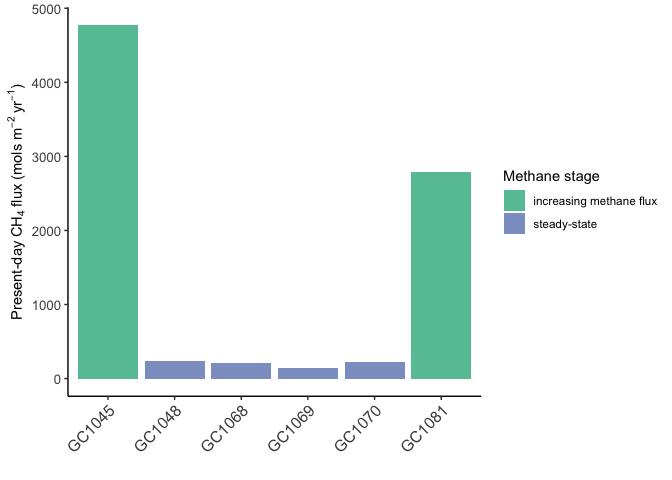
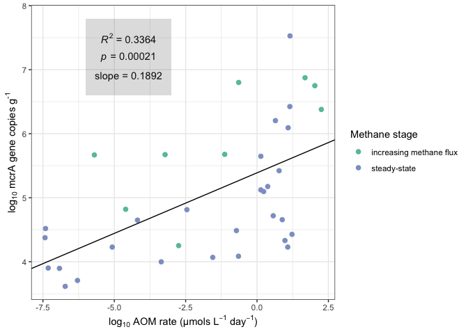
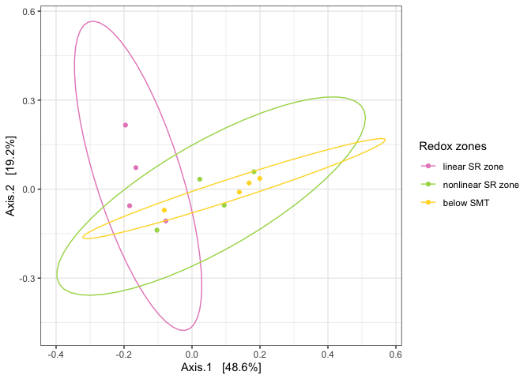

supplemental\_figures\_8.20.Rmd
================
Scott Klasek
8/31/2020

## load necessary libraries and data

``` r
library(phyloseq)
library(tidyverse)
```

    ## ── Attaching packages ───────────────────────────────────────────────────────────────────────────────────────────────────────────────────────────────────── tidyverse 1.3.0 ──

    ## ✓ ggplot2 3.3.2     ✓ purrr   0.3.3
    ## ✓ tibble  2.1.3     ✓ dplyr   0.8.4
    ## ✓ tidyr   1.0.2     ✓ stringr 1.4.0
    ## ✓ readr   1.3.1     ✓ forcats 0.4.0

    ## Warning: package 'ggplot2' was built under R version 3.6.2

    ## ── Conflicts ──────────────────────────────────────────────────────────────────────────────────────────────────────────────────────────────────────── tidyverse_conflicts() ──
    ## x dplyr::filter() masks stats::filter()
    ## x dplyr::lag()    masks stats::lag()

``` r
library(patchwork)
library(tables)
```

    ## Loading required package: Hmisc

    ## Loading required package: lattice

    ## Loading required package: survival

    ## Loading required package: Formula

    ## 
    ## Attaching package: 'Hmisc'

    ## The following objects are masked from 'package:dplyr':
    ## 
    ##     src, summarize

    ## The following objects are masked from 'package:base':
    ## 
    ##     format.pval, units

``` r
library(here)
```

    ## here() starts at /Users/scottklasek/Desktop/svalflux

``` r
sessioninfo <- sessionInfo()
ps.frdp <- readRDS(file="ps.frdp") # imports the final phyloseq object
```

## depth-integrated fluxes from each core

PC1029 is only estimated, others can be
calculated

``` r
aomrates <- read.csv(file="~/Desktop/svalflux/aomrates2020update.csv") # import csv

cores <- as.factor(as.character(levels(aomrates$core)[2:8])) # get a list of the cores
maxdepth <- vector("numeric", length(cores)) # define a vector for writing max depths
for (i in cores) {maxdepth[[i]] <- max((aomrates %>% filter(core==i))$depth)} # for-loop to calculate max depth
maxdepth <- maxdepth[(0.5*length(maxdepth)+1):length(maxdepth)] # omitted zero values
intflux <- vector("numeric", length(cores)) # define a vector for calculating fluxes
for (i in cores) {intflux[[i]] <- sum((aomrates %>% filter(core==i))$aom)} # for-loop to calculate flux
intflux <- intflux[(0.5*length(intflux)+1):length(intflux)] # omitted zero values

fluxes <- as.data.frame(cbind(maxdepth, intflux)) # combine into data frame
fluxes$core <- rownames(fluxes) # add core names
flux.gc <- fluxes[1:6,] # subset only the gravity cores (not as confident about the rates for PC1029)
flux.gc$stage <- c("increasing methane flux", "steady-state", "steady-state", "steady-state", "steady-state", "increasing methane flux") # add stage

gcf <- ggplot(flux.gc,aes(core,intflux,fill=stage))
gg.flux <- gcf+geom_bar(stat="identity")+
  scale_fill_manual("Methane stage", values = c("#66c2a5", "#8da0cb"))+
  scale_y_continuous()+
  xlab("")+
  ylab(bquote('Present-day'~CH[4]~'flux (mols'~m^-2~yr^-1*')'))+
  theme_classic()+
  theme(axis.text.y = element_text(size = 10),axis.text.x=element_text(angle = 45, hjust = 1,size=12))
gg.flux
```

<!-- -->

``` r
gg.flux <- saveRDS(gg.flux, "figures/figureS1flux") # export figure
```

## regression of mcrA counts vs modeled AOM rates

``` r
mcra.aom <- read.csv(file="~/Desktop/svalflux/mcra.aomrate.2020.csv") # import csv
mcra.aom$logaom <- log10(mcra.aom$aom) # calculate log of AOM rate
mcra.aom$logmcra <- log10(mcra.aom$mcra) # calculate log of mcrA gene abundance
mcra.aom$logdsrab <- log10(mcra.aom$dsrab) # calculate log of dsrAB gene abundance

mcra.aom$stage <- "steady-state"
mcra.aom[which(mcra.aom$core=="GC1045"),11] <- "increasing methane flux"
mcra.aom[which(mcra.aom$core=="GC1081"),11] <- "increasing methane flux"

AOM_mcrA.lm <- lm(mcra.aom$logmcra ~ mcra.aom$logaom) # linear raegression
summary(AOM_mcrA.lm) # multiple R^2 is 0.3364, slope estimate is 0.1892, and slope p-value is 0.00021 ***
```

    ## 
    ## Call:
    ## lm(formula = mcra.aom$logmcra ~ mcra.aom$logaom)
    ## 
    ## Residuals:
    ##     Min      1Q  Median      3Q     Max 
    ## -1.3630 -0.6521 -0.1117  0.5397  1.9202 
    ## 
    ## Coefficients:
    ##                 Estimate Std. Error t value Pr(>|t|)    
    ## (Intercept)      5.38890    0.16203  33.259  < 2e-16 ***
    ## mcra.aom$logaom  0.18917    0.04557   4.151  0.00021 ***
    ## ---
    ## Signif. codes:  0 '***' 0.001 '**' 0.01 '*' 0.05 '.' 0.1 ' ' 1
    ## 
    ## Residual standard error: 0.8516 on 34 degrees of freedom
    ## Multiple R-squared:  0.3364, Adjusted R-squared:  0.3168 
    ## F-statistic: 17.23 on 1 and 34 DF,  p-value: 0.0002095

``` r
rate_mcrA <- ggplot(mcra.aom,aes(logaom,logmcra,color=stage)) 
gg.ratemcrA <- rate_mcrA+
  geom_point(size=2)+
  scale_color_manual("Methane stage", values = c("#66c2a5", "#8da0cb"))+
  scale_x_continuous(expression('log'[10]*" AOM rate (µmols L"^{-1}*" day"^{-1}*")"))+
  scale_y_continuous(expression('log'[10]*' mcrA gene copies g'^{"-1"}))+
  geom_abline(intercept = 5.3889, slope = 0.18917)+
  theme(axis.title=element_text(size = 12), axis.text = element_text(size = 11), legend.title = element_text(size = 12), legend.text = element_text(size = 10))+
  annotate("text", x = -4.5, y = 7.5, label = "paste(italic(R) ^ 2, \" = 0.3364\")", parse = TRUE)+
  annotate("text", x = -4.5, y = 7.2, label = "paste(italic(p), \" = 0.00021\")", parse = TRUE)+
  annotate("text", x = -4.5, y = 6.9, label = "paste(slope, \" = 0.1892\")", parse = TRUE)+
  annotate("rect", xmin = -6, xmax = -3, ymin = 6.6, ymax = 7.8, alpha = .2)+
  theme_bw()
gg.ratemcrA 
```

<!-- -->

``` r
gg.ratemcrA <- saveRDS(gg.ratemcrA, "figures/figureS3ratemcrAplot") # export figure
```

## justification of steady-state dynamics

``` r
ssval <- read.csv(file="~/Desktop/svalflux/steadystate_validation.csv") # import csv
ssval <- ssval[,1:4] # trim the columns with no data
ssjp <- ggplot(ssval,aes(depth,value,color=type))
ssjp.plot <- ssjp+
  geom_point(data=subset(ssval, type=="empirical"))+
  geom_line()+
  coord_flip()+
  facet_grid(~core)+
  scale_y_continuous("Sulfate (mM)",limits = c(0,30),position = "right")+
  scale_color_manual("Sulfate profile data type:",values = c("dodgerblue1","black"))+
  scale_x_reverse("Depth (cmbsf)",breaks=c(0,50,100,150,200,250,300,350),limits=c(350,0))+
  theme_bw()+
  theme(legend.position = "bottom")
ssjp.plot
```

    ## Warning: Removed 5 rows containing missing values (geom_point).

<!-- -->

``` r
ssjp.plot <- saveRDS(ssjp.plot, "figures/figureS3ssjust") # export figure
```

## table of core info

``` r
coreinfo <- read.csv(file="~/Desktop/svalflux/coreinfo.csv") # import csv
names(coreinfo)[1:6] <- c("Core", "Latitude", "Longitude", "Water depth (m)", "Core recovery (cm)", "SMT depth (cm)")
coreinfo
```

    ##     Core   Latitude  Longitude Water depth (m) Core recovery (cm)
    ## 1 PC1029  76 06.398  15 58.151             381                 27
    ## 2 GC1045  76 06.347  15 57.959             387                130
    ## 3 GC1081 76 07.022  16 02.593              369                102
    ## 4 GC1048 76 06.737  15 59.845              387                335
    ## 5 GC1068 76 06.739  16 00.311              384                295
    ## 6 GC1069 76 06.719  16 00.334              383                227
    ## 7 GC1070 76 06.703  16 00.162              385                326
    ##   SMT depth (cm)
    ## 1             NA
    ## 2             82
    ## 3             56
    ## 4            320
    ## 5            108
    ## 6            138
    ## 7             69

``` r
coreinfo <- saveRDS(coreinfo, "figures/coreinfo") # export
```

## table of flux histories

``` r
inc.core <- read.csv(file="~/Desktop/svalflux/increasing.core.flux.table.csv") # import csv
names(inc.core)[2:4] <- c("Year before sampling", "CH4 flux mols m^-2 yr ^-1", "Peak AOM depth (cm)") # rename columns to be more legible
inc.core
```

    ##      Core Year before sampling CH4 flux mols m^-2 yr ^-1 Peak AOM depth (cm)
    ## 1  GC1045                   21                     3.674               280.0
    ## 2  GC1045                   20                     3.744               270.0
    ## 3  GC1045                   19                     3.808               257.5
    ## 4  GC1045                   18                     3.874               247.5
    ## 5  GC1045                   17                     3.944               237.5
    ## 6  GC1045                   16                     4.021               227.5
    ## 7  GC1045                   15                     4.101               217.5
    ## 8  GC1045                   14                     4.184               207.5
    ## 9  GC1045                   13                     4.268               197.5
    ## 10 GC1045                   12                     4.351               187.5
    ## 11 GC1045                   11                     4.433               177.5
    ## 12 GC1045                   10                     4.514               167.5
    ## 13 GC1045                    9                     4.593               157.5
    ## 14 GC1045                    8                     4.671               147.5
    ## 15 GC1045                    7                     4.749               137.5
    ## 16 GC1045                    6                     4.826               127.5
    ## 17 GC1045                    5                     4.902               117.5
    ## 18 GC1045                    4                     4.978               107.5
    ## 19 GC1045                    3                     5.054                97.5
    ## 20 GC1045                    0                     5.279                67.5
    ## 21 GC1081                   22                     2.930               275.0
    ## 22 GC1081                   17                     3.253               225.0
    ## 23 GC1081                   12                     3.589               175.0
    ## 24 GC1081                    7                     3.899               125.0
    ## 25 GC1081                    2                     4.207                75.0
    ## 26 GC1081                    1                     4.267                65.0
    ## 27 GC1081                    0                     4.325                55.0
    ## 28 GC1081                   -1                     4.379                45.0
    ## 29 GC1081                   -2                     4.430                35.0

``` r
inc.core <- saveRDS(inc.core, "figures/inc.core") # export
```
